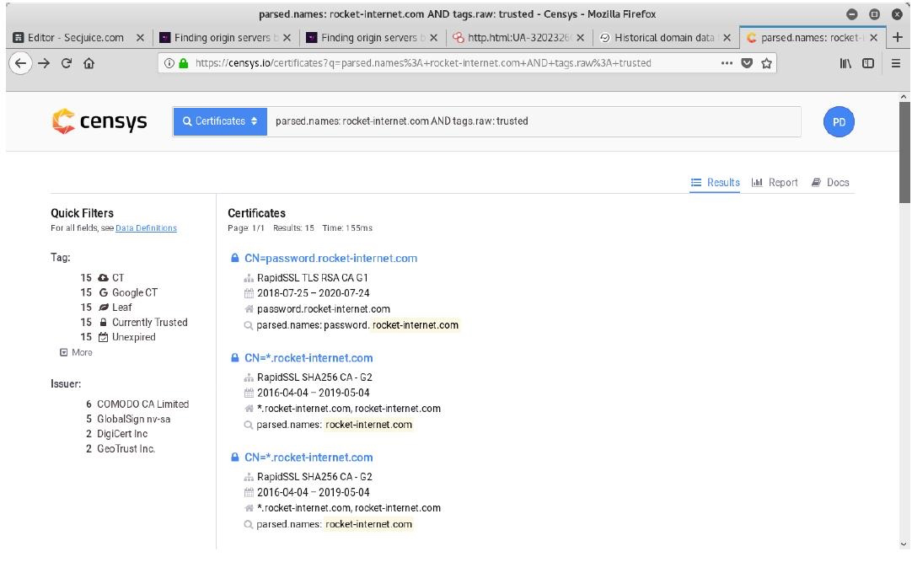
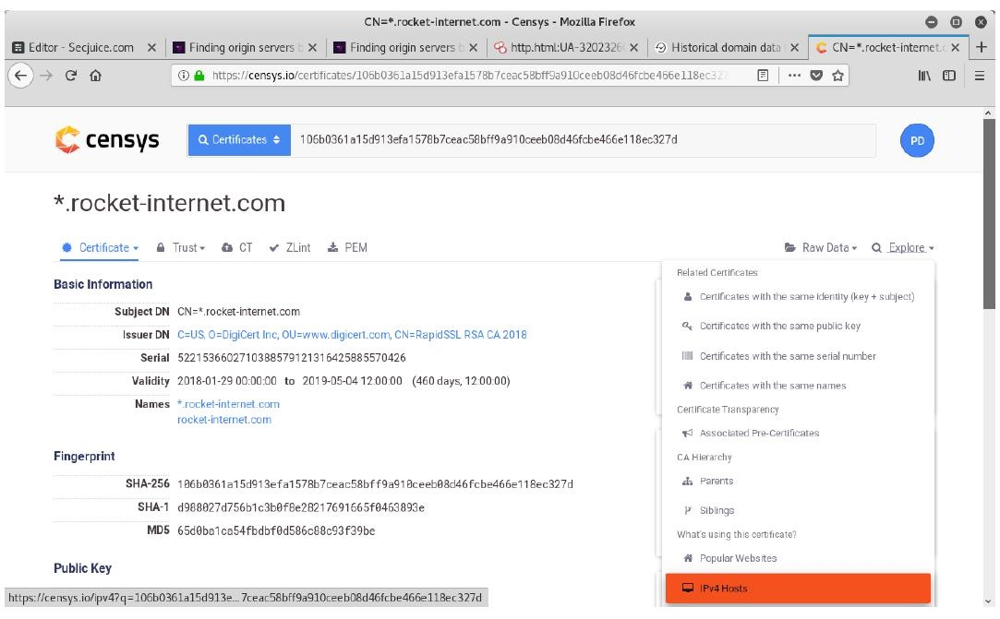

## 信息收集

1. whois查询

2. 收集子域名

3. 端口扫描

4. 查找真实ip

5. 探测旁站及C段

6. 网络空间搜索引擎

7. 扫描敏感目录/文件

8. 指纹识别

9. ###### 非常规操作

10. ###### SSL/TLS证书查询

##### 

### 查找真实IP

绕过CDN的多种方法具体可以参考
https://www.cnblogs.com/qiudabai/p/9763739.html

#### 0x01 验证是否存在CDN

方法1：各种多地 ping 的服务，查看对应 IP 地址是否唯一

方法2：使用 nslookup 进行检测，原理同上，如果返回域名解析对应多个 IP 地址多半是使用了 CDN

#### 0x02 绕过 CDN 查找网站真实 IP

方法1:查询历史DNS记录

方法2:查询子域名

微步在线

Dnsdb查询法

Google 搜索

各种子域名扫描器

方法3：网络空间引擎搜索法

常见的有以前的钟馗之眼，[shodan](https://www.shodan.io/)，[fofa搜索](https://fofa.so/)。以fofa为例，只需输入：title:“网站的title关键字”或者body：“网站的body特征”就可以找出fofa收录的有这些关键字的ip域名，很多时候能获取网站的真实ip，如图：

方法4:利用SSL证书寻找真实原始IP

使用给定的域名

假如你在xyz123boot.com上托管了一个服务，原始服务器IP是136.23.63.44。 而CloudFlare则会为你提供DDoS保护，Web应用程序防火墙和其他一些安全服务，以保护你的服务免受攻击。为此，你的Web服务器就必须支持SSL并具有证书，此时CloudFlare与你的服务器之间的通信，就像你和CloudFlare之间的通信一样，会被加密（即没有灵活的SSL存在）。这看起来很安全，但问题是，当你在端口443（[https://136.23.63.44:443）上直接连接到IP时，SSL证书就会被暴露。](https://136.23.63.44:443）上直接连接到IP时，SSL证书就会被暴露。/)

此时，如果攻击者扫描0.0.0.0/0，即整个互联网，他们就可以在端口443上获取在xyz123boot.com上的有效证书，进而获取提供给你的Web服务器IP。

目前Censys工具就能实现对整个互联网的扫描，Censys是一款用以搜索联网设备信息的新型搜索引擎，安全专家可以使用它来评估他们实现方案的安全性，而黑客则可以使用它作为前期侦查攻击目标、收集目标信息的强大利器。Censys搜索引擎能够扫描整个互联网，Censys每天都会扫描IPv4地址空间，以搜索所有联网设备并收集相关的信息，并返回一份有关资源（如设备、网站和证书）配置和部署信息的总体报告。

而攻击者唯一需要做的就是把上面用文字描述的搜索词翻译成实际的搜索查询参数。

xyz123boot.com证书的搜索查询参数为：parsed.names：xyz123boot.com

只显示有效证书的查询参数为：tags.raw：trusted

攻击者可以在Censys上实现多个参数的组合，这可以通过使用简单的布尔逻辑来完成。

组合后的搜索参数为：parsed.names: xyz123boot.com and tags.raw: trusted

Censys将向你显示符合上述搜索条件的所有标准证书，以上这些证书是在扫描中找到的。

要逐个查看这些搜索结果，攻击者可以通过单击右侧的“Explore”，打开包含多个工具的下拉菜单。What's using this certificate? > IPv4 Hosts

此时，攻击者将看到一个使用特定证书的IPv4主机列表，而真实原始 IP就藏在其中。

你可以通过导航到端口443上的IP来验证，看它是否重定向到xyz123boot.com？或它是否直接在IP上显示网站？

使用给定的SSL证书

如果你是执法部门的人员，想要找出一个隐藏在cheesecp5vaogohv.onion下的儿童色情网站。做好的办法，就是找到其原始IP，这样你就可以追踪到其托管的服务器，甚至查到背后的运营商以及金融线索。

隐藏服务具有SSL证书，要查找它使用的IPv4主机，只需将"SHA1 fingerprint"（签名证书的sha1值）粘贴到Censys IPv4主机搜索中，即可找到证书，使用此方法可以轻松找到配置错误的Web服务器。

方法5:利用HTTP标头寻找真实原始IP

借助SecurityTrails这样的平台，任何人都可以在茫茫的大数据搜索到自己的目标，甚至可以通过比较HTTP标头来查找到原始服务器。

特别是当用户拥有一个非常特别的服务器名称与软件名称时，攻击者找到你就变得更容易。

如果要搜索的数据相当多，如上所述，攻击者可以在Censys上组合搜索参数。假设你正在与1500个Web服务器共享你的服务器HTTP标头，这些服务器都发送的是相同的标头参数和值的组合。而且你还使用新的PHP框架发送唯一的HTTP标头（例如：X-Generated-Via：XYZ框架），目前约有400名网站管理员使用了该框架。而最终由三个服务器组成的交集，只需手动操作就可以找到了IP，整个过程只需要几秒钟。

例如，Censys上用于匹配服务器标头的搜索参数是80.http.get.headers.server :，查找由CloudFlare提供服务的网站的参数如下：

80.http.get.headers.server:cloudflare

方法6:利用网站返回的内容寻找真实原始IP

如果原始服务器IP也返回了网站的内容，那么可以在网上搜索大量的相关数据。

浏览网站源代码，寻找独特的代码片段。在JavaScript中使用具有访问或标识符参数的第三方服务（例如Google Analytics，reCAPTCHA）是攻击者经常使用的方法。

以下是从HackTheBox网站获取的Google Analytics跟踪代码示例：

ga（'create'，'UA-93577176-1'，'auto'）;
可以使用80.http.get.body：参数通过body/source过滤Censys数据，不幸的是，正常的搜索字段有局限性，但你可以在Censys请求研究访问权限，该权限允许你通过Google BigQuery进行更强大的查询。

Shodan是一种类似于Censys的服务，也提供了http.html搜索参数。

搜索示例：https://www.shodan.io/search?query=http.html%3AUA-32023260-1

方法7:使用国外主机解析域名

方法8:网站漏洞查找

1）目标敏感文件泄露，例如：.git文件泄露，.svn文件泄露，phpinfo之类的探针、GitHub信息泄露等。
2）XSS盲打，命令执行反弹shell，SSRF等。
3）无论是用社工还是其他手段，拿到了目标网站管理员在CDN的账号，从而在从CDN的配置中找到网站的真实IP。

方法9:网站邮件订阅查找

方法10：用 Zmap 扫全网

需要找 xiaix.me 网站的真实 IP，我们首先从 apnic 获取 IP 段，然后使用 Zmap 的 banner-grab 扫描出来 80 端口开放的主机进行 banner 抓取，最后在 http-req 中的 Host 写 xiaix.me

方法11：F5 LTM解码法

当服务器使用F5 LTM做负载均衡时，通过对set-cookie关键字的解码真实ip也可被获取，例如：Set-Cookie: BIGipServerpool_8.29_8030=487098378.24095.0000，先把第一小节的十进制数即487098378取出来，然后将其转为十六进制数1d08880a，接着从后至前，以此取四位数出来，也就是0a.88.08.1d，最后依次把他们转为十进制数10.136.8.29，也就是最后的真实ip

0 x 0 5 旁 站 和C段
