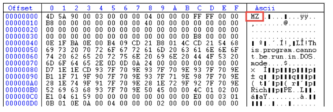
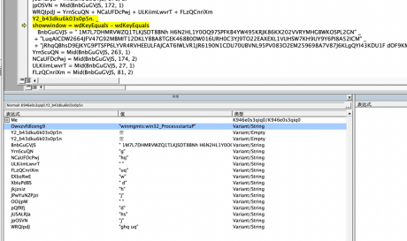
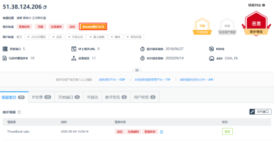

**溯源手册**

本溯源手册，分技巧与实战两大篇幅旨在帮助大家可以快速上手并在实战中运用，也可充当字典的作用，在溯源过程中可以翻一翻，更全面的溯源，故某些内容可能会简化。

## 技巧篇

通常情况下，接到溯源任务时，获得的信息如下

攻击时间\
攻击IP\

预警平台\
攻击类型\
恶意文件\
受攻击域名/IP

其中攻击IP、攻击类型、恶意文件、攻击详情是溯源入手的点。

通过攻击类型分析攻击详情的请求包，看有没有攻击者特征，通过获取到的IP地址进行威胁情报查询来判断所用的IP具体是代理IP还是真实IP地址。

-   如端口扫描大概率为个人vps或空间搜索引擎，在接到大量溯源任务时可优先溯源。

-   如命令执行大概率为未经任何隐匿的网络、移动网络、接到脚本扫描任务的肉鸡，在接到大量溯源任务时可优先溯源。

-   如爬虫大概率为空间搜索引擎，可放到最后溯源。

-   如恶意文件可获得c2地址、未删除的带有敏感信息的代码（如常用ID、组织信息）、持续化控制代码（C2地址指在APT攻击里的命令与控制，若获取到C2地址可以使我们的溯源目标更有针对性）

&nbsp;

-   持续化控制代码需要详细分析，如采用DGA域名上线的方法，分析出域名算法，预测之后的域名可有效减少损失，增加溯源面。

### 溯源结果框架

在受到攻击、扫描之后，进行一系列溯源操作后，理想情况下想要获得如下数据，来刻画攻击者画像。

姓名/ID：\
攻击IP：\
地理位置：\
QQ:\
微信：\
邮箱：\
手机号：\
支付宝：\
IP地址所属公司：\
IP地址关联域名：\
其他社交账号信息（如微博/src/id证明）：\
人物照片：\
跳板机（可选）：\
（ps：以上为最理想结果情况，溯源到名字公司加分最高）

在写溯源报告时，应避免单一面石锤，需要反复验证，避免中途溯源错人，各个溯源线索可以串起来，要具有逻辑性。

### 溯源常用手法

本节将按照获取到的数据展开分来来讲，最后可能融会贯通，互相适用。

威胁情报平台

https://x.threatbook.cn/\
https://ti.qianxin.com/\
https://ti.360.cn/\
https://www.venuseye.com.cn/

不要过于依赖威胁情报，仅供参考 平台大多为社区维护，存在误报以及时效性问题，可能最后跟真正攻击者毫无关系。

#### **已知域名获取信息**

##### 历史whois

通过威胁情报平台我们可以获取域名解析记录、历史whois、子域名、SSL证书等如图：

[https://whois.chinaz.com/reverse?ddlSearchMode=4](https://whois.chinaz.com/reverse?ddlSearchMode=4)

[https://community.riskiq.com/](https://community.riskiq.com/)

可获得

ID

姓名

邮箱

##### SSL证书

可获得

ID

邮箱

##### 解析记录

通过解析记录可以获得域名A记录从而获取到域名后的IP地址。

A记录 ------ 映射域bai名到一个或多个IP

CNAME------ 映射域名到另一个域名（子域名）

域名解析记录：http://www.jsons.cn/nslookup/

全球ping，查看现绑定ip，看是否域名使用了CDN技术。

[http://ping.chinaz.com/](http://ping.chinaz.com/)

fofa

#### **已知IP获取信息**

##### 反查域名

-   威胁情报平台

-   [https://www.ipip.net/ip.html](https://www.ipip.net/ip.html)

-   [https://www.aizhan.com/](https://www.aizhan.com/)

-   [https://www.whois.com/](https://www.whois.com/)

##### IP信息

-   威胁情报平台

-   [https://www.ipip.net/](https://www.ipip.net/)

-   [http://ipwhois.cnnic.net.cn/index.jsp](http://ipwhois.cnnic.net.cn/index.jsp)

-   可获得

    -   是否为移动网络、IDC等

    -   IP段所属公司

##### IP定位

-   [https://chaipip.com/](https://chaipip.com/)

-   [https://www.opengps.cn/Data/IP/ipplus.aspx](https://www.opengps.cn/Data/IP/ipplus.aspx)

#### **已知ID/姓名/手机号/邮箱获取信息**

##### 手机号/邮箱

sgk

查支付宝转账，验证姓名。

通过部分平台账号找回密码，可猜手机号。

QQ添加好友搜索

微信添加好友搜索

[https://www.reg007.com/](https://www.reg007.com/)

社交平台查找（抖音、脉脉搜索等）

##### ID/姓名

sgk

谷歌/百度

src搜索

微博搜索

贴吧搜索

社交平台查找（抖音、脉脉搜索等）

#### **恶意文件**

恶意文件通常会从邮件的路径获得，可以将邮件全格式保存，用十六进制编辑器查看，可以获得发送邮件IP地址。

##### **需要准备的工具**

###### 逆向类

Ida

JEB

文件编辑类

010 editor

Winhex

###### 网络、进程监控类

processmonitor

Wireshark

科来网络分析系统

SRsniffer

###### 固件分析类

Binwalk

BIN2BMP

PIXD

###### 在线沙箱

微步云沙箱 [https://s.threatbook.cn/](https://s.threatbook.cn/)

奇安信云沙箱 [https://sandbox.ti.qianxin.com/sandbox/page](https://sandbox.ti.qianxin.com/sandbox/page)

腾讯哈勃 [https://habo.qq.com/](https://habo.qq.com/)

Joe Sandbox：[https://www.joesandbox.com/](https://www.joesandbox.com/)

##### **常规溯源手法**

###### **文件识别**

文件含有的pe信息

常见的可执行程序格式有PE，ELF，MACH-O等，不同的格式有不同的标志信息（参考理论篇），知道了目标文件的格式后才能确定对应的分析方法和分析工具。

可以使用16进制解析器载入可执行程序，然后查看是哪种类型的文件。

一般二进制文件的前四个字节为文件格式的magic，可以通过从网络搜索获得文件的信息，或者使用相关的工具（PEID，file）等进行自动识别。

###### **计算哈希值**

哈希是一种用来唯一标识目标程序的常用方法。目标程序通过一个哈希算法，会产生出一段唯一的用于标识这个样本的哈希值，我们可以将这个值理解为是目标程序的指纹。常用的哈希算法有MD5、Sha-1以及CRC32等。由于仅仅采用一种算法，特别是MD5算法，有可能使得不同程序产生同样的哈希结果，所以一般会运用多种哈希验证文件的唯一性。

###### **查找字符串**

程序中的字符串就是一串可打印的字符序列，一个程序通常都会包含一些字符串，比如打印输出信息、连接的URL，或者是程序所调用的API函数等。从字符串中进行搜索是获取程序功能提示的一种简单方法。（在IDA和OD中都可以查找字符串）并不是所有的字符串都是有意义的，但是利用这个结果，也能够给我们的静态分析带来很大的便利了。

###### **查找导入函数**

如果软件被加壳的话，那么导入表中的函数会很少，所以可以从这里判断文件是否被加壳。如果没有加壳，那么导入表中会列出程序使用的大部分函数（除去程序动态获得的），我们就可以通过这些函数大致判断一下程序的行为。

###### **解析宏**

使用IDA反汇编程序的时候，IDA并不会将宏的名字解析出来，相反，它只会使用宏对应的数字进行显示，如下如所示：

如果只看这些数字，完全无法得知什么情况，好在IDA提供了解析机制，可以将数字转换为宏名。在对应的数字上右键，选择Enum：

然后在弹出的对话框中选择对应的宏即可

替换后的结果如下，这样的话，就方便了静态查看代码

###### **侦壳操作**

病毒木马编写者经常会使用加壳技术来让他们的恶意程序难以被检测或分析。正常的程序总是会包含很多字符串。而加了壳的恶意代码通过分析所得到的可打印字符串就会很少。如果查找出的程序的字符串很少时，那么这个程序就很有可能是加了壳的。此时往往就需要使用其它方法来进一步检测它们的行为。(常用PEiD进行查壳)

###### **动态调试**

使用调试器对病毒进行分析在反病毒工作中扮演着十分重要的角色。调试器允许你查看任意内存地址的内容、寄存器的内容以及每个函数的参数。调试器也允许你在任意时刻改变关于程序执行的任何东西。比如你可以在任意时刻改变一个变量的值------前提是你需要获得关于这个变量足够的信息，包括在内存中的位置。在实际的动态调试过程中，最常用的是OllyDBG和WinDbg，前者是病毒分析人员使用最多的调试器，缺点是不支持内核调试，如果想调试内核，WinDbg基本上就是唯一的选择了。虽然IDA Pro也能够进行动态调试，但是它远远不如OD方便。因此在实际分析的过程中，往往是将二者结合使用的。因为如果用IDA Pro在静态分析中遇到了十分抽象的函数，那么用OD动态地执行一下，该函数的功能往往就能一目了然了

###### **多线程调试**

D调试软件时，它每次只能跟一个线程，如果遇到的软件创建了很多线程，那么调试起来就比较麻烦了，本节介绍一下多线程的调试方法。

首先看一下线程创建的函数：

HANDLE CreateThread(

LPSECURITY_ATTRIBUTES lpThreadAttributes,//SD

SIZE_T dwStackSize,//initialstacksize

LPTHREAD_START_ROUTINE lpStartAddress,//threadfunction

LPVOID lpParameter,//threadargument

DWORD dwCreationFlags,//creationoption

LPDWORD lpThreadId//threadidentifier

)

重点看第三个和第四个函数，其中第三个参数指定了新线程的入口地址，第四个参数为新线程所需的参数，当程序调用此函数来创建线程的时候，定位到线程的入口地址设置断点，一般情况下，程序会在后面调用Sleep或WaitForSingleObject函数，这样的话，程序的控制权就到了新线程里面。

如果程序没有调用Sleep或WaitForSingleObject函数，那么可以修改函数的代码，强制程序调用这两个函数，这样程序就转到新线程中执行。另一种方法是修改程序的EIP，使其指向新线程入口，如果有参数的话，还要修改寄存器的值，使其指向参数地址，不过这种方法可能会造成寄存器内容不正确，环境异常，从而造成程序执行崩溃。

还有一种方法来调试多线程。如果程序多次调用CreateThread，确定一个我们打算调试的线程，并让这个线程创建成功，当程序再调用CreateThread创建线程的时候，直接修改此函数，让它直接返回，这样就不会再创建线程了，我们就可以只调试一个线程。

###### **调试子进程**

有些样本并不是单独运行的，它在运行过程中可能会创建子进程来完成恶意功能，遇到这种情况，就需要进入子进程中进行调试。

如果父进程创建子进程时是以suspended的方式创建的，那么父进程会向子进程进行代码注入，写入之后会调用ResumeThread函数恢复子进程的运行。遇到这种情况，要确定父进程写入代码的地址，当代码写入之后，调用ResumeThread恢复子进程运行前，附加到子进程中，在代码注入的地址下断点并F9让子进程运行。这时再回到父进程中，运行函数ResumeThread，这样子进程就可以断在代码注入的地址了。

还有一种创建子进程的方式，就只是简单的开启一个子进程运行，这种情况比较简单，需要注意的一点就是父进程创建子进程时传给子进程的参数，使用OD打开要运行的子进程，传入所需的参数即可开始调试。

#### **跳板机**

本节进行跳板机上信息搜集，查看跳板机是被哪个IP入侵的，是否留下一些黑客工具带有个人或组织信息，继续向上溯源

本节需要溯源人员对linux及windows系统命令有一定掌握。

关于如何攻破跳板机

一般跳板机大多数为黑客的全网漏洞扫描脚本批量攻击拿下的肉鸡，故其比较容易拿下。不排除黑客通过定点、手动攻击、购买等途径获得的跳板机。

进行全端口探测,尝试默认密码、找Web服务进行攻击。

一些影响范围广泛、利用简单的漏洞 如：Phpstudy后门、Weblogic漏洞、Struts2漏洞、路由器监控摄像器等终端漏洞。

遇到CS server可通过csbruter工具爆破密码。

常见的日志分析工具：

windows：logparser

linux：主要为一些命令的使用例：split sed cat sort uniq awk等

跳板机的溯源过程，可以主要从端口、进程、定时任务、日志来入手

##### **Linux**

###### 端口查询

使用 netstat 网络连接命令，分析可疑端口、IP、PID

部分系统可使用lsof -i

查看下 pid 所对应的进程文件路径，

运行 ls -l /proc/\$PID/exe 或 file /proc/\$PID/exe（\$PID 为对应的 pid 号）

###### 进程查询

使用 ps 命令，分析进程

ps aux \| grep pid

###### 定时任务

1、利用 crontab 查询创建的定时任务

基本命令

crontab -l 列出某个用户cron服务的详细内容

Tips：默认编写的crontab文件会保存在 (/var/spool/cron/用户名 例如: /var/spool/cron/root

crontab -r 删除每个用户cront任务(谨慎：删除所有的计划任务)

crontab -e 使用编辑器编辑当前的crontab文件

如：\*/1 \* \* \* \* echo \"hello world\" \>\> /tmp/test.txt 每分钟写入文件

2、利用 anacron 命令实现异步定时任务调度

使用案例

每天运行 /home/backup.sh 脚本：

vi /etc/anacrontab

\@daily 10 example.daily /bin/bash /home/backup.sh

当机器在 backup.sh 期望被运行时是关机的，anacron会在机器开机十分钟之后运行它，而不用再等待 7天。

###### 历史命令

1、root 用户的历史命令

histroy

2、打开 /home 各帐号目录下的 .bash_history，查看普通帐号执行的历史命令。

为历史的命令增加登录的 IP 地址、执行命令时间等信息：

1）保存1万条命令

sed -i \'s/\^HISTSIZE=1000/HISTSIZE=10000/g\' /etc/profile

2）在/etc/profile的文件尾部添加如下行数配置信息：

USER_IP=\`who -u am i 2\>/dev/null \| awk \'{print \$NF}\' \| sed -e \'s/\[()\]//g\'\`

if \[ \"\$USER_IP\" = \"\" \]

then

USER_IP=\`hostname\`

fi

export HISTTIMEFORMAT=\"%F %T \$USER_IP \`whoami\` \"

shopt -s histappend

export PROMPT_COMMAND=\"history -a\"

3）source /etc/profile 让配置生效

###### 用户

who 查看当前登录用户（tty 本地登陆 pts 远程登录）

w 查看系统信息，想知道某一时刻用户的行为

uptime 查看登陆多久、多少用户，负载状态

1、用户信息文件 /etc/passwd

root:x:0:0:root:/root:/bin/bash

account:password:UID:GID:GECOS:directory:shell

用户名：密码：用户ID：组ID：用户说明：家目录：登陆之后的 shell

注意：无密码只允许本机登陆，远程不允许登陆

2、影子文件 /etc/shadow每个:为一次分割

root:\$6\$oGs1PqhL2p3ZetrE\$X7o7bzoouHQVSEmSgsYN5UD4.kMHx6qgbTqwNVC5oOAouXvcjQSt.Ft7ql1WpkopY0UV9ajBwUt1DpYxTCVvI/:16809:0:99999:7:::

用户名：加密密码：密码最后一次修改日期：两次密码的修改时间间隔：密码有效期：密码修改到期到的警告天数：密码过期之后的宽限天数：账号失效时间：保留

###### 日志

日志默认存放位置：/var/log

--------------------------------------------------------------------------------------------------------------------------------------------------------------------------

  日志文件           说明

------------------ -------------------------------------------------------------------------------------------------------------------------------------------------------

  /var/log/cron      记录了系统定时任务相关的日志

  /var/log/cups      记录打印信息的日志

  /var/log/dmesg     记录了系统在开机时内核自检的信息，也可以使用dmesg命令直接查看内核自检信息

  /var/log/mailog    记录邮件信息

  /var/log/message   记录系统重要信息的日志。这个日志文件中会记录Linux系统的绝大多数重要信息，如果系统出现问题时，首先要检查的就应该是这个日志文件

  /var/log/btmp      记录错误登录日志，这个文件是二进制文件，不能直接vi查看，而要使用lastb命令查看

  /var/log/lastlog   记录系统中所有用户最后一次登录时间的日志，这个文件是二进制文件，不能直接vi，而要使用lastlog命令查看

  /var/log/wtmp      永久记录所有用户的登录、注销信息，同时记录系统的启动、重启、关机事件。同样这个文件也是一个二进制文件，不能直接vi，而需要使用last命令来查看

  /var/log/utmp      记录当前已经登录的用户信息，这个文件会随着用户的登录和注销不断变化，只记录当前登录用户的信息。同样这个文件不能直接vi，而要使用w,who,users等命令来查询

  /var/log/secure    记录验证和授权方面的信息，只要涉及账号和密码的程序都会记录，比如SSH登录，su切换用户，sudo授权，甚至添加用户和修改用户密码都会记录在这个日志文件中

Web访问日志通常为access.log文件可以使用find命令进行查找

查找最近修改过的文件命令

例：find ./\* -mmin -5 Tips： mmin分钟 mtime 天

日志分析小技巧：

登录成功的IP有哪些：

grep \"Accepted \" /var/log/secure \| awk \'{print \$11}\' \| sort \| uniq -c \| sort -nr \| more

登录成功的日期、用户名、IP：

grep \"Accepted \" /var/log/secure \| awk \'{print \$1,\$2,\$3,\$9,\$11}\'

###### Webshell查找

河马 webshell：http://www.shellpub.com

##### **Windows**

###### 检查系统账号安全

1、查看服务器是否存在可疑账号、新增账号。

检查方法：打开 cmd 窗口，输入 lusrmgr.msc 命令，查看是否有新增/可疑的账号，如有管理员群组的（Administrators）里的新增账户，如有，请立即禁用或删除掉。

2、查看服务器是否存在隐藏账号、克隆账号。

检查方法：

a、打开注册表 ，查看管理员对应键值。

b、使用D盾_web查杀工具，集成了对克隆账号检测的功能。

3、结合日志，查看管理员登录时间、用户名是否存在异常。

检查方法：

a、Win+R 打开运行，输入\"eventvwr.msc\"，回车运行，打开"事件查看器"。

b、导出 Windows 日志 \-- 安全，利用微软官方工具 Log Parser 进行分析。

###### 端口查询

1、检查端口连接情况，是否有远程连接、可疑连接。

检查方法：

a、使用netstat -ano 命令查看目前的网络连接，定位可疑的 ESTABLISHED

b、根据 netstat 命令定位出的 PID 编号，再通过 tasklist 命令进行进程定位 tasklist \| findstr \"PID\"

###### 进程查询

检查方法：

a、开始 \-- 运行 \-- 输入 msinfo32 命令，依次点击 \"软件环境 \-- 正在运行任务\" 就可以查看到进程的详细信息，比如进程路径、进程ID、文件创建日期以及启动时间等。

b、打开D盾_web查杀工具，进程查看，关注没有签名信息的进程。

c、通过微软官方提供的 Process Explorer 等工具进行排查 。

d、查看可疑的进程及其子进程。可以通过观察以下内容：

没有签名验证信息的进程

没有描述信息的进程

进程的属主

进程的路径是否合法

CPU 或内存资源占用长时间过高的进程

3、小技巧：

 a、查看端口对应的 PID：netstat -ano \| findstr \"port\"

 b、查看进程对应的 PID：任务管理器 \-- 查看 \-- 选择列 \-- PID 或者 tasklist \| findstr \"PID\"

 c、查看进程对应的程序位置：

 任务管理器 \-- 选择对应进程 \-- 右键打开文件位置

 运行输入 wmic，cmd 界面输入 process

 d、tasklist /svc 进程 \-- PID \-- 服务

 e、查看Windows服务所对应的端口：

 %systemroot%/system32/drivers/etc/services（一般 %systemroot% 就是 C:\\Windows 路径）

###### 检查启动项、计划任务、服务

1、检查服务器是否有异常的启动项。

检查方法：

a、登录服务器，单击【开始】\>【所有程序】\>【启动】，默认情况下此目录在是一个空目录，确认是否有非业务程序在该目录下。 b、单击开始菜单 \>【运行】，输入 msconfig，查看是否存在命名异常的启动项目，是则取消勾选命名异常的启动项目，并到命令中显示的路径删除文件。 c、单击【开始】\>【运行】，输入 regedit，打开注册表，查看开机启动项是否正常，特别注意如下三个注册表项：

HKEY_CURRENT_USER\\Software\\Microsoft\\Windows\\CurrentVersion\\run

HKEY_LOCAL_MACHINE\\Software\\Microsoft\\Windows\\CurrentVersion\\Run

HKEY_LOCAL_MACHINE\\Software\\Microsoft\\Windows\\CurrentVersion\\Runonce

###### Webshell

使用D盾进行全盘扫描，对脚本文件进行人工判断。

## **实战篇**

本篇内容主要以\"2020HW\"行动发生的真实攻击事件为主，目的是用实战案列给大家最直观的感受，部分内容已脱敏。

### 1.web攻击溯源篇

（1）9.13日，18:10:43分蜜罐设备告警，发现攻击者对自定义蜜罐界面进行端口扫描，在研判时发现该攻击者IP地址为总部统一下发的高危预警IP，随立即对其展开攻击溯源工作。

我们获取到IP后，首先对其进行威胁情报收集，推荐使用微步在线威胁情报社区。如图：

（2）通过ping该域名来获取其使用的真实地址，得到地61.188.254.133，通过该地址反查域名得到xxooxxoo.xyz，再查询该域名的whois信息，我们得到了攻击者的初步信息。

在实战过程中，往往我们反查IP地址获取到的域名是获取不到有效的利用信息的，此时我们需要更加耐心，查询其历史注册域名，通过不断的IP反查，域名反查来获取更多信息，渗透的本质是信息收集，溯源的本身也是信息收集的一种体现。

（3）通过前两步的分析，我们得到了攻击者的手机号与姓名，我们可以通过社交平台及APP来验证攻击者的真实性，也可以通过社工库来获取攻击者的更多信息，社工库源自Telegram（由于需要翻墙这里不再提供截图，大家自行查找）。

1.支付宝通过转账功能可以验证其姓名真实性。

通过QQ号，进入QQ空间获取到大量个人信息（朋友圈，QQ空间这种社交圈子大家尽量还是设置为不允许陌生人访问）

此时可以判断攻击者曾就职于腾讯。同时通过QQ空间我们还发现攻击者曾开发过微信公众号，通过搜索引擎搜索获取到的scjtqs关键词，我们获取到了攻击者的github信息，一些开发项目的信息，可以证明攻击者是IT行业从业者。

### 2.钓鱼邮件分析篇

钓鱼邮件攻击多为两种，一是带有附件的word宏病毒，二是引导受害者进入钓鱼网站来获取受害者的敏感信息。识别钓鱼邮件首先关注发件人的地址信息，以及攻击者发过来的恶意链接地址（将鼠标光标移动至恶意链接地址在浏览器左下角可以看到相关地址）。同时在大家日常工作中要提高自己的安全意识，不要使用以自己生日命名的密码或者简单的密码组合，不要再互联网中经常使用个人信息来进行注册，往往攻击者再获取到内部人员邮箱之后进行的攻击会使内部员工大面积中招。

**一、事件描述：**

2020年09月17日 17:11:00我方拿到钓鱼邮件样本，随立即对其展开分析工作。通过云沙箱对样本进行分析，发现其为word宏病毒。

将文件上传至云沙箱，可发现该文件为恶意文件。

分析总结该文件执行流程如下：运行文件后会通过powershell执行恶意代码，下载了名为K2ngq9rh.exe的恶意程序，该恶意程序运行会执行多项恶意行为并将自身删除。

打开文档前先禁用宏，防止word宏代码执行对机器进行高危操作，对宏代码进行分析。

分为Od7aj7ii3yu和K946e0s3qiq0两部分宏代码。

Od7aj7ii3yu 函数为一个私有方法在文档打开时创建了6个字符串数组对象，为后续操作做准备。

K946e0s3qiq0为恶意宏代码的主体程序，代码中使用字符串拼接作为字典，使用mid、trim、split函数偏移对无序字符串进行取值。

对其中一个部分验证如下：

继续追踪代码,发现公代码会调用wmi(winmgmts),使用win32_process接口获取计算机的系统信息。

继续跟踪代码发现一个比较有意思的事情，在解密过程中会出现pizdec 字样的字符串，查询后是俄罗斯语，怀疑该钓鱼邮件与俄罗斯有关。

继续分析，可以看到在字符串解密后会使用powershell -encode 执行加密后的代码。

该加密后的代码有2部分构成：

1.  明文使用"."、"\*"、"/"、" "等做混淆

2.  混淆后使用base64加密

> 逆向该过程还原明文
>
> 
>
> 

分析宏代码释放的exe文件，在函数中发现了作者自定义的函数名称为lhxXfY9mIrDZ，结合宏代码中的pizdec。谷歌搜索后发现2020年9月18号的一个沙箱报告。

报告如下

木马逻辑分为加载器和木马核心，在加载器运行时，也就是qct8u1hKuXXwoP.exe会先获取系统的基本信息、是否为调试环境等。

判断是否在debug环境下

如果是调试环境就会sleep，不执行后续动作。

获取系统的cpu 和 oem信息

根据报告内容发现如果加载器运行正常会下载木马核心。

拼接下载地址，下载木马分析。在 ida中分析发现木马作者没有删去本机的调试路径。

根据此路径为关键字搜索可以确定该钓鱼邮件的组织为

Emotet

Emotet恶意软件的第一个版本早在2014年就被广泛发现，其目的是通过拦截互联网流量来窃取银行凭证。首次在野外发现Emotet时，该恶意软件仅使用其本机信息窃取工具集，主要针对德国和奥地利的银行。Emotet背后的运营团队是Mealybug。该团队 是一个网络犯罪组织，自2014年以来一直保持活跃。我们可以通过其使用的自定义恶意软件Trojan.Emotet来识别它。近几年来，Mealybug似乎已经改变了其商业模式，从针对欧洲的银行客户转变为了使用其基础设施为全球其他威胁行为者提供恶意软件包装和交付服务。此次钓鱼邮件攻击，是针对于政府企业的一次APT攻击。

分析文件执行内容，可以发现该恶意文件会执行多种恶意行为，包括代码混淆、释放恶意文件、创建可以进程等：

文件执行过程中可观察到其实通过powershell进行数据的传输工作。

通过对文件执行中的powershell代码进行解码分析，得到源代码。

解码得到

对代码进行分析得知代码内容为请求以下URL

<http://theccwork.com/mail.theccwork.com/IJp/>\
<https://www.retirementprofessional.com/wp-admin/tjQ/>\
<https://writingfromling.live/wp-admin/GL/>\
<http://shahqutubuddin.org/ix/>\
<https://jumpstart.store/wp-admin/q/>\
<https://aidenshirt.com/wp-admin/e6f/>\
<https://edenrug.store/wp-admin/H/>

对以上URL进行溯源分析发现站点均为wordpress模板，wordpress为最新版本无法进行漏洞利用。部分信息如下：

访问该域名会提示此网站为钓鱼网站。

点击链接下载其中病毒文件并进行威胁情报分析。

对其请求的IP地址进行情报收集。

发现其为Emotet银行木马。

2.本地执行此病毒木马通过分析流量发现其指向两个域名。

对流量中的域名地址进行溯源分析

其IP地址为Emotet银行木马地址。

3.通过分析该病毒木马文件，发现其Host指向四个IP地址其中包含Emotet银行木马地址。

通过百度词条可得知，EMOTET银行木马其主要通过垃圾邮件的方式进行传播。

**结论：**

根据以上线索推断分析，此事件为境外黑产团伙传播Emotet银行木马的钓鱼邮件攻击，尝试对攻击者进行溯源反制发现其相关站点为浮动变化站点。未能有进一步发现。