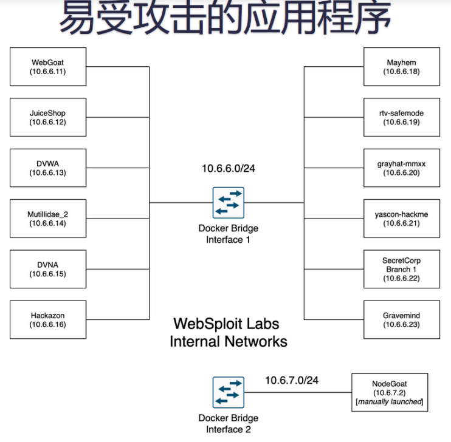
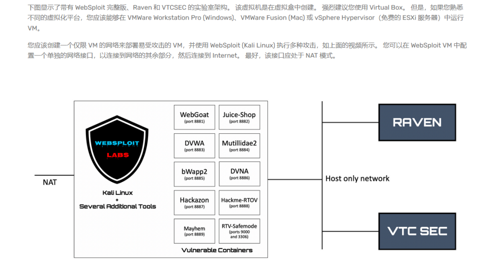

渗透测试与赏金猎人
进阶是个大难题，可能入门也是个难题。良驹当配良鞍，资源推荐。 https://www.oreilly.com/ -
--- sec875
参考材料：defcon红队村 https://bootcamp.h4cker.org/#next
环境部署
websploit 实验室部署
https://websploit.org/
场景分布图



基于kali的docker部署
```
curl -sSL https://websploit.org/install.sh | sudo bash
service docker start
sudo docker ps
```
靶机升级

```
wget https://websploit.org/update.sh
sudo bash update.sh
```

基于OVA的部署方式
我已经基于VMware，以及增加300G容易，和ubuntu自己拉镜像均以失败。我于作者认知保持一致，
基于VirtualBox的部署，没那么多错误。
基于OVA的靶机，仅仅只有kali，install脚本于root家目录中。
https://websploit.org/download.html
基于渗透的Raven与VTC SEC靶机
https://drive.google.com/drive/folders/1eKADGFjdnsIsbajxSho6MAZZfqHAMwCp

```
wget https://websploit.org/update.sh
sudo bash update.sh
```



