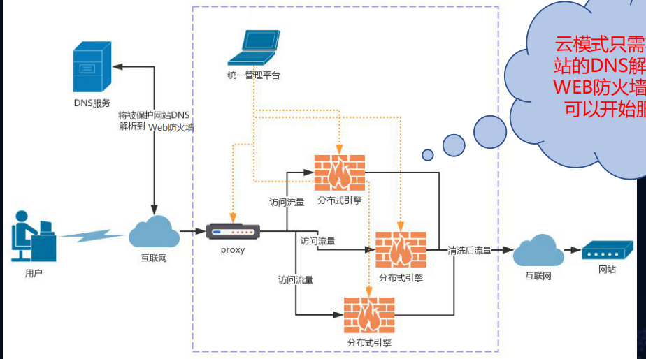
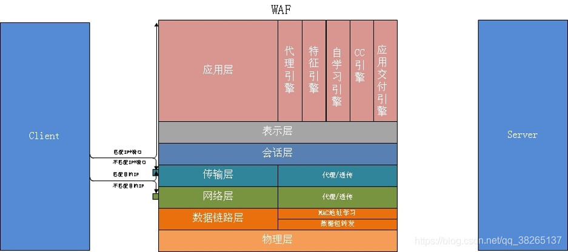
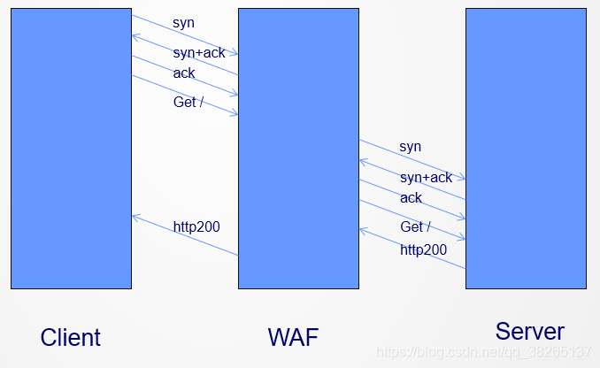
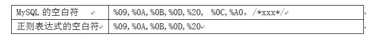
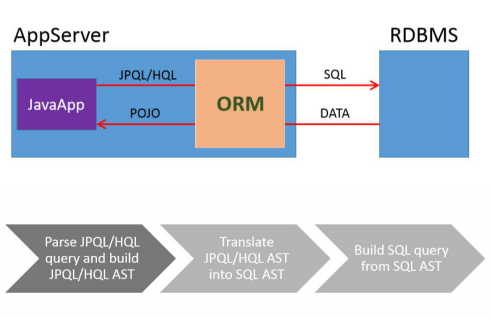
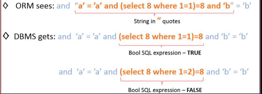
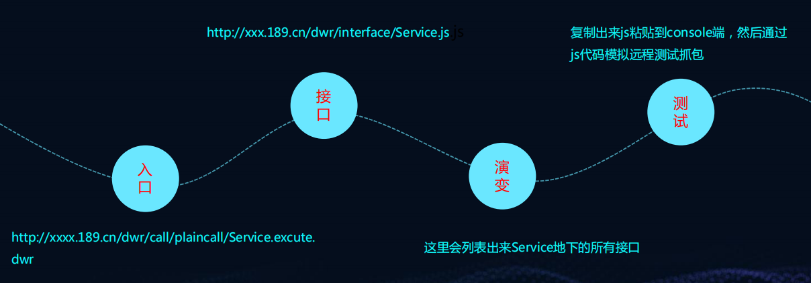
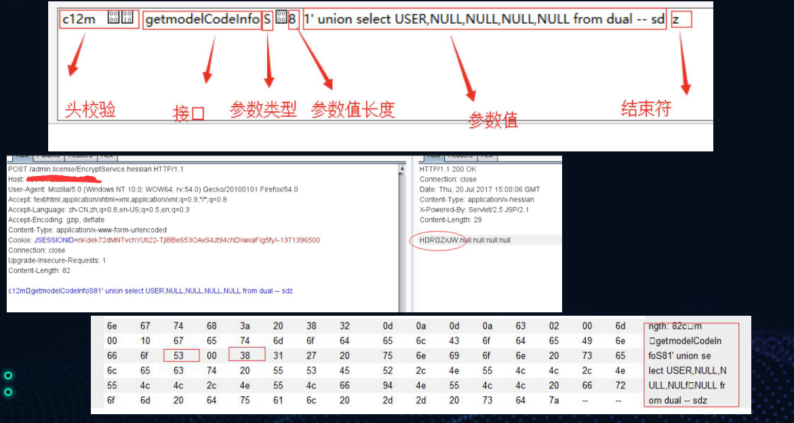
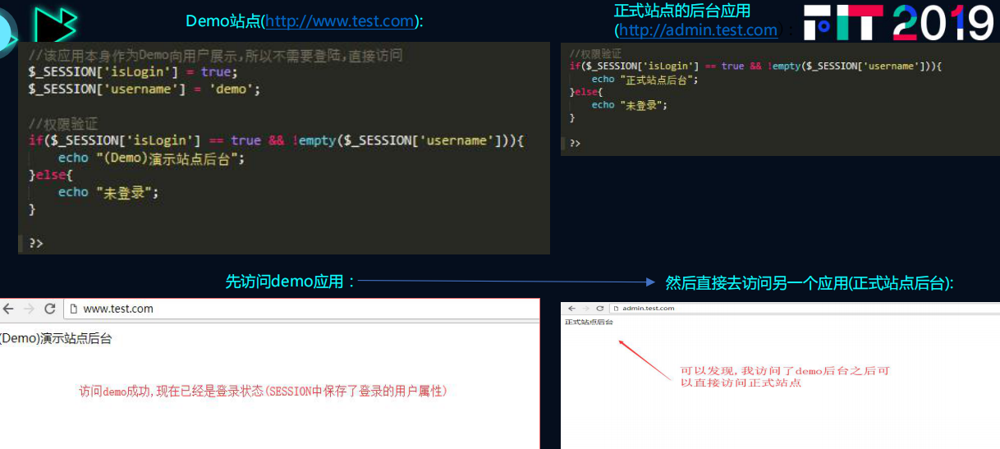

## 前言

主要针对SRC和众测，探讨自己的方法

怎么分析，怎么去绕，怎么去获取证据，等等


## 一、拦截框架下注入的过程拆解

越来越多的web系统，随着运维方安全意识的提高，网络设备的投入，
以及安全编码规范的介入，漏洞的发现从过去的简单粗暴，到现在举步
维艰，怎么去判断漏洞的存在，进而根据漏洞获取证据数据，这个是个
众测平台选手的痛点

### 1.数据库层面基础铺垫

1. 判断性SQL语句的形式

2. 条件判断函数方法分析

   mysql

   ```mysql
   if(1=(select 1 REGEXP if(1=1,1,0x00)),1,1)=1
   IFNULL(ascii(substr(user(),1,1))/(114%ascii(substr
   (user(),1,1))),'yes’)
   IFNULL(hex(substr(user(),1,1))/(114%hex(substr(user(),1,1))),'yes’)
   IFNULL(1/(locate(substr(user(),1,1),'r')),'yes’)
   IFNULL(1/(locate(right(left(lower(user()),1),1),'r')),' yes’)
   left(user(),1)="r";
   if(1=1,1,1)
   ```

   oracle

   ```sql
   NVL(TO_CHAR(DBMS_XMLGEN.getxml('select 1 from dual where 1337>1')),'1')!=1
   NVL2(NULLIF(substr('abc',1,1),'ca'),1,2)=1
   INSTR('abcd','b', 2, 1)>0 2018-10-21’- decode(1,21,1,to_date(decode(1,1,'','s'),'yyyy
   -mm-dd'))-’
   to_date(decode(substr(user,1,1),'a','','s'),'yyyy-mm-dd’))
   decode(sign(INSTR(USER,'A', 2, 1)),0,to_number('x'),1)
   ```

   sqlserver

   ```sql
   PATINDEX('Wa%25', 'Washington')>0
   right(left(lower('abc'),1),1)='a’
   isnull(nullif(substring('abc',1,1),'a'),'c')='c' 
   regexp_like(1,(case when 1=1 then 1 else 0x00end))
   ```

   

3. 通用型判断SQL语句

### 2.层层递进分析WAF求证据

#### waf的原理

WAF的发展主要经历了IPS架构，[反向代理](https://so.csdn.net/so/search?q=反向代理&spm=1001.2101.3001.7020)，透明代理和流模式。



#### WAF关键技术

WAF透明代理技术原理



waf通信



WAF主要会更改如下数据包内容项：

- 客户端TCP源端口
- 客户端源MAC/服务器源MAC地址
- 长短连接协议版本
- MIME类型

##### waf的识别

###### **基于Cookie值**

Citrix Netscaler（2013年使用广泛）

Citrix Netscaler”会在HTTP返回头部Cookie位置加入“ns_af”的值，可以以此判断为Citrix Netscaler的WAF，国内此类WAF很少

**F5 BIG IP ASM**

```
F5 BiG IP ASM会在Cookie中加入“TS+随机字符串”的Cookie信息，
```

###### **基于HTTP响应**

**Mod_Security**

Mod_Security是为Apache设计的开源Web防护模块，一个恶意的请求Mod_Security会在响应头返回“406 Not acceptable”

**WebKnight**

WebKnight是用来设计在IIS下面使用的WAF设备，较为常见。WebKnight会对恶意的请求返回“999 No Hacking”

**F5 BIG IP**

 F5 BIG IP会对恶意请求返回“419 Unknown”的信息

**dotDefender**

dotDefender用来防护.net的程序，会对恶意请求返回“dotDefender Blocked Your Request”

###### **特定资源文件**

部分特定WAF在返回的告警页面含特定的CSS或者JS文件，可以作为判断的依据，这类情况在WAF类里比较少，可归并到HTTP响应中。


Sqlmap中Waf检测方法（81种，包括360，安全狗，safe3，云锁）

```python
sqlmap.py -u “http://www.xxx.com” --identify-waf --batch
```


#### 全局过waf的几个思考点

##### 1. 架构层绕过WAF

###### 1.1寻找源站

信息泄露发现源站IP  思路太多，邮件

穷举IP地址 完成一次国内IP扫描只需要8-9小时

###### 1.2利用同网段

云服务商买一台VPS，通过VPS攻击目标站点，因为流量是局域网，可能不经过WAF检测，实现绕过

######  1.3利用边界漏洞

寻找子站的SSRF漏洞。如果子站访问目标站不经过WAF集群，可以利用SSRF漏洞来绕过WAF

##### 2. 资源限制角度绕过WAF

WAF只检测前面的几K字节、1M、或2M，只需要在POST BODY前面添加许多无用数据，把攻击payload放在最后即可绕过WAF检测

##### 3 协议层面绕过WAF的检测

###### 3.1协议覆盖不全 

Waf未能覆盖Content-Type: multipart/form-data从而导致被绕过。或者WAF会认为它是文件上传请求，从而只检测文件上传，导致被绕过

###### 3.2协议解析不正确  

例如文件上传，上传文件名的修改test.jpg/shell.php

###### 3.3协议解析与后WEB容器的协议解析不一致

文件名覆盖  在multipart协议中，一个文件上传块存在多个Content-Disposition，将以最后一个Content-Disposition的filename值作为上传的文件名 第一个文件名shell.123 第二个shell.php 上传后是shell.php

Content-Disposition: form-data;name="myfile"; filename="p3.txt""  

Content-Disposition: form-data;name="myfile"; filename="t3.jsp"

在一个Content-Disposition 中，存在多个filename 

Content-Disposition: form-data;name="myfile"; filename="p3.txt";filename="t3.jsp"  

遗漏文件名  

当WAF遇到“name=”myfile";;”时，认为没有解析到filename。而后端容器继续解析到的文件名是t3.jsp Content-Disposition: form-data;name="myfile";; filename="t3.jsp"。  

未解析所有文件  

 multipart协议中，一个POST请求可以同时上传多个文件。如图，许多WAF只检查第一个上传文件，没有检查上传的所有文件，而实际后端容器会解析所有上传的文件名，攻击者只需把paylaod放在后面的文件PART  

文件名解析兼容性  

 multipart协议中，文件名的形式为“filename="abc.php"”。但是Tomcat、PHP等容器解析协议时会做一些兼容，能正确解析 ”filename="abc.php”、”filename=abc.php”、 ”filename='abc.php’”。而WAF只按照协议标准去解析，无法解析文件名，但是后端容器能正确获得文件名，从而导致被绕过。场景的绕过形式：

- Content-Disposition: form-data; name="file"; filename=abc.php
- Content-Disposition: form-data; name="file"; filename="abc.php
- Content-Disposition: form-data; name="file"; filename='abc.php’

3.4参数污染

 请求中包含2个参数名相同的参数typeid，第一个是正常参数的值正常，第二个参数才是payload。如果WAF解析参数使用第一个值，没检查第二个值，将导致绕过。这是很久很久的一个CASE，现在几乎没有WAF存在这个问题。

/forum.php？ typeid=644&typeid=if(now()%3dsysdate()%2csleep(19.844)%2c0)/*'XOR(if(now()%3dsysdate()%2csleep(19.844)%2c0))OR'%22XOR(if(now()%3dsysdate()%2csleep(19.844)%2c0))OR%22*/

##### 4. 规则层面的绕过

 对基于正则表达式的WAF，绕过WAF规则主要思考安全工程师写WAF规则时在想什么，容易忽略什么，推断一些可能绕过的方式，然后多次尝试进行验证。隶属于漏洞层面过waf

###### 4.1. SQL注入绕过

绕过SQL注入规则主要利用WAF规则本身的问题、未考虑到SQL语法变形、及后端数据库SQL语句语法特性

注释符绕过  

/*xxx*/是注释，也可以充当空白符。因为 /**/可使得MySQL对sql语句(union/**/select)词法解析成功。事实上许多WAF都考虑到/**/可以作为空白分，但是waf检测 “/\*.*\*/”很消耗性能，工程师会折中，可能在检测中间引入一些特殊字符，例如：/*\w+*/。或者，WAF可能只中间检查n个字符“/\*.{,n}\*/”。根据以上想法，可以逐步测试绕过方法：

- 先测试最基本的：union/**/select
- 再测试中间引入特殊字：union/*aaaa%01bbs*/select
- 最后测试注释长度：union/*aaaaaaaaaaaaaaaaaaaaaaaaaaaaaaaaaaaaaaa*/select

同理，对于/*!xxx*/，可以采取类似的思路绕过WAF。

空白符绕过  

基于正则表达式的WAF， SQL注入规则使用正则表达式的“\s”匹配空格，例如”select\s+union”。利用正则表达式的空白符与MySQL空白符的不同可绕过WAF规则。如何这些MySQL的特性？通过fuzz,每次更改正常SQL语句的某部分，替换为其他字符，判断语法是否正确，即可判断出来MySQL语法特性。当然，也可以通过分析MySQL词法来发现语法特性，从而找到绕过方法。

  利用空白符进行绕过，测试WAF时尽可能减少其他原因的影响，例如”union select”被拦截，只需把中间空白符替换为”%250C”, “%25A0”进行绕过测试。

- union%250Cselect
- union%25A0select



函数分隔符

 对基于正则表达式的WAF，我们猜测安全工程师写WAF规则时，可能不知道函数名与左括号之间可以存在特殊字符，或者遗漏可以存在特殊字符。例如匹配函数”concat()”的规则写法，“concat(”或者”concat\s*(”，就没有考虑到一些特殊字符。相应的绕过方法，在特殊位置引入特殊的分隔符，逐个测试。这些特殊分隔符发现也是通过Fuzz出来的。

- concat%2520(
- concat/**/(
- concat%250c(
- concat%25a0(

  举一反三，寻找类似的关键位置，Fuzz特殊字符，发现更多的绕过新方法。猜测工程师们写规则因为各种原因容易遗漏的点，进行绕过WAF检测。

浮点数词法解析

利用MySQL解析浮点数的特点，正则表达式无法匹配出单词union，但是MySQL词法解析成功解析出浮点数、sql关键字union。

- select * from users where id=8E0union select 1,2,3,4,5,6,7,8,9,0
- select * from users where id=8.0union select 1,2,3,4,5,6,7,8,9,0
- select * from users where id=\Nunion select 1,2,3,4,5,6,7,8,9,0  

利用error-based进行SQL注入

  Error-based的SQL注入函数非常容易被忽略，导致WAF规则过滤不完整。随着对MySQL研究越来越深，被发现可用于error-based SQL注入的函数越来越多，同时也给绕过WAF造就了更多机会。常见的函数：

- extractvalue(1, concat(0x5c,md5(3)));
- updatexml(1, concat(0x5d,md5(3)),1);
- GeometryCollection((select*from(select*from(select@@version)f)x))
- polygon((select*from(select name_const(version(),1))x))
- linestring() 
- multipoint() 
- multilinestring() 
- multipolygon() 

  利用Error-based的SQL注入函数进行绕过时，可以结合函数分隔符，或其他方法灵活运用。

Mysql特殊语法

  最有效的发现手段，还是去读读MySQL词法分析源代码。和协议绕过类似，挖掘SQL标准与MySQL的词法分析差异是发现WAF SQL注入绕过的有效手段。以下是MySQL语法的一个特写(ps:不是我发现的)：

select{x table_name}from{x information_schema.tables};

综合利用实例

  以上都是SQL注入绕过中的技术点，在实际渗透测试中，需要灵活综合利用才能达到完整绕过，读取数据数据。以下给出完整绕过WAF SQ注入检测的实例。如图，本例中综合多个绕过技术点，最终实现完整绕过实现读取数据。

- 利用浮点数词法解析，绕过union select 的检测。
- 同样，函数分隔符思想集和浮点数词法解析，绕过关键字from的检测。
- 最后空白分分割绕过INFORMATION_SCHEMA.TABLES的检查

###### 4.2.文件包含

 文件包含分为相对路径、绝对路径文件包含。在相对路径文件包含中，最终根据Linux虚拟文件系统(vfs)的规则查找文件，通过分析vfs的文件路径解析规则，提取其中规则特点，用这些特点去绕过WAF。在绝对文件路径包含中，主要是根据攻击场景，WAF未过滤一些协议、未过滤某些特殊路径。

相对路径的绕过

写WAF文件包含规则时，如果检测单一的”../”，误报会非常多，所以WAF文件包含规则通常会检测连续的“../"。根据vfs解析路径的语法，解析到“//”文件路径不变，解析到“/./”文件路径依然。 通过避免连续的"../"，从而绕过WAF文件包含规则。Eg: ././..///./.././/../etc//passwd，它等价于../../../etc/passwd

绝对路径的绕过

- WAF没有考虑到路径中插入“/./”、“//”对于vfs解析路径是等价的，导致可被绕过。例如 /etc/./passwd 与 /etc/passwd 是等价的。还可以通过组合“/./”、“//”进行绕过，eg. /etc///.//././/passwd。
- 对于绝对路径文件包含，WAF一般会拦截常见路径，而不会防御所有的绝对路径。因此，在渗透测试中，可以包含其他的路径下一些文件，例如/usr/local/nginx/conf/nginx.conf。
- 如果WAF只检测连续的../，检查开始路径为Linux的目录名，可以采用/wtt/../绕过WAF文件包含检测。 例如，“/wtt/../etc/passwd”， wtt不是Linux标准目录，不会被规则匹配。WAF只检测连续的../，但是只使用一个../，不被拦截。最终读取/etc/passwd文件。

 利用WAF未检测的协议。PHP 文件包含支持的协议，在渗透测试中，看环境选择可行的方法

> - file:// — Accessing local filesystem 
>
> - http:// — Accessing HTTP(s) URLs 
>
> - ftp:// — Accessing FTP(s) URLs 
>
> - php:// — Accessing various I/O streams 
>
> - zlib:// — Compression Streams data:// — Data (RFC 2397) 
>
> - glob:// — Find pathnames matching pattern 
>
> - phar:// — PHP Archive 
>
> - ssh2:// — Secure Shell 2 
>
> - rar:// — RAR 
>
> - ogg:// — Audio streams 
>
> - expect:// — Process Interaction Streams
>
>   

总结

  一个好WAF不是吹出来的，是实践检验出来的。研究WAF的绕过手段，是为了更好的提升WAF的防御能力。在研究突破的过程中，不要仅仅停留在正则表达式，基本漏洞原理，需要对涉及并深入更多的领域，例如HTTP协议理解和PHP、Tomcat对HTTP协议源码分析，MySQL词法分析，和Fuzz的思路等。在此过程中，会有许多乐趣，也会有各方面能力的提升。

### 3.框架层的语句分析

#### [基于jpql类型的绕过分析](https://blog.csdn.net/dtttyc/article/details/80001826)

jpql与SQL的区别就是SQL是面向对象关系数据库，他操作的是数据表和数据列，而jpql操作的对象是实体对象和实体属性



ORM注入
数字类型（ JPQL ）：
SELECT e FROM user e WHERE e.id = SQL('(select 1 from
dual where 1=1)’) and SQL('(SELECT 1)=1’)
字符类型（JPQL）：
通常指的是类似hibernate一类具有安全语法检测的注入




#### 基于Hibernate类型的绕过分析

ORM注入
数字类型（ Hibernate ORM ）：
test\'' or 1<length((select version())) – 翻译成为HQL语句就变为：
SELECT p FROM pl.btbw.persistent.Post p where
p.name='test\'' or 1<length((select version())) – ' 最后转变为真正的SQL语句：
select post0_.id as id1_0_, post0_.name as name2_0_ from
post post0_ where post0_.name=‘test\'' or
1<length((select version())) -- ' 这样我们就会逃逸出来一个语句或者方法
通常指的是类似hibernate一类具有安全语法检测的注入


## 二、基于三方调用框架分析利用

#### WEBSERVICE接口

1.默认的安全配置2.未授权的访问3.自身未修复漏洞WEBSERVICE

Jws文件审计  

​	通常而言jws文件也是axis2发布的一种表现形式，然后更多的被
审计人员忽略

1. 在web目录全局查找jws结尾的文件
2. 根据对应的web访问目录通过浏览器进行访问
3. 对其相应的接口进行审计


SOAPMonitor

用来进行webservice管理发布，调试等等，这里面存在一个反序
列化的问题

1. 访问根路径/SOAPMonitor , 右键源码就可以看到一个配置项
内容
2. 远程调试时候开放默认5001端口进行对象传输
3. 寻找对应的执行链构造payload进行rec


Axis2

对于整个项目通过axis2或者axis发布的服务，从统计经验上来讲，
未授权大面积存在，而且低版本的从全局上就存在xml实体注入
漏洞

1. 访问对应的webservice路径，比如/services/或者
/servlet/AxisServlet
2. 对所有接口对应的类进行审计，通常默认情况下都是一一对应
3. 低版本构造xxe payload可以进行漏洞测试

Xfire

Web发布容器，已经停止维护，截至到最后一个版本，在
webservice上还是存在xml实体注入

1. 访问根路径/services，暴露对应的webservices接口
2. 构造payload全局造成xml实体注入


#### DWR接口

1. 实际的网站发布debug模式是关闭状态，我们做黑盒测试就要去猜测
两个默认目录,分别为/exec/和/dwr
2. 审计可以套用左边的请求包的模板，在你认为存在问题的地方构造
java接口调用的请求数据包
3. 网站发布dwr接口，通常都是未授权调用，包含内容比较多，比如用
户，管理等api接口
4. 如果参数构造有不确定因素，可以把对应的dwr接口空实现，然后转
接到我们自己可以本地模拟的代码上面来




#### HESSIAN接口




#### GWT接口


## 三、趣味的SESSION和EXC

#### SESSION污染

场景：在进行一些操作时,很常见的写法是先将验证码存储于Session当中，将验证码作为图片或是手机验证码,邮箱等方式发送给用户,对其进行身份的验证.

通常在这种情况下会很容易引发一个问题, 该场景常见于php中:用户A找回密码,需要进行手机校验码的校验,服务器把发送出去的验证码放在了Session中,此时用户必须输入正确的验证码才能成功的进行密码重置

场景: 在php中,session使用文件的方式存储,它的唯一性不是很好(多个应用可以访问同一个Session)

某程序员开发了一套CMS，把他作为一个demo部署在了自己的官网A上某程序员开发了一套CMS，把他作为一个demo部署在了自己的官网B ，但是这两个域名都解析到了同一服务器上,可能就会产生很大的问题

但是如果在没发送验证码的情况下，那么session中code为空,再将请求提交的验证码置为空，使用php的情况下会导致false == false，即条件为真，验证码匹配成功， 出现这一问题的原因是由于服务器没有正确的处理session，在使用之后必须对其进行销毁,并且需要对session进行空验证



在未登录http://admin.test.com的情况下,通过先访问http://www.test.com/
demo站点对自己的session进行一次赋值,伪造出身份
那么这个session是可以被http://admin.test.com访问到的,所以造成的混淆使用
引发安全问题

#### XXE在EXCEL中的应用场景

应用场景：
在很多系统，不管是后台还是前台，我们经常会碰到，导入/导
出这样的字样，从统计的角度来看，百分之八十以上都是excel，
例如，导入人员信息/导出人员信息，录入系统配置/导出系统配
置等等

技巧变形：
从某种意义上，我们是不需要去修改workbook.xml，有时候我
们想要达到的目的就是，导出来之后，然后根据格式，外部实体
引入，读取系统文件，比如/etc/passwd等，可以在导入的时候
进行操作，那么我们就应该去修改xl/worksheets/sheet1.xml
调用的实体 替换模板数据即可，这时候当我们导入时候，就会把
系统敏感文件读取出来